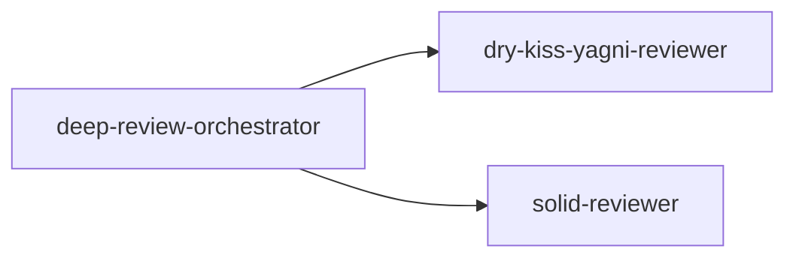

# `.claude/agents/`

Custom Claude Code subagent definitions — real, persisted `.claude/agents/*.md` files (YAML
frontmatter + markdown body as the subagent's own system prompt), each dispatched via the `Agent`
tool. Unlike a skill, a subagent runs isolated from whichever conversation dispatches it — see
`deep-review-orchestrator.md`'s own opening note for what that buys this project specifically.

## Flow

Real entry point: `deep-review-orchestrator`, dispatched directly —

```
Agent({description: "<short task description>", subagent_type: "deep-review-orchestrator", prompt: "<scope>"})
```

`<scope>` — see `deep-review-orchestrator.md` step 1 for the full set of accepted values. The
orchestrator dispatches the two reviewer lenses below in a single, parallel response, then
dispatches its own per-candidate verification subagents (ad hoc `general-purpose` dispatches, not
named files in this directory, so not pictured below) before returning its result. `dry-kiss-yagni-reviewer`
and `solid-reviewer` also name each other in their own "not X, see Y" opening line, but neither
one dispatches or reads the other — that cross-reference is documentation only, not an execution
path, so it stays out of the diagram below.


