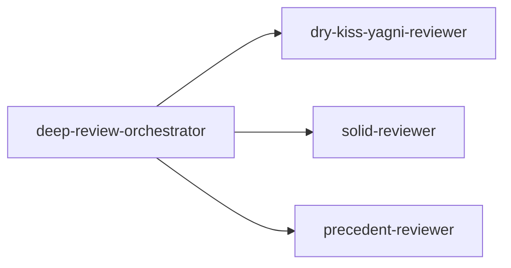

# `.claude/agents/review/`

Code-review subagents — [`deep-review-orchestrator`](deep-review-orchestrator.md) dispatches the
three reviewer lenses below in a single, parallel response, then dispatches its own per-candidate
verification subagents (ad hoc `general-purpose` dispatches, not named files in this directory, so
not pictured below) before returning its result.
[`dry-kiss-yagni-reviewer`](dry-kiss-yagni-reviewer.md) and [`solid-reviewer`](solid-reviewer.md)
also name each other in their own "not X, see Y" opening line, but neither one dispatches or reads
the other — that cross-reference is documentation only, not an execution path, so it stays out of
the diagram below. [`precedent-reviewer`](precedent-reviewer.md) checks a different axis entirely
(consistency with this project's own prior rules/decisions, not general code quality), so it
doesn't cross-reference either of the other two.

## Flow

Entry point: [`deep-review-orchestrator`](deep-review-orchestrator.md), dispatched directly —

```
Agent({description: "<short task description>", subagent_type: "deep-review-orchestrator", prompt: "<scope>"})
```

`<scope>` — see `deep-review-orchestrator.md` step 1 for the full set of accepted values.


