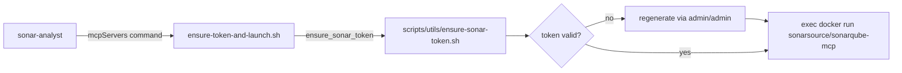

# `.claude/agents/sonar/`

Queries the local SonarQube server's already-uploaded analysis state (quality gate, issues,
metrics) via an MCP server scoped to this one agent — see
[`scripts/sonar/README.md`](../../../scripts/sonar/README.md)'s own "MCP server" section for why
this is agent-scoped rather than a session-wide `.mcp.json`, and how it complements
`scripts/sonar.sh`'s own live-progress tracking during a scan rather than replacing it.

## Flow

Entry point: [`sonar-analyst`](sonar-analyst.md), dispatched directly —

```
Agent({description: "<short task description>", subagent_type: "sonar-analyst", prompt: "<what you want to know>"})
```

`sonar-analyst.md`'s own `mcpServers` frontmatter points its `command` at
[`ensure-token-and-launch.sh`](ensure-token-and-launch.sh) instead of the real MCP server
directly — this wrapper re-runs fresh on every dispatch (an inline MCP server's own lifecycle:
connects when the subagent starts, disconnects when it finishes), so it can guarantee a valid
SonarQube auth token every time rather than relying on one fixed at Claude Code's own startup. The
real server is the official `sonarsource/sonarqube-mcp` **Docker image** (`docker run --network
host ...`, run with `--network host` to reach the SonarQube server container's published port) —
not the `sonarqube-mcp-server` npm package, which is deprecated and no longer maintained (verified
directly against its real GitHub README).



The `sonarqube-mcp` server exposes ~20 tools across 10 toolsets by default — `sonar-analyst.md`'s
own `SONARQUBE_TOOLSETS` env var narrows this to just `quality-gates,issues,measures` (5 tools),
the ones this agent's own role actually needs.
