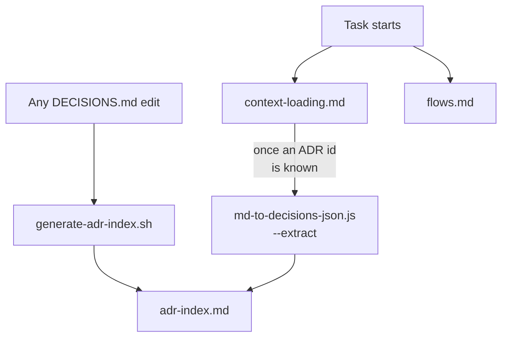

# .claude/nav/ — AI navigation layer

This directory is additive: it complements the existing `CLAUDE.md`/`DECISIONS.md`/backlog/
`.claude/skills` system, it never replaces or restates any of it. Three files here —
[adr-index.md](adr-index.md), [context-loading.md](context-loading.md), [flows.md](flows.md) —
each opens with its own purpose statement, not restated here — plus the scripts that generate and
verify them, nested in `.claude/nav/scripts/` (own `README.md`, not restated here either).

## Flow

[adr-index.md](adr-index.md) is generated, never hand-edited:

```bash
bash .claude/nav/scripts/generate-adr-index.sh
```

[context-loading.md](context-loading.md) and [flows.md](flows.md) are hand-maintained — no
generation step of their own. `context-loading.md` points a task toward `adr-index.md` first and,
once a task narrows to one or a few known ADR ids, toward the `--extract` companion below instead
of opening the whole `DECISIONS.md`. `flows.md`'s own "Project commands & skills" table is
verified against the real `.claude/commands/*.md`/`.claude/skills/*/SKILL.md` files, not
generated, by `.claude/nav/scripts/check-flows-completeness.sh`.



## Explicitly not here, and why

- **No `module-index.md`.** [`docs/architecture/bounded-contexts.md`](docs/architecture/bounded-contexts.md)
  already gives a per-domain Contract + Cross-Domain-Dependencies breakdown, and module `CLAUDE.md`
  is unconditionally `@`-imported into every session regardless of task type — a redundant index
  cannot reduce token cost for an AI session, only for a human skimming outside one, which is a
  different problem.
- **No `database-ownership.md`.** [`docs/architecture/architecture-map.html`](docs/architecture/architecture-map.html)'s
  Database ERD page already gives an exact table → module → Liquibase-changelog mapping for every
  table, live from the real changelogs, in more detail than a new file would.
- **No manual `Tags`/`Scope` metadata on existing ADRs.** `Status`/`Module`/`Title` are already
  100% mechanically derivable from every `DECISIONS.md` entry's existing text — no new authoring
  burden was needed to build [adr-index.md](adr-index.md). Free-form tagging is the one genuinely
  subjective field that would need retrofitting across every existing entry (count varies as
  `DECISIONS.md` files grow — see [adr-index.md](adr-index.md)'s own generated total, not a
  hardcoded figure here); deferred until real usage friction demonstrates the need, not built
  speculatively.

## Staying correct

Nothing here is exempt from going stale. [adr-index.md](adr-index.md) is only as fresh as its last
regeneration — `/sync-docs --full-audit`'s existing ADR classifier (VALID/STALE/SUPERSEDED/
DONE-GOAL-NOT-MARKED) is the reused mechanism for catching drift here too, not a new one built for
this layer specifically.

Two more mechanisms guard against drift: a standing `.claude/rules.md` rule — any `DECISIONS.md`
edit, by any workflow, regenerates the index (`bash .claude/nav/scripts/generate-adr-index.sh`) in the same
operation, not only when going through `/record-decision` — and `bash .claude/nav/scripts/check-adr-index-freshness.sh`,
a read-only check (diffs the current file against a fresh regeneration, always restores the
working tree regardless of outcome) wired as an unconditional early stage in `scripts/ci.sh`. The
rules.md rule is the primary defense; the CI stage is a backstop for whenever `/ci` is actually
run — this repo has no automatic per-commit or per-push trigger yet, so neither mechanism is a
hard guarantee on every single change, only on ones that go through Claude's own discipline or an
explicit CI run.
