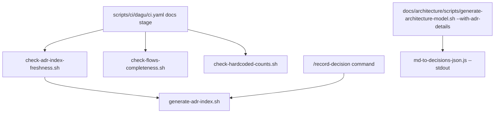

# .claude/nav/scripts/

Generation/verification logic behind `.claude/nav/adr-index.md` and `.claude/nav/flows.md` — see
`.claude/nav/README.md` for what those files are and how they're used; this directory is only the
code that builds/checks them.

## Flow

Real entry points, independently invocable:

```bash
bash .claude/nav/scripts/generate-adr-index.sh
bash .claude/nav/scripts/check-adr-index-freshness.sh
bash .claude/nav/scripts/check-flows-completeness.sh
bash .claude/nav/scripts/check-hardcoded-counts.sh
node .claude/nav/scripts/md-to-decisions-json.js <module> [<module> ...]
node .claude/nav/scripts/md-to-decisions-json.js --stdout <module>
node .claude/nav/scripts/md-to-decisions-json.js --extract <module> <ADR-NNN>[,<ADR-NNN>...]
```

`check-adr-index-freshness.sh` wraps `generate-adr-index.sh` (backs up the committed
`adr-index.md`, re-runs the generator, diffs, restores) — a real caller/callee relationship.
`check-adr-index-freshness.sh`, `check-flows-completeness.sh`, and `check-hardcoded-counts.sh` run
together as the `docs` stage in `scripts/ci/dagu/ci.yaml`. `generate-adr-index.sh` is also called
directly, outside that stage, by `/record-decision` and by a standing `.claude/rules.md` rule
requiring it after any `DECISIONS.md` edit.

`md-to-decisions-json.js` has two distinct real callers, not one flow: its `--stdout` mode is
called by `docs/architecture/scripts/generate-architecture-model.sh` (a script in a different
script-group directory) only when `--with-adr-details` is passed; its `--extract` mode is invoked
directly, on demand, per `.claude/nav/README.md`'s own guidance, not from any other script.


