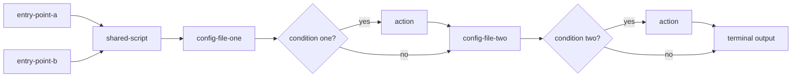

# Infra Doc Standards

Documentation standards for infrastructure/tooling files — bash/batch scripts, `docker-compose*.yml`,
`.properties` — as distinct from `doc-standards` (which covers documentation about the Java/Vaadin
application itself: `README.md`, `CLAUDE.md`, `DECISIONS.md`, `docs/architecture/*`, `docs/ai/*`).

## Base standard

Script-header documentation in this repo is grounded in the
[Google Shell Style Guide](https://google.github.io/styleguide/shellguide.html) — the most widely
cited authoritative convention for bash, and the only one found (2026-08-14 web search) with an
actual structured header spec rather than free-form prose advice. Two relevant parts of it:

- **File-level:** every file must have a top-level comment giving a brief overview of its
  contents, placed immediately after the shebang line.
- **Function-level:** every function's header comment describes its API behaviour via five
  labeled fields — `Description`, `Globals` (global variables read/modified), `Arguments`,
  `Outputs` (what it writes to stdout/stderr), `Returns` (exit status, if not just the last
  command's).

## Where we deviate from Google, and why

| Google | Ours | Why |
|---|---|---|
| Structured block only for functions; file-level is one free sentence | Structured block at the **file** level | Most of our scripts are standalone CLI entry points, not function libraries — the file itself is the unit of invocation |
| `Arguments` | `Usage` | Merges invocation syntax + flag meaning in one field (split into a per-flag list when there are 3+ flags — see example below) |
| — | `Uses` (added) | Google's guide has no notion of a script orchestrating docker/mvn/node/python — ours routinely does |
| — (`Globals` exists only in Google's *function*-level block, no file-level equivalent) | `Env` (added, file level) | Not a rename — Google never addresses this at file level. Our scripts rarely have shell-global state, but frequently read overridable `VAR:-default` environment variables, so we add a field for it |

## Where we follow Google as-is

| Google | Ours | Why |
|---|---|---|
| `Outputs` and `Returns` as two separate fields | Same — `Outputs` (what it writes) and `Returns` (exit codes) stay split | No reason to merge them; Google already got this right |
| Visual delimiter framing the header block | `# ── Header ── ... # ──` (our own marker style, same idea) | Bounds the block explicitly instead of relying on context — the two real parsing bugs this session both trace back to that ambiguity |

## The file-level header (target shape)

```
# ── Header ──────────────────────────────────────────────────────────────────
# Description: what this file does, one short paragraph.
# Usage: how it's invoked. "None" if it takes no arguments. 3+ flags -> one flag per line.
# Uses: tools/runtimes it invokes (bash, docker, mvn, node, ...). "None" if none.
# Env: overridable environment variables, with defaults. "None" if it reads none.
# Input: what it reads (files, APIs, other scripts' output). "None" if none.
# Outputs: what it produces (files written, side effects) -- no exit codes here.
# Returns: exit codes and what each one means.
# ────────────────────────────────────────────────────────────────────────────
```

The `# ── Header ──` / `# ──` pair bounds the block explicitly, so a parser (or a human) never has
to guess where it ends from context (a blank line, the next line of code, or nothing at all).

### Example — `scripts/deploy.sh`

```bash
#!/bin/bash
# ── Header ──────────────────────────────────────────────────────────────────
# Description: Full prod deploy -- builds Docker image from scratch, starts all services on port 8081.
# Usage: bash scripts/deploy.sh [--reset] [--restart-infra] [--file] [--no-cache] [--reset-db] [--prune-all]
#   --reset          wipe DB/MinIO volumes, then rebuild
#   --restart-infra  restart infra containers only (no rebuild)
#   --file           filtered console output + full log to /tmp/deploy.log
#   --no-cache       force rebuild ignoring Docker layer cache
#   --reset-db       truncate app tables (reset-clean.sql) before starting the app
#   --prune-all      also prune stopped containers/volumes HOST-WIDE (see DECISIONS.md ADR-001)
# Uses: bash, docker buildx, docker compose.
# Env: NETWORK (default advertisement), DB_CONTAINER (advertisement-db), MINIO_CONTAINER
#   (advertisement-minio), APP_CONTAINER (marketplace-app), APP_IMAGE (marketplace-app), DB_PORT
#   (5432), MINIO_PORT (9000), MINIO_CONSOLE_PORT (9001), APP_PORT (8081) -- all overridable, used
#   by scripts/ci.sh for its isolated e2e stack.
# Input: repo source, .env (POSTGRES_IMAGE, S3_* fallback defaults).
# Outputs: running marketplace-app container on APP_PORT.
# Returns: 0 on success, non-zero on build/startup failure.
# ────────────────────────────────────────────────────────────────────────────
```

### `Outputs`/`Returns` stay two separate fields (per Google) — example, `check-architecture-model-freshness.sh`

```
# Outputs: an ERROR line naming which file is stale, if any -- no file is written, the committed
#   files are always restored afterward.
# Returns: 0 = up to date, 1 = stale.
```

### Explicit "None" instead of omitting a field — example, `screenshot-architecture-map.sh`

```
# Description: Screenshots every screen of architecture-map.html...
# Usage: None -- always run with no arguments.
# Uses: bash, a headless Playwright browser...
```

## Non-obvious operational side effects belong in the header, not just `DECISIONS.md`

A field's job isn't just "the mundane primary behavior" — if a script has a real, non-obvious
operational side effect (auto-resets a server setting every run, self-heals a config drift,
silently wipes something under a condition), that fact belongs in the relevant field's own text
(usually `Outputs`, sometimes `Env`), with a pointer to say "see `DECISIONS.md`" for the full
reasoning — not just buried there where a reader has to already know to look. The header is what
someone sees first; `DECISIONS.md` is where they go if they want the *why*.

## Per-function headers — only for files that are `source`d by other scripts

Google's structured block is really meant for functions. Most of our scripts don't export
functions other scripts call — but a few genuinely are small libraries, `source`d by several other
scripts. For a file like this, each function meant to be called externally gets its own
Google-style block, in addition to the file's own header:

```bash
#!/bin/bash
# ── Header ──────────────────────────────────────────────────────────────────
# Description: Idempotent check-and-install for Docker CLI plugins this sandbox doesn't ship by
#   default (buildx, compose v2). Source this file, call the function you need.
# Usage: source scripts/ensure-docker-plugins.sh; then call ensure_buildx / ensure_docker_compose.
# Uses: bash, curl.
# Env: None.
# Input: None.
# Outputs: installs a plugin into ~/.docker/cli-plugins/ if missing.
# Returns: 0 always (installs on demand, no-ops if already present).
# ────────────────────────────────────────────────────────────────────────────

#######################################
# Ensures `docker buildx` is available, installing it if missing.
# Arguments: None.
# Outputs: progress messages to stdout.
# Returns: 0 always.
#######################################
ensure_buildx() {
  ...
}
```

A purely internal/private function (never called from outside its own file) does not get one of
these — a one-line comment is enough, per `.claude/rules.md`'s "one line or none" rule.

## Windows (`.bat`) delegator files — `same as <file>` forwarding

Most `.bat` files in this repo are pure delegators to a sibling `.sh` (invoke it through WSL, add
nothing of their own). For these, fields whose value is identical to the target `.sh`'s own header
get a short `same as <file>` instead of restating the content — only fields with something genuinely
`.bat`-specific (a narrower flag set, Windows-only usage tips) keep their own full text.

### Example — `scripts/deploy.bat`

```bat
@echo off
REM ── Header ──────────────────────────────────────────────────────────────────
REM Description: Full prod deploy -- builds Docker image from scratch, starts all services on port 8081.
REM Usage:
REM   scripts\deploy.bat                    -- full image rebuild + start
REM   scripts\deploy.bat --no-cache         -- force rebuild ignoring Docker layer cache
REM   scripts\deploy.bat --reset            -- wipe DB/MinIO volumes, then rebuild
REM   scripts\deploy.bat --restart-infra    -- restart infra containers only (no rebuild)
REM   scripts\deploy.bat --reset-db         -- truncate app tables before starting the app
REM Uses: WSL (wsl bash scripts/deploy.sh).
REM Env: same as scripts/deploy.sh.
REM Input: None.
REM Outputs:
REM   Filtered console output (WSL/Git Bash): bash scripts/deploy.sh 2>&1 | tee /tmp/deploy.log | grep -E "BUILD|ERROR|Started|Waiting|ready|FAILED"
REM   Stream full app log after deploy: docker logs -f marketplace-app
REM Returns: same as scripts/deploy.sh (0 = success, non-zero = build/startup failure).
REM ────────────────────────────────────────────────────────────────────────────
```

### Trivial delegators (no unique content of their own)

For a `.bat` that's just `@echo off` + one `wsl bash <sibling>.sh %*` line — every field is
`same as <sibling>.sh` except `Description`/`Uses`:

```bat
@echo off
REM Description: Windows entry point -- delegates to <sibling>.sh via WSL.
REM Usage: same as <sibling>.sh.
REM Uses: WSL (wsl bash <sibling>.sh).
REM Env: same as <sibling>.sh.
REM Input: same as <sibling>.sh.
REM Outputs: same as <sibling>.sh.
REM Returns: same as <sibling>.sh.
```

## Docker files (`Dockerfile`, `docker-compose*.yml`)

A Dockerfile isn't invoked directly with its own flags the way a script is — it's built via
`docker build`, so two of the fields carry a different meaning. `Returns` is the one field whose
value never changes across any Dockerfile — a type-level constant stated once here, not a per-file
fact worth repeating on every Dockerfile's own header.

| Field | Meaning for a script | Meaning for a Dockerfile | Always the same value? |
|---|---|---|---|
| `Description` | what the script does | what image it builds and why | No -- varies per file |
| `Usage` | CLI flags | the `docker build -f <path> -t <tag> .` invocation (plus real `--build-arg`s, if any) | No -- varies per file |
| `Uses` | tools/runtimes it invokes | base image(s) (`FROM ...`), build tools used inside | No -- varies per file |
| `Env` | overridable env vars it reads | the Dockerfile's own `ARG`/`ENV` instructions -- the native equivalent | No -- varies per file |
| `Input` | files/APIs it reads | what it `COPY`s in (source tree, `pom.xml`, ...) | No -- varies per file |
| `Outputs` | files written, side effects | the resulting image (name/tag) and what's inside (exposed port, entrypoint) | No -- varies per file |
| `Returns` | exit codes | build success/failure belongs to the `docker build` command, not the file | Yes -- always `N/A`, field omitted |

**Multi-stage builds** don't get a full 7-field block per stage -- one file-level header covers the
whole file, and each `FROM ... AS <stage>` line gets a one-line comment stating that stage's role,
per the general "one line or none" rule.

### Example — `scripts/ci/Dockerfile`

```dockerfile
# syntax=docker/dockerfile:1
# ── Header ──────────────────────────────────────────────────────────────────
# Description: CI-runner image -- one container the user interacts with (scripts/ci.sh ->
#   scripts/ci/run.sh), Docker-outside-of-Docker: the host's docker.sock is mounted into it at
#   `docker run` time so it can create/tear down its own isolated ci-* sibling containers without
#   touching the persistent dev stack. Full design rationale: scripts/ci/DECISIONS.md ADR-001.
# Usage: docker build -f scripts/ci/Dockerfile -t ci-runner .
# Uses: eclipse-temurin:25-jdk base image.
# Env: None (build-time only, no ARG/ENV declared).
# Input: repo source (mvnw, pom.xml).
# Outputs: ci-runner image -- see scripts/ci/entrypoint.sh for the in-container orchestration logic.
# ────────────────────────────────────────────────────────────────────────────
FROM eclipse-temurin:25-jdk
```

## `.properties` files

A `.properties` file is passive configuration, not something invoked — `Uses`/`Input`/`Outputs`/
`Returns` are dropped entirely: their value never changes across any `.properties` file (`None`/
`None`/`None`/`N/A` respectively, for the reasons in the table below) — a type-level constant
stated once here, not a per-file fact worth repeating on every `.properties` file's own header.
Only `Description`/`Usage`/`Env` actually vary per file, so those are the only three fields such a
file's header carries.

| Field | Meaning for a script | Meaning for a `.properties` file | Always the same value? |
|---|---|---|---|
| `Description` | what the script does | what it configures, for which tool | No -- varies per file |
| `Usage` | CLI flags | not invoked -- state which file/flag actually reads it (e.g. `-Dproject.settings=...`) | No -- varies per file |
| `Env` | overridable env vars it reads | `${VAR}` substitution, if the file genuinely uses any | No -- varies per file |
| `Uses` | tools/runtimes it invokes | it's passive data | Yes -- always `None`, field omitted |
| `Input` | files/APIs it reads | this file *is* the input | Yes -- always `None`, field omitted |
| `Outputs` | files written, side effects | static config, produces nothing on its own | Yes -- always `None`, field omitted |
| `Returns` | exit codes | it's never executed | Yes -- always `N/A`, field omitted |

## README — what the tool is, why we use it

Every script-group directory's `README.md` opens with a short paragraph (a few sentences) naming
the real external tool the directory wraps and, when relevant, why this project uses it — before
the `## Flow` section, not folded into it (`Flow` covers the file-to-file sequence, not what the
tool itself is or why it's in this project).

Example — `scripts/sonar/README.md`:

> SonarQube is a static-analysis tool that scans the codebase for bugs, code smells, and security
> vulnerabilities, enforcing a quality gate on every run. This project runs it locally in an
> isolated Docker container instead of a hosted SonarCloud instance, so results stay available
> offline and the quality gate can block a local run without depending on an external service.

## README "Flow" section

Every script-group directory's `README.md` gets a `## Flow` section covering the sequence between
files — not what each file does on its own (that's the file's own header, see above).

1. **Entry point(s) — named explicitly.** State which file(s) actually trigger the flow. A
   directory can have more than one real entry point (e.g. an OS-specific pair like `run.sh`/
   `run.bat`, or a script meant to be run manually vs. one invoked automatically by CI) — list all
   of them, never assume there's exactly one.
2. A command block showing how to invoke each entry point.
3. One or two sentences of context for *why* there's branching worth diagramming — not a
   restatement of any single file's own `Description`.
4. One or more Mermaid `flowchart` diagrams of the real file-to-file call chain — however many it
   actually takes to represent it accurately, never forced to a fixed count. Decision diamonds are
   used only for a condition that determines which *other file* gets touched or how — not for a
   single file's own internal control flow (a retry/wait loop that never reaches out to another
   file stays out of the diagram, it's that file's own `Outputs`/`Returns` detail). The specific
   shapes below (how many entry points, whether they converge into one diagram or split into
   several) are examples of how this plays out for real directories in this repo — not an
   exhaustive rulebook; judge each directory's own actual call graph on its own terms.
   - One entry point → one diagram.
   - Multiple entry points that converge quickly into the same shared logic (e.g. an OS-specific
     pair like `run.sh`/`run.bat`) → one diagram, each entry point as its own starting node,
     feeding into the shared flow.
   - Multiple entry points leading to genuinely different flows (little/no shared logic) →
     separate diagrams, one per entry point — don't force unrelated flows into one picture.
5. **Every file in the directory gets traced for its real behavior, not assumed.** Before drawing
   an arrow, check the actual code: does another file read this one conditionally, write to it, or
   modify it under some condition? If yes, that's a decision diamond on the diagram, not a plain
   arrow — skipping this check produces a diagram that looks complete but silently omits real
   behavior.
6. **Diagram order reflects real chronological execution, not grouping by file.** If a file is
   touched at two separate points in the real sequence with something else happening in between,
   draw it as two separate touches in that real order — don't merge them into one box just because
   it's the same file. Grouping by file instead of by real execution order produces a diagram that
   looks tidy but misrepresents when things actually happen.
7. **Every path ends at a real terminus, never a placeholder dead end.** A decision's `no`/false
   branch flows directly into whatever real step happens next — never into a vague box like
   "continue" that goes nowhere on the diagram. The diagram's own last node is the entry point's
   real output (the same fact already stated in that file's own `Outputs` field) — so every path a
   reader's eye can follow actually arrives somewhere concrete.

### Why Mermaid, not a hand-rolled notation

ISO/ANSI define standard flowchart symbols for exactly this purpose — oval (start/end), rectangle
(process step), diamond (decision), parallelogram (input/output), arrow (direction) — this is an
established visual vocabulary, not a house style invented for this repo. Mermaid.js is the standard
text-based implementation of these symbols for technical documentation, with native support for
labeled conditional branches. GitHub has rendered Mermaid natively (a fenced ` ```mermaid ` block,
no build step, no external service) across READMEs/issues/PRs/wikis since 2022 — and this repo
already uses Mermaid elsewhere (Database ERD, Sequence Diagrams on `architecture-map.html`), so this
isn't a new tool being introduced. Caveat: outside GitHub (an npm/PyPI page, a static site generator,
a PDF export) a Mermaid block falls back to a plain code block — not universal everywhere, but
correct on GitHub, where this repo is actually hosted and read.

### Decision diamond labeling — ISO 5807

Every decision diamond follows [ISO 5807](https://www.conceptdraw.com/How-To-Guide/flowchart-symbols)'s
convention exactly: the diamond node itself states the question/condition; only the arrows leaving
the diamond carry a label (`yes`/`no`), with at least two outgoing paths, one per outcome. A plain
process arrow (unconditional, between two non-decision nodes) never carries a label — labels exist
only to distinguish a decision's own outcomes, nowhere else in the diagram.

Example:



### Choosing direction, keeping labels compact

Mermaid has no built-in way to wrap a flowchart across multiple rows the way text wraps — a long
`LR` chain with several decision diamonds just keeps growing wider until it needs a scrollbar. Two
real levers instead of that: pick `TD` (top-down) when a diagram has more decision diamonds than
straight-line steps — vertical growth reads better than an ever-widening horizontal chain; and keep
node/diamond label text short, using `<br/>` to force a line break inside a label rather than
letting one long line dictate the whole node's width — a diamond in particular grows fastest of any
node shape as its label gets longer, since the shape needs extra padding at its own corners to stay
readable.

## Applying this standard

When this skill is run against a directory or an individual infrastructure file, everything in
scope is brought into full compliance with the standard described above — headers, `README.md`
Flow section, everything — not a partial pass. There is no "is this file already compliant"
tracking inside this skill itself; that's a per-run decision, made when the skill is actually
invoked, not a state this document maintains.
