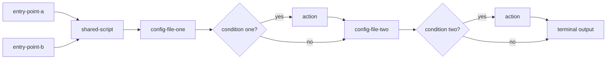

# Infra Doc Standards

Documentation standards for infrastructure/tooling files — bash/batch scripts, `docker-compose*.yml`,
`.properties` — as distinct from `doc-standards` (which covers documentation about the Java/Vaadin
application itself: `README.md`, `CLAUDE.md`, `DECISIONS.md`, `docs/architecture/*`, `docs/ai/*`).

## ⛔ One fact, one canonical home — highest priority in this document

Files are the highest-priority artifact. A file's own header must fully and precisely describe
everything that file does — every flag, every conditional branch, every real side effect — lean
and laconic but with no gap in coverage. Finish every file's header first; files are independent
of each other, so this can happen in any order or in parallel. Do not open or reference the
directory's `README.md` at all while doing this, not even to check for overlap.

Only once every file in the directory has a complete header does `README.md` get written or
touched. `README.md` may only ever contain information that is fundamentally about more than one
file at once — the sequence/interaction between files, why a step is grouped or blocks another,
what the whole chain produces end to end, a flow diagram of the real call chain, which
script-groups/files actually source a shared one. What any single file does, on its own, is never
README's job, at any level of brevity — not even a one-sentence gloss "for navigation." If a fact
is already covered by a file's own header, it must never appear in `README.md` in any form — not
restated, not reworded, not summarized. Before writing any README sentence, check: does an existing
file header already say this, or could it be answered by reading one file alone? If yes, drop the
sentence.

A directory's `README.md` describes only that directory's own level: its own files and how they
interact with each other. It never restates something a nested subdirectory's own `README.md`
already covers (a subdirectory speaks for itself), and never restates the wider context a parent
directory's own `README.md` provides.

A shared environmental constraint or gotcha that two or more otherwise-unrelated files
independently hit (not a call chain, not a caller/callee relationship — just a coincidence that
they need the same workaround) is not a "sequence/interaction between files" fact sanctioned for
`README.md`. Each affected file explains its own reason in its own header, exactly as if the
other files didn't exist. The test: if file A's header already explains its own reason and file
B's doesn't yet, the fix is never "write the combined explanation in `README.md` instead" — it's
"add the explanation to file B's own header, matching file A's existing pattern" (in scope) or
"flag it as a finding" (out of scope). A `README.md` paragraph that survives only because some
referenced file's header is still incomplete is itself evidence the paragraph doesn't belong.

This is the single governing statement of the file-vs-README duplication rule in this document —
every other section touching the same topic (finding placement, the `Flow` section's own scope,
the root `scripts/README.md`'s entry-point descriptions) defers to this rule rather than restating
it.

## Base standard

Script-header documentation in this repo is grounded in the
[Google Shell Style Guide](https://google.github.io/styleguide/shellguide.html) — the most widely
cited authoritative convention for bash, and the only one found (2026-08-14 web search) with an
actual structured header spec rather than free-form prose advice. Two relevant parts of it:

- **File-level:** every file must have a top-level comment giving a brief overview of its
  contents, placed immediately after the shebang line.
- **Function-level:** every function's header comment describes its API behaviour via five
  labeled fields — `Description`, `Globals` (global variables read/modified), `Arguments`,
  `Outputs` (what it writes to stdout/stderr), `Returns` (exit status, if not just the last
  command's).

## Where we deviate from Google, and why

| Google | Ours | Why |
|---|---|---|
| Structured block only for functions; file-level is one free sentence | Structured block at the **file** level | Most of our scripts are standalone CLI entry points, not function libraries — the file itself is the unit of invocation |
| `Arguments` | `Usage` | Merges invocation syntax + flag meaning in one field (split into a per-flag list when there are 3+ flags — see example below) |
| — | `Uses` (added) | Google's guide has no notion of a script orchestrating docker/mvn/node/python — ours routinely does |
| — (`Globals` exists only in Google's *function*-level block, no file-level equivalent) | `Env` (added, file level) | Not a rename — Google never addresses this at file level. Our scripts rarely have shell-global state, but frequently read overridable `VAR:-default` environment variables, so we add a field for it |

## Where we follow Google as-is

| Google | Ours | Why |
|---|---|---|
| `Outputs` and `Returns` as two separate fields | Same — `Outputs` (what it writes) and `Returns` (exit codes) stay split | No reason to merge them; Google already got this right |
| Visual delimiter framing the header block | `# ── Header ── ... # ──` (our own marker style, same idea) | Bounds the block explicitly instead of relying on context — the two real parsing bugs this session both trace back to that ambiguity |

## The file-level header (target shape)

```
# ── Header ──────────────────────────────────────────────────────────────────
# Description: what this file does, one short paragraph.
# Usage: how it's invoked. "None" if it takes no arguments. 3+ flags -> one flag per line.
# Uses: tools/runtimes it invokes (bash, docker, mvn, node, ...). "None" if none.
# Env: overridable environment variables, with defaults. "None" if it reads none.
# Input: what it reads (files, APIs, other scripts' output). "None" if none.
# Outputs: what it produces (files written, side effects) -- no exit codes here.
# Returns: exit codes and what each one means.
# ────────────────────────────────────────────────────────────────────────────
```

The `# ── Header ──` / `# ──` pair bounds the block explicitly, so a parser (or a human) never has
to guess where it ends from context (a blank line, the next line of code, or nothing at all).

### Example — `scripts/deploy-and-run.sh`

```bash
#!/bin/bash
# ── Header ──────────────────────────────────────────────────────────────────
# Description: Full prod deploy -- builds Docker image from scratch, starts all services on port 8081.
# Usage: bash scripts/deploy-and-run.sh [--reset] [--restart-infra] [--file] [--no-cache] [--reset-only-db] [--prune-all]
#   --reset          wipe DB/MinIO volumes, then rebuild
#   --restart-infra  restart infra containers only (no rebuild)
#   --file           filtered console output + full log to /tmp/deploy.log
#   --no-cache       force rebuild ignoring Docker layer cache
#   --reset-only-db       truncate app tables (reset-clean.sql) before starting the app
#   --prune-all      also prune stopped containers/volumes HOST-WIDE (see docs/ai/adr-index.md)
# Uses: bash, docker buildx, docker compose.
# Env: NETWORK (default advertisement), DB_CONTAINER (advertisement-db), MINIO_CONTAINER
#   (advertisement-minio), APP_CONTAINER (marketplace-app), APP_IMAGE (marketplace-app), DB_PORT
#   (5432), MINIO_PORT (9000), MINIO_CONSOLE_PORT (9001), APP_PORT (8081) -- all overridable, used
#   by scripts/ci.sh for its isolated e2e stack.
# Input: repo source, .env (POSTGRES_IMAGE, S3_* fallback defaults).
# Outputs: running marketplace-app container on APP_PORT.
# Returns: 0 on success, non-zero on build/startup failure.
# ────────────────────────────────────────────────────────────────────────────
```

Why this example: `Usage` breaks into one flag per line here rather than staying a single sentence
— chosen because the file takes 6 flags, past the "3+ flags" threshold where a single-sentence
`Usage` line would force a reader to parse a wall of `[--flag]` brackets instead of scanning a list.

## `Usage`'s no-flags invocation must be stated explicitly when every flag is optional

When every flag in a script's `Usage` is optional (no required positional argument), the field
must open with one line stating what the bare invocation does, before the per-flag breakdown --
never left only implied by `Description`. A reader scanning `Usage` for "what do I get if I just
run this" should never have to cross-reference a separate field to find out.

Example — `scripts/deploy-and-run.sh`:
```
# Usage: bash scripts/deploy-and-run.sh [--reset] [--restart-infra] [--file] [--no-cache] [--reset-only-db] [--with-tests] [--from-scratch] [--prune-all]
#   (no flags)       reuse scripts/build-and-test.sh's shared jar -- no Docker image built, no
#                    tests run -- start all services on port 8081
#   --reset          wipe DB/MinIO volumes, then rebuild
#   ...
```

Why this rule: matches the existing "3+ flags -> one flag per line" threshold's own reasoning --
once a flag list is long enough to need one-per-line already, the plain invocation's own behavior
is exactly the fact most likely to get lost in it without its own explicit line.

### `Outputs`/`Returns` stay two separate fields (per Google) — example, `check-architecture-model-freshness.sh`

```
# Outputs: an ERROR line naming which file is stale, if any -- no file is written, the committed
#   files are always restored afterward.
# Returns: 0 = up to date, 1 = stale.
```

Why this example: chosen over merging both into one field because this script's two facts answer
genuinely different reader questions — "what does it print" (`Outputs`) vs. "what does its exit
code mean for my CI gate" (`Returns`) — collapsing them would force a reader hunting for the exit
code to first parse past the unrelated ERROR-message description.

### Explicit "None" instead of omitting a field — example, `screenshot-architecture-map.sh`

```
# Description: Screenshots every screen of architecture-map.html...
# Usage: None -- always run with no arguments.
# Uses: bash, a headless Playwright browser...
```

Why this example: `Usage` states `None` explicitly rather than being left out, chosen because an
absent field reads as "not documented yet" while `None` reads as "checked, confirmed empty" — the
distinction matters precisely because this skill's own rule elsewhere requires every field present.

## Non-obvious operational side effects belong in the header, not just `DECISIONS.md`

A field's job isn't just "the mundane primary behavior" — if a script has a real, non-obvious
operational side effect (auto-resets a server setting every run, self-heals a config drift,
silently wipes something under a condition), that fact belongs in the relevant field's own text
(usually `Outputs`, sometimes `Env`) — not just buried in `DECISIONS.md`, where a reader has to
already know to look. The header is what someone sees first; the adr-index pointer convention for
the full reasoning is covered by "Header fields follow the same 'no real file as pointer'
discipline" below.

## Explicit container/image names belong in the Description field

When a script gives its own Docker container or image a fixed, meaningful name (rather than
leaving Docker to assign a random one), that name goes in the header's `Description` field, not
just in the script body — so a reader can `docker exec`/`docker logs`/`docker inspect` into a
running instance directly, without first opening the script to find out what it's called.

## Header fields follow the same "no real file as pointer" discipline as README/SKILL/rules/commands

A header field (`Description`/`Usage`/`Env`/`Outputs`, etc.) never names a real file elsewhere in
the repo as a pointer — the same discipline `.claude/rules.md`'s "name a real file only when
unavoidable" rule already applies to `SKILL.md`/commands/`rules.md`/`README.md`. The one sanctioned
exception, matching `.claude/rules.md`'s ADR-citation rule: a generic "see `docs/ai/adr-index.md`"
(never a specific `ADR-NNN` number) — no other real file name belongs in a header field.

## `Env` field distinguishes "set automatically by a caller" from "set directly by you"

When a script is invoked by another script/container-run rather than typed directly by a human,
its `Env` field must mark each variable as one of two kinds, not describe them all the same way:
- **Set automatically by whatever invokes this file** (translated from that caller's own flags,
  passed via `-e VAR=value` on `docker run` or similar) — never exported directly by a user.
- **May be exported directly in the calling shell** — a user genuinely might set this themselves.

Mixing both kinds under one undifferentiated list (as if all of them were things a user types)
produces exactly the confusion this rule exists to prevent: a reader can't tell "do I type
`export X=...` myself, or does something else do this for me automatically."

## `UPPER_CASE` for constants (including CLI-flag results) and exported env vars; `lower_case` only for genuinely local/loop state

Per the Google Shell Style Guide's own "Constants and Environment Variable Names" section:
constants and anything exported to the environment are `UPPER_CASE`. This explicitly includes a
variable set once from a CLI flag and never reassigned afterward — the Guide's own example ("some
things become constant at their first setting, for example via getopts... it's OK to set a
constant in getopts or based on a condition, but it should be made readonly right after") treats a
parsed-flag variable as a constant from that point on, same as a value that was fixed from the
start. `lower_case` belongs to the Guide's separate "Variable Names" section — genuinely local,
potentially-reassigned state such as a loop counter or an accumulator, not a value that's fixed
once parsing completes.

In practice this means most of a typical script's top-level variables (paths, image/container
names, flags derived from CLI arguments) legitimately stay `UPPER_CASE` — matching this repo's
existing convention throughout `scripts/`. This is not a license to rename them.

## `Description` stays lean — flag-specific detail belongs in `Usage`/`Env`, not duplicated here

`Description` states the file's core purpose in one short paragraph — what it fundamentally does,
not a blow-by-blow of every flag's own conditional behavior (that's `Usage`'s job for CLI flags,
`Env`'s job for environment variables). Cramming per-flag detail into `Description` too duplicates
what `Usage`/`Env` already say, and makes the one field meant to answer "what is this file, in
short" hard to actually read at a glance.

When a file's own real behavior is too complex to state precisely in one short paragraph,
`Description` leads with a lean, one-sentence gist, then continues with the fuller detail in that
same field — never split into a short version living in the file's header and a separate summary
living in a README instead. A reader always gets the brief version from the same place as the full
one: the file's own header.

## Where a real finding about a script or directory gets recorded

A significant fact discovered while actually running or investigating a script (not obvious from
reading the code alone — an environment quirk, a real risk, why something behaves the way it
does) gets written into whichever file the finding is actually about, not left only in a chat
transcript or a backlog issue — placement follows "One fact, one canonical home" above.

A finding captured only in a backlog issue during investigation is a legitimate intermediate step
(the issue is where it's confirmed and worded first) — but once confirmed, it belongs in the file
it actually describes, not left permanently in the issue as the only record.

## Per-function headers — only for files that are `source`d by other scripts

Google's structured block is really meant for functions. Most of our scripts don't export
functions other scripts call — but a few genuinely are small libraries, `source`d by several other
scripts. For a file like this, each function meant to be called externally gets its own
Google-style block, in addition to the file's own header:

```bash
#!/bin/bash
# ── Header ──────────────────────────────────────────────────────────────────
# Description: Idempotent check-and-install for Docker CLI plugins this sandbox doesn't ship by
#   default (buildx, compose v2). Source this file, call the function you need.
# Usage: source scripts/utils/ensure-docker-plugins.sh; then call ensure_buildx / ensure_docker_compose.
# Uses: bash, curl.
# Env: None.
# Input: None.
# Outputs: installs a plugin into ~/.docker/cli-plugins/ if missing.
# Returns: 0 always (installs on demand, no-ops if already present).
# ────────────────────────────────────────────────────────────────────────────

#######################################
# Ensures `docker buildx` is available, installing it if missing.
# Arguments: None.
# Outputs: progress messages to stdout.
# Returns: 0 always.
#######################################
ensure_buildx() {
  ...
}
```

A purely internal/private function (never called from outside its own file) does not get one of
these — a one-line comment is enough, per `.claude/rules.md`'s "one line or none" rule.

Why this example: `ensure_buildx` gets a per-function header while `ensure-docker-plugins.sh`'s own
internal helpers don't, because this specific function is called from outside the file
(`scripts/sonar/run.sh` and others `source` it and call it directly) — the per-function block exists
for the caller who never opens this file, not as a blanket rule for every function in a library file.

## File-type-specific header rules

The base 7-field header shape (`Description`/`Usage`/`Uses`/`Env`/`Input`/`Outputs`/`Returns`)
applies as-is to `.sh`/bash files, per everything above. Each file type below states only where
and why it deviates from that base shape.

### JavaScript files (`.js`)

Grounded in JSDoc's `@fileoverview` convention from the
[Google JavaScript Style Guide](https://google.github.io/styleguide/jsguide.html) — the same
authority family as the Google Shell Style Guide this skill's bash convention is already grounded
in, explicitly recommended whenever a file consists of more than a single class definition. A
runnable/`require()`d JavaScript file is the same shape as a `.sh` file (real logic, not passive
config) — same 7-field structured header, in a `/* ... */` block instead of `#`-prefixed lines (JS
block comments span multiple lines natively, unlike YAML).

```javascript
/* ── Header ──────────────────────────────────────────────────────────────────
 * Description: what this file does, one short paragraph.
 * Usage: how it's invoked/required. "None" if it's a library only, never run directly.
 * Uses: notable dependencies. "None" if none.
 * Env: overridable environment variables, with defaults. "None" if it reads none.
 * Input: what it reads (files, other modules' exports). "None" if none.
 * Outputs: what it produces (side effects, exported values) -- no exit codes here.
 * Returns: exit codes, if this file is a runnable entry point. "N/A" for a pure library module.
 * ──────────────────────────────────────────────────────────────────────────── */
```

Per-function headers apply the same as `source`d bash library files (see "Per-function headers"
above): a helper file `require()`d by 2+ other files gets its own header per exported function, not
just the file-level block.

### Python files (`.py`)

Python's own [PEP 257](https://peps.python.org/pep-0257/) governs module/function/class
docstrings (`"""triple-quoted"""`) — aimed at a different consumer (introspection, `help()`,
generated API docs), not a script's own usage instructions. A `#`-prefixed header comment block
at the top of the file, right after the shebang, is a separately documented, common convention
for exactly the script-level purpose this skill's header serves — same shape as `.sh`, same
7-field header.

```python
#!/usr/bin/env python3
# ── Header ──────────────────────────────────────────────────────────────────
# Description: what this file does, one short paragraph.
# Usage: how it's invoked. "None" if it takes no arguments.
# Uses: notable dependencies. "None" if none.
# Env: overridable environment variables, with defaults. "None" if it reads none.
# Input: what it reads. "None" if none.
# Outputs: what it produces -- no exit codes here.
# Returns: exit codes and what each one means.
# ────────────────────────────────────────────────────────────────────────────
```

Per-function headers apply the same as `source`d bash library files (see "Per-function headers"
above) for a Python module imported by other scripts rather than run directly.

### Windows (`.bat`) delegator files — `same as <file>` forwarding

Most `.bat` files in this repo are pure delegators to a sibling `.sh` (invoke it through WSL, add
nothing of their own). For these, fields whose value is identical to the target `.sh`'s own header
get a short `same as <file>` instead of restating the content — only fields with something genuinely
`.bat`-specific (a narrower flag set, Windows-only usage tips) keep their own full text.

#### Example — `scripts/deploy-and-run.bat`

```bat
@echo off
REM ── Header ──────────────────────────────────────────────────────────────────
REM Description: Full prod deploy -- builds Docker image from scratch, starts all services on port 8081.
REM Usage:
REM   scripts\deploy-and-run.bat                    -- full image rebuild + start
REM   scripts\deploy-and-run.bat --no-cache         -- force rebuild ignoring Docker layer cache
REM   scripts\deploy-and-run.bat --reset            -- wipe DB/MinIO volumes, then rebuild
REM   scripts\deploy-and-run.bat --restart-infra    -- restart infra containers only (no rebuild)
REM   scripts\deploy-and-run.bat --reset-only-db         -- truncate app tables before starting the app
REM Uses: WSL (wsl bash scripts/deploy-and-run.sh).
REM Env: same as scripts/deploy-and-run.sh.
REM Input: None.
REM Outputs:
REM   Filtered console output (WSL/Git Bash): bash scripts/deploy-and-run.sh 2>&1 | tee /tmp/deploy.log | grep -E "BUILD|ERROR|Started|Waiting|ready|FAILED"
REM   Stream full app log after deploy: docker logs -f marketplace-app
REM Returns: same as scripts/deploy-and-run.sh (0 = success, non-zero = build/startup failure).
REM ────────────────────────────────────────────────────────────────────────────
```

Why this example: `Usage`/`Outputs` keep full text here instead of `same as scripts/deploy-and-run.sh`
because this `.bat` genuinely behaves differently at the invocation surface (Windows path syntax,
WSL/Git-Bash-specific piping for filtered console output) — `Env`/`Returns` do collapse to `same as`
because those facts are identical to the `.sh` sibling with nothing Windows-specific to add.

#### Trivial delegators (no unique content of their own)

For a `.bat` that's just `@echo off` + one `wsl bash <sibling>.sh %*` line — every field is
`same as <sibling>.sh` except `Description`/`Uses`:

```bat
@echo off
REM Description: Windows entry point -- delegates to <sibling>.sh via WSL.
REM Usage: same as <sibling>.sh.
REM Uses: WSL (wsl bash <sibling>.sh).
REM Env: same as <sibling>.sh.
REM Input: same as <sibling>.sh.
REM Outputs: same as <sibling>.sh.
REM Returns: same as <sibling>.sh.
```

### Docker files (`Dockerfile`, `docker-compose*.yml`)

A Dockerfile isn't invoked directly with its own flags the way a script is — it's built via
`docker build`, so two of the fields carry a different meaning. `Returns` is the one field whose
value never changes across any Dockerfile — a type-level constant stated once here, not a per-file
fact worth repeating on every Dockerfile's own header.

| Field | Meaning for a script | Meaning for a Dockerfile | Always the same value? |
|---|---|---|---|
| `Description` | what the script does | what image it builds and why | No -- varies per file |
| `Usage` | CLI flags | the `docker build -f <path> -t <tag> .` invocation (plus real `--build-arg`s, if any) | No -- varies per file |
| `Uses` | tools/runtimes it invokes | base image(s) (`FROM ...`), build tools used inside | No -- varies per file |
| `Env` | overridable env vars it reads | the Dockerfile's own `ARG`/`ENV` instructions -- the native equivalent | No -- varies per file |
| `Input` | files/APIs it reads | what it `COPY`s in (source tree, `pom.xml`, ...) | No -- varies per file |
| `Outputs` | files written, side effects | the resulting image (name/tag) and what's inside (exposed port, entrypoint) | No -- varies per file |
| `Returns` | exit codes | build success/failure belongs to the `docker build` command, not the file | Yes -- always `N/A`, field omitted |

**Multi-stage builds** don't get a full 7-field block per stage -- one file-level header covers the
whole file, and each `FROM ... AS <stage>` line gets a one-line comment stating that stage's role,
per the general "one line or none" rule.

#### Example — `scripts/ci/Dockerfile`

```dockerfile
# syntax=docker/dockerfile:1
# ── Header ──────────────────────────────────────────────────────────────────
# Description: CI-runner image -- one container the user interacts with (scripts/ci.sh ->
#   scripts/ci/run.sh), Docker-outside-of-Docker: the host's docker.sock is mounted into it at
#   `docker run` time so it can create/tear down its own isolated ci-* sibling containers without
#   touching the persistent dev stack. Full design rationale: see docs/ai/adr-index.md.
# Usage: docker build -f scripts/ci/Dockerfile -t ci-runner .
# Uses: eclipse-temurin:25-jdk base image.
# Env: DAGU_VERSION, DAGU_HOME, DAGU_PORT, DAGU_AUTH_MODE (all declared via ENV, not
#   caller-overridable at build time).
# Input: repo source (mvnw, pom.xml).
# Outputs: ci-runner image -- see scripts/ci/docker-entrypoint.sh for the in-container
#   orchestration logic.
# ────────────────────────────────────────────────────────────────────────────
FROM eclipse-temurin:25-jdk
```

Why this example: `Env` lists `DAGU_VERSION`/`DAGU_HOME`/`DAGU_PORT`/`DAGU_AUTH_MODE` as
non-caller-overridable, chosen specifically because a Dockerfile's `ENV` instructions are baked
into the image at build time — unlike a script's `Env` field (which usually distinguishes
caller-set vs. user-exportable), a Dockerfile's `Env` field only ever has one kind of entry, so no
such split applies here. `Returns` is omitted entirely, not just left "None" — chosen because build
success/failure belongs to the `docker build` command itself, never a fact this file's own header
could state (see the field-meaning table above).

### `.properties` files

A `.properties` file is passive configuration, not something invoked — `Uses`/`Input`/`Outputs`/
`Returns` are dropped entirely: their value never changes across any `.properties` file (`None`/
`None`/`None`/`N/A` respectively, for the reasons in the table below) — a type-level constant
stated once here, not a per-file fact worth repeating on every `.properties` file's own header.
Only `Description`/`Usage`/`Env` actually vary per file, so those are the only three fields such a
file's header carries.

| Field | Meaning for a script | Meaning for a `.properties` file | Always the same value? |
|---|---|---|---|
| `Description` | what the script does | what it configures, for which tool | No -- varies per file |
| `Usage` | CLI flags | not invoked -- state which file/flag actually reads it (e.g. `-Dproject.settings=...`) | No -- varies per file |
| `Env` | overridable env vars it reads | `${VAR}` substitution, if the file genuinely uses any | No -- varies per file |
| `Uses` | tools/runtimes it invokes | it's passive data | Yes -- always `None`, field omitted |
| `Input` | files/APIs it reads | this file *is* the input | Yes -- always `None`, field omitted |
| `Outputs` | files written, side effects | static config, produces nothing on its own | Yes -- always `None`, field omitted |
| `Returns` | exit codes | it's never executed | Yes -- always `N/A`, field omitted |

### YAML files (excluding `docker-compose*.yml`, covered above)

No formal field-structured standard exists for a passive YAML configuration file — but the general
convention (standard practice in Kubernetes manifests and Ansible playbooks) is a top-of-file
comment block stating purpose and context. YAML has no block-comment syntax — every header line
needs its own `#`, the same mechanical shape as this skill's bash headers.

Whether `Uses`/`Input`/`Outputs`/`Returns` apply depends on what the file actually is, not a fixed
rule for every YAML file: a genuinely passive config file (read as data, never itself processed as
a workflow) drops all four and follows the same three-field (`Description`/`Usage`/`Env`) shape and
table as `.properties` above. A YAML file an engine actively processes as a workflow (produces real
outputs, has its own success/failure outcome) keeps the full field set instead, following the
script-header shape.

#### Example — a passive profile config

```yaml
# Description: Dev-profile overrides -- localhost Postgres/MinIO, seed data enabled.
# Usage: read automatically by the app on startup when the dev profile is active.
# Env: None.
spring:
  ...
```

Why this example: only three fields appear (`Description`/`Usage`/`Env`) instead of the full
7-field shape, chosen because this file is read passively at startup, never itself executed or
processed as a workflow — the `Uses`/`Input`/`Outputs`/`Returns` fields would all be constant
`None`/`N/A` boilerplate repeated on every such file (see the `.properties` table above for the
same reasoning applied there first).

## README — what the tool is, why we use it

Every script-group directory's `README.md` opens with a short paragraph (a few sentences) naming
the real external tool the directory wraps and, when relevant, why this project uses it — before
the `## Flow` section, not folded into it (`Flow` covers the file-to-file sequence, not what the
tool itself is or why it's in this project).

Example:

> SonarQube is a static-analysis tool that scans the codebase for bugs, code smells, and security
> vulnerabilities, enforcing a quality gate on every run. This project runs it locally in an
> isolated Docker container instead of a hosted SonarCloud instance, so results stay available
> offline and the quality gate can block a local run without depending on an external service.

## README "Flow" section

Every script-group directory's `README.md` gets a `## Flow` section covering the sequence between
files — not what each file does on its own (that's the file's own header, see above).

1. **Entry point(s) — named explicitly, and only if they actually belong to this directory.**
   State which file(s) actually trigger the flow. A directory can have more than one real entry
   point (e.g. an OS-specific pair like `run.sh`/`run.bat`, or a script meant to be run manually
   vs. one invoked automatically by CI) — list all of them, never assume there's exactly one. But
   an entry point is a dedicated wrapper whose own sole purpose is invoking this directory's
   logic — not any external, independent script (living elsewhere, with its own separate purpose)
   that merely calls into this directory as one step of its own larger flow. The latter is not
   this directory's concern to document at all — it never appears in this directory's own Flow
   section, not even as a prose note naming it; if that external script wants to document its own
   dependency on this directory, that's its own README's job, not this one's.
2. A command block showing how to invoke each entry point.
3. One or two sentences of context for *why* there's branching worth diagramming — not a
   restatement of any single file's own `Description`.
4. One or more Mermaid `flowchart` diagrams of the real file-to-file call chain — however many it
   actually takes to represent it accurately, never forced to a fixed count. Decision diamonds are
   used only for a condition that determines which *other file* gets touched or how — not for a
   single file's own internal control flow (a retry/wait loop that never reaches out to another
   file stays out of the diagram, it's that file's own `Outputs`/`Returns` detail). The specific
   shapes below (how many entry points, whether they converge into one diagram or split into
   several) are examples of how this plays out for real directories in this repo — not an
   exhaustive rulebook; judge each directory's own actual call graph on its own terms.
   - One entry point → one diagram.
   - Multiple entry points that converge quickly into the same shared logic (e.g. an OS-specific
     pair like `run.sh`/`run.bat`) → one diagram, each entry point as its own starting node,
     feeding into the shared flow.
   - Multiple entry points leading to genuinely different flows (little/no shared logic) →
     separate diagrams, one per entry point — don't force unrelated flows into one picture.
5. **Every file in the directory gets traced for its real behavior, not assumed.** Before drawing
   an arrow, check the actual code: does another file read this one conditionally, write to it, or
   modify it under some condition? If yes, that's a decision diamond on the diagram, not a plain
   arrow — skipping this check produces a diagram that looks complete but silently omits real
   behavior.
6. **Diagram order reflects real chronological execution, not grouping by file.** If a file is
   touched at two separate points in the real sequence with something else happening in between,
   draw it as two separate touches in that real order — don't merge them into one box just because
   it's the same file. Grouping by file instead of by real execution order produces a diagram that
   looks tidy but misrepresents when things actually happen.
7. **Every path ends at a real terminus, never a placeholder dead end.** A decision's `no`/false
   branch flows directly into whatever real step happens next — never into a vague box like
   "continue" that goes nowhere on the diagram. The diagram's own last node is the entry point's
   real output (the same fact already stated in that file's own `Outputs` field) — so every path a
   reader's eye can follow actually arrives somewhere concrete.

### Why Mermaid, not a hand-rolled notation

ISO/ANSI define standard flowchart symbols for exactly this purpose — oval (start/end), rectangle
(process step), diamond (decision), parallelogram (input/output), arrow (direction) — this is an
established visual vocabulary, not a house style invented for this repo. Mermaid.js is the standard
text-based implementation of these symbols for technical documentation, with native support for
labeled conditional branches. GitHub has rendered Mermaid natively (a fenced ` ```mermaid ` block,
no build step, no external service) across READMEs/issues/PRs/wikis since 2022 — and this repo
already uses Mermaid elsewhere (Database ERD, Sequence Diagrams on `architecture-map.html`), so this
isn't a new tool being introduced. Caveat: outside GitHub (an npm/PyPI page, a static site generator,
a PDF export) a Mermaid block falls back to a plain code block — not universal everywhere, but
correct on GitHub, where this repo is actually hosted and read.

### Decision diamond labeling — ISO 5807

Every decision diamond follows [ISO 5807](https://www.conceptdraw.com/How-To-Guide/flowchart-symbols)'s
convention exactly: the diamond node itself states the question/condition; only the arrows leaving
the diamond carry a label (`yes`/`no`), with at least two outgoing paths, one per outcome. A plain
process arrow (unconditional, between two non-decision nodes) never carries a label — labels exist
only to distinguish a decision's own outcomes, nowhere else in the diagram.

Example:



### Choosing direction, keeping labels compact

Mermaid has no built-in way to wrap a flowchart across multiple rows the way text wraps — a long
`LR` chain with several decision diamonds just keeps growing wider until it needs a scrollbar. Two
real levers instead of that: pick `TD` (top-down) when a diagram has more decision diamonds than
straight-line steps — vertical growth reads better than an ever-widening horizontal chain; and keep
node/diamond label text short, using `<br/>` to force a line break inside a label rather than
letting one long line dictate the whole node's width — a diamond in particular grows fastest of any
node shape as its label gets longer, since the shape needs extra padding at its own corners to stay
readable.

## The root `scripts/README.md` — a different shape from a script-group's own README

Every rule above (`README — what the tool is`, `README "Flow" section`) describes a single
script-group's own `README.md` (e.g. a tool-wrapping directory's own file) — one directory, one
real chain of files. The root `scripts/README.md` sits one level above all of them and has a
different job: list every real entry point across the whole tree, not diagram any one chain.

- **List every entry point**, whether it delegates into a subfolder of its own, a differently-named
  directory elsewhere in the repo, an existing directory another entry point already owns, or is
  genuinely self-contained with no delegation at all.
- **Classify each entry point by reading its actual body**, never by naming convention or by
  whether a same-named subfolder happens to exist — a real entry point can delegate into a
  differently-named directory, which a naming-based check would silently miss.
- **Description stays concise and abstract, never duplicating a file's own header `Description`
  field** (see "One fact, one canonical home" above) — the architecture-map generator already
  surfaces that field directly.
- **If an entry point delegates**, state only where its real logic lives — no diagram at this
  level; the diagram belongs to whichever level actually owns the branching logic.
- **If an entry point is genuinely self-contained**, no diagram either — there's nothing to chain.
- The same shape applies recursively wherever a directory nests further — never force a diagram
  onto a level that doesn't own real branching.

When "run the skill over `scripts/`" is invoked, verification (reading a referenced file to
cross-check what a root-level entry point claims about it) may reach into `scripts/`'s own
nested subdirectories (`scripts/sonar/`, `scripts/ci/`, etc.) and into `playwright/` — a sibling
top-level directory `scripts/playwright.sh` directly delegates into, tightly coupled enough to
treat the same way as a nested subdirectory for this purpose. Any other directory an entry point
references (e.g. `docs/architecture/scripts/`, `architecture-doc.sh`'s target) stays out of
reach even for verification — take that entry point's own header claim at face value, don't open
the target file to cross-check it; that directory's own accuracy is its own future skill run's
job, not this one's. This is a read/verify allowance only — it does not extend *editing* rights;
fixing a file inside `scripts/sonar/` still requires its own separate "run the skill over
`scripts/sonar/`" invocation, per "In scope" below.

### Nested library/support folders — never a script-group, always get a minimal README

A subdirectory whose own files are never entry points themselves — only `source`d/imported/called
by other files, whether from just one script-group (e.g. `scripts/ci/dagu/`, workflow-definition
content nested inside the `ci` group) or shared across several (e.g. `scripts/utils/`, sourced by
`ci`/`deploy-and-run`/`sonar` alike) — is never itself a script-group in the sense the rest of this
document uses, no matter how deep it nests. It still gets its own `README.md`, but a short one:
context genuinely unique to this folder (e.g. the threshold rule for when something is extracted
here at all) — never a list or table of the files themselves, which adds nothing beyond what's
already visible from the directory listing itself (and already surfaced automatically by
`docs/architecture/scripts/generate-architecture-model.sh`'s own file scan). Never a column or
sentence describing what a file does or provides — that's the file's own header's job regardless of
how brief the wording. "Who calls/sources this file" is a fact about the *caller*, not about the
shared file — it belongs in each real caller's own `Uses`/`Input` field (e.g. every one of
`scripts/utils/ensure-docker-plugins.sh`'s real callers states in its own header that it sources
that file), never in the shared file's own header and never listed in this directory's README.
Never a `## Flow` section, since there's no entry-point chain to diagram.

## ⛔ Applying this standard — what "run the skill over a directory" means

Running this skill against a directory means: go through every file in scope maximally precisely,
updating or fully replacing that file's own header comment as needed so it stays accurate and
complete — never just a light patch around the edges — then regenerate that directory's
`README.md` from the now-finished file headers (a rewrite, not a piecemeal edit). File-then-README
order and the no-duplication rule follow "One fact, one canonical home" above. Everything in scope
is brought into full compliance with the standard described in this document — headers, `README.md`
Flow section, everything — not a partial pass. There is no "is this file already compliant"
tracking inside this skill itself; that's a per-run decision, made when the skill is actually
invoked, not a state this document maintains.

This applies to every pre-existing line in `README.md`, not only newly-noticed gaps — pre-existing
content earns no presumption of compliance just because it predates this run; every line, old or
new, is re-derived from the finished file headers and re-tested against "One fact, one canonical
home" before being kept.

"In scope" means the invoked directory only — a run scoped to one directory (e.g. "run the skill
over scripts/sonar/") fixes only files and README content inside that directory, never a stale
reference, gap, or unrelated finding noticed in some other file while working, even one immediately
adjacent (a parent's README, a sibling script-group). Report it instead of fixing it inline —
propose appending it to this project's standing deferred-findings bucket (see `.claude/rules.md`'s
"Out-of-scope-but-valid findings" section for where and how) rather than only stating it in chat,
so the finding survives past this conversation instead of being lost once the session ends. Scope
creep beyond the invoked directory is not "thoroughness," it's an unbounded task turning into a
different, unapproved one.

## After deleting a file, sweep the in-scope directory for remaining references to it

Whenever a file is deleted as part of applying this skill to a directory, that same directory's
own `README.md` and every other file's header still in scope get checked for a leftover reference
to the deleted file (a Flow-diagram node, an entry-point mention, a `Uses`/`Input` pointer) before
the pass is considered complete — a stale reference to a file that no longer exists is exactly the
kind of drift this skill exists to prevent, and deleting the file itself is the one moment that
reference is guaranteed to go stale.

## ⛔ Aggregated cross-file facts get verified by search, never by memory of what was already read

Any README content that aggregates a fact across many files (a reference table of containers,
volumes, entry points, env vars -- anything collected "from everything in this directory/tree")
must be verified complete by an actual search (grep or equivalent) across the real files at the
moment of writing it -- never assembled from memory of files already read earlier in the same
session. A file read once, then not re-checked, is exactly how a real container/volume/entry
point gets silently dropped from an aggregate table. This applies regardless of how recently or
how thoroughly those files were read.

## Independent review — verify docs actually cover the script's real capabilities

After applying this standard to a directory, spawn a fresh agent (no prior context of this
conversation) to independently re-read the actual script files and the resulting header/README
content, and report back whether the written documentation actually covers everything the script
really does — every flag, every conditional branch, every real side effect. Catches the class of
gap a same-context self-review misses (a flag added to the code but never mentioned in the
header's `Usage` field, a real fact left out of `Env`/`Outputs`) precisely because the reviewer
starts cold, from the real files, not from what was already believed to be true while writing.

Also verify placement, not just accuracy: for every fact in `README.md`, confirm it could not be
answered by reading a single file's own header alone. A README sentence that duplicates a file
header — even if factually correct — is itself a finding to report, per "One fact, one canonical
home."
