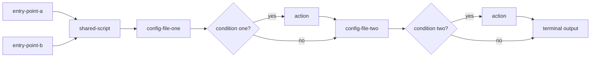

# Infra README Standards

Conventions for a script-group directory's own `README.md` — what belongs in it, how its `## Flow`
section diagrams the sequence between files, and how the root `scripts/README.md` differs from a
single directory's own README. Sibling to `infra-doc-standards` (file-level and per-function header
conventions for the files themselves) — that skill's "⛔ One fact, one canonical home" rule is the
governing principle both header and README placement decisions defer to; this skill never restates
it, only applies it. Distinct from `doc-standards` (which covers documentation about the
Java/Vaadin application itself: `README.md`, `CLAUDE.md`, `DECISIONS.md`, `docs/architecture/*`,
`docs/ai/*`).

## README — what the tool is, why we use it

Every script-group directory's `README.md` opens with a short paragraph (a few sentences) naming
the real external tool the directory wraps and, when relevant, why this project uses it — before
the `## Flow` section, not folded into it (`Flow` covers the file-to-file sequence, not what the
tool itself is or why it's in this project).

Example:

> SonarQube is a static-analysis tool that scans the codebase for bugs, code smells, and security
> vulnerabilities, enforcing a quality gate on every run. This project runs it locally in an
> isolated Docker container instead of a hosted SonarCloud instance, so results stay available
> offline and the quality gate can block a local run without depending on an external service.

## README "Flow" section

Every script-group directory's `README.md` gets a `## Flow` section covering the sequence between
files — not what each file does on its own (that's the file's own header, see
`infra-doc-standards`).

1. **Entry point(s) — named explicitly, and only if they actually belong to this directory.**
   State which file(s) actually trigger the flow. A directory can have more than one real entry
   point (e.g. an OS-specific pair like `run.sh`/`run.bat`, or a script meant to be run manually
   vs. one invoked automatically by CI) — list all of them, never assume there's exactly one. But
   an entry point is a dedicated wrapper whose own sole purpose is invoking this directory's
   logic — not any external, independent script (living elsewhere, with its own separate purpose)
   that merely calls into this directory as one step of its own larger flow. The latter is not
   this directory's concern to document at all — it never appears in this directory's own Flow
   section, not even as a prose note naming it; if that external script wants to document its own
   dependency on this directory, that's its own README's job, not this one's.
2. A command block showing how to invoke each entry point.
3. One or two sentences of context for *why* there's branching worth diagramming — not a
   restatement of any single file's own `Description`.
4. One or more Mermaid `flowchart` diagrams of the real file-to-file call chain — however many it
   actually takes to represent it accurately, never forced to a fixed count. Decision diamonds are
   used only for a condition that determines which *other file* gets touched or how — not for a
   single file's own internal control flow (a retry/wait loop that never reaches out to another
   file stays out of the diagram, it's that file's own `Outputs`/`Returns` detail). The specific
   shapes below (how many entry points, whether they converge into one diagram or split into
   several) are examples of how this plays out for real directories in this repo — not an
   exhaustive rulebook; judge each directory's own actual call graph on its own terms.
   - One entry point → one diagram.
   - Multiple entry points that converge quickly into the same shared logic (e.g. an OS-specific
     pair like `run.sh`/`run.bat`) → one diagram, each entry point as its own starting node,
     feeding into the shared flow.
   - Multiple entry points leading to genuinely different flows (little/no shared logic) →
     separate diagrams, one per entry point — don't force unrelated flows into one picture.
5. **Every file in the directory gets traced for its real behavior, not assumed.** Before drawing
   an arrow, check the actual code: does another file read this one conditionally, write to it, or
   modify it under some condition? If yes, that's a decision diamond on the diagram, not a plain
   arrow — skipping this check produces a diagram that looks complete but silently omits real
   behavior.
6. **Diagram order reflects real chronological execution, not grouping by file.** If a file is
   touched at two separate points in the real sequence with something else happening in between,
   draw it as two separate touches in that real order — don't merge them into one box just because
   it's the same file. Grouping by file instead of by real execution order produces a diagram that
   looks tidy but misrepresents when things actually happen.
7. **Every path ends at a real terminus, never a placeholder dead end.** A decision's `no`/false
   branch flows directly into whatever real step happens next — never into a vague box like
   "continue" that goes nowhere on the diagram. The diagram's own last node is the entry point's
   real output (the same fact already stated in that file's own `Outputs` field) — so every path a
   reader's eye can follow actually arrives somewhere concrete.

### Why Mermaid, not a hand-rolled notation

ISO/ANSI define standard flowchart symbols for exactly this purpose — oval (start/end), rectangle
(process step), diamond (decision), parallelogram (input/output), arrow (direction) — this is an
established visual vocabulary, not a house style invented for this repo. Mermaid.js is the standard
text-based implementation of these symbols for technical documentation, with native support for
labeled conditional branches. GitHub has rendered Mermaid natively (a fenced ` ```mermaid ` block,
no build step, no external service) across READMEs/issues/PRs/wikis since 2022 — and this repo
already uses Mermaid elsewhere (Database ERD, Sequence Diagrams on `architecture-map.html`), so this
isn't a new tool being introduced. Caveat: outside GitHub (an npm/PyPI page, a static site generator,
a PDF export) a Mermaid block falls back to a plain code block — not universal everywhere, but
correct on GitHub, where this repo is actually hosted and read.

### Decision diamond labeling — ISO 5807

Every decision diamond follows [ISO 5807](https://www.conceptdraw.com/How-To-Guide/flowchart-symbols)'s
convention exactly: the diamond node itself states the question/condition; only the arrows leaving
the diamond carry a label (`yes`/`no`), with at least two outgoing paths, one per outcome. A plain
process arrow (unconditional, between two non-decision nodes) never carries a label — labels exist
only to distinguish a decision's own outcomes, nowhere else in the diagram.

Example:



### Choosing direction, keeping labels compact

Mermaid has no built-in way to wrap a flowchart across multiple rows the way text wraps — a long
`LR` chain with several decision diamonds just keeps growing wider until it needs a scrollbar. Two
real levers instead of that: pick `TD` (top-down) when a diagram has more decision diamonds than
straight-line steps — vertical growth reads better than an ever-widening horizontal chain; and keep
node/diamond label text short, using `<br/>` to force a line break inside a label rather than
letting one long line dictate the whole node's width — a diamond in particular grows fastest of any
node shape as its label gets longer, since the shape needs extra padding at its own corners to stay
readable.

## The root `scripts/README.md` — a different shape from a script-group's own README

Every rule above (`README — what the tool is`, `README "Flow" section`) describes a single
script-group's own `README.md` (e.g. a tool-wrapping directory's own file) — one directory, one
real chain of files. The root `scripts/README.md` sits one level above all of them and has a
different job: list every real entry point across the whole tree, not diagram any one chain.

- **List every entry point**, whether it delegates into a subfolder of its own, a differently-named
  directory elsewhere in the repo, an existing directory another entry point already owns, or is
  genuinely self-contained with no delegation at all.
- **Classify each entry point by reading its actual body**, never by naming convention or by
  whether a same-named subfolder happens to exist — a real entry point can delegate into a
  differently-named directory, which a naming-based check would silently miss.
- **Description stays concise and abstract, never duplicating a file's own header `Description`
  field** (see `infra-doc-standards`'s "One fact, one canonical home" rule) — the architecture-map
  generator already surfaces that field directly.
- **If an entry point delegates**, state only where its real logic lives — no diagram at this
  level; the diagram belongs to whichever level actually owns the branching logic.
- **If an entry point is genuinely self-contained**, no diagram either — there's nothing to chain.
- The same shape applies recursively wherever a directory nests further — never force a diagram
  onto a level that doesn't own real branching.

When "run the skill over `scripts/`" is invoked, verification (reading a referenced file to
cross-check what a root-level entry point claims about it) may reach into `scripts/`'s own
nested subdirectories (`scripts/sonar/`, `scripts/ci/`, etc.) and into `playwright/` — a sibling
top-level directory `scripts/playwright.sh` directly delegates into, tightly coupled enough to
treat the same way as a nested subdirectory for this purpose. Any other directory an entry point
references (e.g. `docs/architecture/scripts/`, `architecture-doc.sh`'s target) stays out of
reach even for verification — take that entry point's own header claim at face value, don't open
the target file to cross-check it; that directory's own accuracy is its own future skill run's
job, not this one's. This is a read/verify allowance only — it does not extend *editing* rights;
fixing a file inside `scripts/sonar/` still requires its own separate "run the skill over
`scripts/sonar/`" invocation, per "In scope" below.

### Nested library/support folders — never a script-group, always get a minimal README

A subdirectory whose own files are never entry points themselves — only `source`d/imported/called
by other files, whether from just one script-group (e.g. `scripts/ci/dagu/`, workflow-definition
content nested inside the `ci` group) or shared across several (e.g. `scripts/utils/`, sourced by
`ci`/`deploy-and-run`/`sonar` alike) — is never itself a script-group in the sense the rest of this
document uses, no matter how deep it nests. It still gets its own `README.md`, but a short one:
context genuinely unique to this folder (e.g. the threshold rule for when something is extracted
here at all) — never a list or table of the files themselves, which adds nothing beyond what's
already visible from the directory listing itself (and already surfaced automatically by
`docs/architecture/scripts/generate-architecture-model.sh`'s own file scan). Never a column or
sentence describing what a file does or provides — that's the file's own header's job regardless of
how brief the wording. "Who calls/sources this file" is a fact about the *caller*, not about the
shared file — it belongs in each real caller's own `Uses`/`Input` field (e.g. every one of
`scripts/utils/ensure-docker-plugins.sh`'s real callers states in its own header that it sources
that file), never in the shared file's own header and never listed in this directory's README.
Never a `## Flow` section, since there's no entry-point chain to diagram.

## ⛔ Applying this standard — what "run the skill over a directory" means

Running this skill against a directory means: every file in scope already has a complete,
accurate header (per `infra-doc-standards` — run that skill first if it hasn't been), then
regenerate that directory's `README.md` from the now-finished file headers (a rewrite, not a
piecemeal edit). File-then-README order and the no-duplication rule follow `infra-doc-standards`'s
"One fact, one canonical home" rule. Everything in scope is brought into full compliance with the
standard described in this document — the `README.md` Flow section, everything — not a partial
pass. There is no "is this file already compliant" tracking inside this skill itself; that's a
per-run decision, made when the skill is actually invoked, not a state this document maintains.

This applies to every pre-existing line in `README.md`, not only newly-noticed gaps — pre-existing
content earns no presumption of compliance just because it predates this run; every line, old or
new, is re-derived from the finished file headers and re-tested against `infra-doc-standards`'s
"One fact, one canonical home" rule before being kept.

"In scope" means the invoked directory only — a run scoped to one directory (e.g. "run the skill
over scripts/sonar/") fixes only `README.md` content inside that directory, never a stale
reference, gap, or unrelated finding noticed in some other file while working, even one immediately
adjacent (a parent's README, a sibling script-group). Report it instead of fixing it inline —
propose appending it to this project's standing deferred-findings bucket (see `.claude/rules.md`'s
"Out-of-scope-but-valid findings" section for where and how) rather than only stating it in chat,
so the finding survives past this conversation instead of being lost once the session ends. Scope
creep beyond the invoked directory is not "thoroughness," it's an unbounded task turning into a
different, unapproved one.

## After deleting a file, sweep the in-scope directory for remaining references to it

Whenever a file is deleted as part of applying this skill to a directory, that same directory's
own `README.md` gets checked for a leftover reference to the deleted file (a Flow-diagram node, an
entry-point mention) before the pass is considered complete — a stale reference to a file that no
longer exists is exactly the kind of drift this skill exists to prevent, and deleting the file
itself is the one moment that reference is guaranteed to go stale.

## ⛔ Aggregated cross-file facts get verified by search, never by memory of what was already read

Any README content that aggregates a fact across many files (a reference table of containers,
volumes, entry points, env vars -- anything collected "from everything in this directory/tree")
must be verified complete by an actual search (grep or equivalent) across the real files at the
moment of writing it -- never assembled from memory of files already read earlier in the same
session. A file read once, then not re-checked, is exactly how a real container/volume/entry
point gets silently dropped from an aggregate table. This applies regardless of how recently or
how thoroughly those files were read.

## Independent review — verify docs actually cover the script's real capabilities

After applying this standard to a directory, spawn a fresh agent (no prior context of this
conversation) to independently re-read the actual script files and the resulting `README.md`
content, and report back whether the written documentation actually covers everything the script
really does — every flag, every conditional branch, every real side effect. Catches the class of
gap a same-context self-review misses (a real fact left out of the Flow section) precisely because
the reviewer starts cold, from the real files, not from what was already believed to be true while
writing.

Also verify placement, not just accuracy: for every fact in `README.md`, confirm it could not be
answered by reading a single file's own header alone. A README sentence that duplicates a file
header — even if factually correct — is itself a finding to report, per `infra-doc-standards`'s
"One fact, one canonical home" rule.
