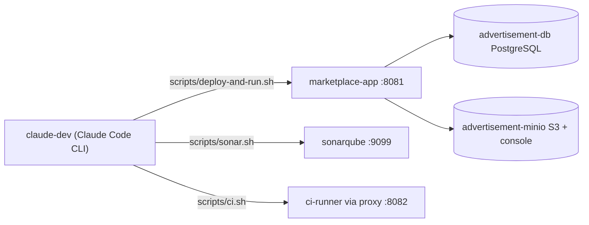

# Infrastructure

Technical infrastructure overview for the Advertisement Platform — how to run it, the services it
depends on, and the environment it expects. See [README.md](README.md) for what the project is.

---

## AI Development Environment

This project is built and maintained with [Claude Code](https://claude.com/claude-code) as an
active part of the engineering process. Claude runs inside its own Docker container, isolated
from the host — normally the first thing to bring up.

| | |
|---|---|
| Container | `claude-dev` |
| Image | `claude-j25-dev` (built from [`Dockerfile.ai`](Dockerfile.ai)) |
| Mounts | project directory, a per-login `.claude` auth config folder, the host's Maven cache (`~/.m2`), the Docker socket |

```bat
scripts\claude.bat your.email@gmail.com            REM start (or reuse) the container
scripts\claude.bat your.email@gmail.com --update   REM rebuild the image from Dockerfile.ai first
scripts\claude.bat your.email@gmail.com --recreate REM force a fresh container
```

Chat history and project context are shared across accounts (same mounted project directory);
only the auth config folder is per-account, so switching accounts on rate limits keeps the
conversation going.

Once inside, Claude drives every other block on this page via the scripts under `scripts/` and
the slash commands under `.claude/commands/` — see
[`docs/architecture/architecture-map.html`](docs/architecture/architecture-map.html)'s own Tooling
& Pipelines screen for the full, always-current command/skill/agent list with descriptions, not
restated here.

---

## Starting the Application

**Recommended path:** `bash scripts/deploy-and-run.sh` — reuses
[`scripts/build-and-test.sh`](scripts/build-and-test.sh)'s shared build, starts DB + MinIO + the
app, and waits for a real startup signal before returning.

| | |
|---|---|
| Container | `marketplace-app` |
| App URL | [http://localhost:8081](http://localhost:8081) |
| REST API docs (Swagger UI) | [http://localhost:8081/swagger-ui/index.html](http://localhost:8081/swagger-ui/index.html) — spec JSON at `/v3/api-docs` |

```bash
bash scripts/deploy-and-run.sh                  # reuse the shared build, start everything
bash scripts/deploy-and-run.sh --reset          # wipe DB/MinIO volumes, then rebuild
bash scripts/deploy-and-run.sh --restart-infra  # restart DB + MinIO only
bash scripts/deploy-and-run.sh --from-scratch   # build a real, separately tagged image
```

Windows: `scripts\deploy-and-run.bat` (same flags, WSL under the hood).

**Dev mode (run from an IDE instead):** start only the infrastructure, then run the app from your
IDE with the `dev` Spring profile active — connects to `localhost:5432`/`localhost:9000`, app on
[http://localhost:8080](http://localhost:8080).

```bash
docker-compose -f scripts/deploy-and-run/docker-compose.db.yml -f scripts/deploy-and-run/docker-compose.minio.yml up -d
```

See [`scripts/README.md`](scripts/README.md) and [`scripts/CLAUDE.md`](scripts/CLAUDE.md) for every
flag and the raw
[`docker-compose.app.yml`](scripts/deploy-and-run/docker-compose.app.yml) alternative (port 8080,
no caching/pruning support).

---

## Local Services

| Service | Container | Local link | Solves |
|---|---|---|---|
| PostgreSQL | `advertisement-db` | `localhost:5432` | application database |
| MinIO (S3-compatible storage) | `advertisement-minio` | [console: localhost:9001](http://localhost:9001) (`admin`/`admin12345`) · API: `localhost:9000` | photo/attachment storage, emulates Supabase Storage |
| Application | `marketplace-app` | [localhost:8081](http://localhost:8081) | the app itself |
| SonarQube | `sonarqube` | [localhost:9099](http://localhost:9099) | static analysis / quality gate dashboard |
| Dagu (local CI) | `ci-runner` + `ci-runner-dagu-proxy` | [localhost:8082](http://localhost:8082) | isolated CI pipeline UI (unit/integration/e2e/sonar run history) |



## Quickstart — start everything

| Step | Linux / WSL | Windows |
|---|---|---|
| 1. AI dev container | — | `scripts\claude.bat your.email@gmail.com` |
| 2. DB + MinIO + app | `bash scripts/deploy-and-run.sh` | `scripts\deploy-and-run.bat` |
| 3. SonarQube analysis + dashboard | `bash scripts/sonar.sh` | `scripts\sonar.bat` |
| 4. Isolated CI pipeline + Dagu UI | `bash scripts/ci.sh` | `scripts\ci.bat` |
| 5. End-to-end tests against the running app | `bash scripts/playwright.sh` | `scripts\playwright.bat` |

Every `.bat` entry point delegates to the same `.sh` script via WSL — same flags, same behavior.

Running `deploy-and-run.sh`/`.bat` then `playwright.sh`/`.bat` is already a complete, working test
environment — real Postgres, real MinIO, a real production-mode build, and a full browser-driven
end-to-end suite — with no extra setup.

To reset application data without restarting anything: `bash scripts/reset.sh` /
`scripts\reset.bat` (truncates all tables via `scripts/deploy-and-run/reset.sh`, ~1s, doesn't touch
MinIO volumes).

---

## Environment Variables

Key variables used by the application.
* For **local Docker testing**, configure them in `scripts/deploy-and-run/docker-compose.app.yml`.
* For **production**, set them directly in the hosting provider's dashboard/secrets manager.

| Variable | Description | Example |
|---|---|---|
| `DB_HOST` | PostgreSQL host | `db` / a managed Postgres hostname |
| `DB_PORT` | PostgreSQL port | `5432` |
| `DB_NAME` | Database name | `experiments` |
| `DB_USER` | Database user | `experiments_user` |
| `DB_PASSWORD` | Database password | — |
| `DB_SSL_PARAMS` | Optional SSL query params | `?sslmode=require` |
| `S3_ENDPOINT` | S3-compatible storage endpoint | `http://minio:9000` |
| `S3_BUCKET` | Bucket name | `advertisement` |
| `S3_ACCESS_KEY` | S3 access key | — |
| `S3_SECRET_KEY` | S3 secret key | — |
| `S3_REGION` | S3 region | `us-east-1` / `auto` |
| `S3_PUBLIC_URL` | Public base URL for file access | `http://localhost:9000/advertisement` |
| `APP_PUBLIC_URL` | Public base URL of the app itself — used to build absolute deep-link/OG/sitemap URLs | `http://localhost:8080` |

---

## Running Without Docker

Requires a running PostgreSQL instance and a running MinIO instance (or any S3-compatible storage)
matching the
[`application-dev.yml`](marketplace-app/src/main/resources/application-dev.yml) config.

```bash
git clone https://github.com/OstMutant/Advertisement.git
cd Advertisement
./mvnw spring-boot:run -Dspring-boot.run.profiles=dev
```
