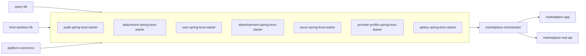

# Advertisement Platform

**Java 25 · Spring Boot 4.1 · Vaadin 25 · PostgreSQL · S3 · Playwright · Testcontainers**

[Architecture](#architectural-principles) · [Module Docs](#module-layout) · [Testing Strategy](#testing-strategy)

---

## Quick Start

```
bash scripts/deploy-and-run.sh
```

Builds and starts the full stack (Postgres, MinIO/S3, the app). The app comes up at
**http://localhost:8081** with an empty catalog — sign up to create an account; the **first
account ever registered is automatically promoted to Admin**, no seed credentials needed. The REST
API's interactive docs are at `http://localhost:8081/swagger-ui/index.html`. Full setup details
(Docker Compose stack, env vars, running without Docker): [INFRASTRUCTURE.md](INFRASTRUCTURE.md).

---

## What is it?

A service marketplace: users publish listings, browse and filter a shared catalog, and
administrators moderate everything through a full audit trail with field-level change history and
restore. Built as a real, working system — not a toy example — so every module also demonstrates
one specific engineering pattern applied to an actual feature: SPI-based module decoupling,
immutable audit snapshots, optimistic concurrency, hand-written SQL with no ORM.

---

## What can you do in it?

- **Advertisements** — create/manage listings with rich HTML descriptions (sanitized
  server-side), photos and video; browse the shared catalog with dynamic filter/sort/pagination
  by category, city, and listing type; ownership checks, soft delete + restore, optimistic
  locking.
- **Users** — sign up (rate-limited), manage account settings (locale, page sizes), edit or
  restore a profile; role-based access (Admin/Moderator/User).
- **Taxonomy** — categories/tags with per-locale translations, soft-deletable, many-to-many
  assignment to any entity type; admins manage categories and taxonomy directly.
- **Attachments** — photo/video uploads to S3-compatible storage, YouTube embeds, media history
  for restore.
- **Audit trail** — every domain write captured as a versioned snapshot; admins/moderators review
  every change through a per-entity activity timeline with field-level diffs, restore prior
  versions.
- **i18n** — English/Ukrainian, enum-based translation keys (missing keys fail fast, never a
  silent fallback).
- **Deep links & rich previews** — share a listing link with a rich social-media preview (Open
  Graph, JSON-LD) for social/search previews.
- **External REST API** — a separate, non-Vaadin delivery channel over the same orchestrator,
  API-key authenticated, with interactive Swagger docs.

---

## If you have 5 minutes

- [`AuthorizationService`](marketplace-orchestrator/src/main/java/org/ost/orchestrator/services/AuthorizationService.java) /
  [`AccessEvaluator`](marketplace-app/src/main/java/org/ost/marketplace/services/security/AccessEvaluator.java) —
  the authorization model.
- [`SqlCondition`](query-lib/src/main/java/org/ost/query/filter/SqlCondition.java) /
  [`OrderByBuilder`](query-lib/src/main/java/org/ost/query/sort/OrderByBuilder.java) in
  `query-lib` — hand-written SQL filtering/sorting, no ORM.
- [`backlog/BACKLOG.md`](backlog/BACKLOG.md) + any file under `backlog/tasks/` — technical debt is
  tracked as real, dated, self-correcting entries, not a vague TODO list (see "Technical debt
  tracking" below).
- [`06-seed-filter-sort-pagination.spec.js`](playwright/e2e/06-seed-filter-sort-pagination.spec.js) —
  one representative Playwright spec, real browser-driven flow.

---

## Technical debt tracking

Every known gap, deferred decision, and follow-up is a dated entry in
[`backlog/BACKLOG.md`](backlog/BACKLOG.md), ranked and cross-linked to a full write-up under
`backlog/tasks/`. Resolved items move to `backlog/completed/tasks/` with their real outcome
recorded — including cases where the original plan turned out wrong and was corrected in place.
This is one of the project's more unusual artifacts: a running, honest record of what's actually
still rough, not just what shipped.

---

## About

This is not a finished product — there is no fixed public feature roadmap, and the product side
keeps evolving. The engineering foundation underneath it is the actual point of the project:
- explicit control over data flow and SQL
- composable abstractions without framework magic
- clear responsibility boundaries between layers

---

## Architectural Principles

**Explicit over implicit** — No ORM, no JPA; all SQL is written manually via Spring JDBC, no
hidden query generation or implicit persistence behavior.

**Immutable data flow** — Entities and DTOs are immutable value objects, so state doesn't leak
across layers through shared references. Every domain write is captured as an immutable, versioned
snapshot rather than a mutable log line — snapshots are diffed at read time into a field-level
activity timeline, so "what changed" is derived from real before/after state instead of
hand-maintained.

**Optimistic concurrency** — `Advertisement`, `Taxon`, and `User` updates carry a `version`
column; a stale write is rejected with `StaleWriteException` instead of silently
overwriting a concurrent change.

**UI as a thin adapter** — Vaadin handles layout and interaction wiring only, no business logic
lives inside UI components.

**Declarative where it matters** — Validation rules, localization keys, and filter definitions are
expressed declaratively and kept strongly typed.

**Attachment lifecycle** — uploads go to S3-compatible storage with transactional metadata (a
failed post-save step rolls back the DB row, verified by a real-transaction Testcontainers test),
scheduled cleanup of orphaned objects, snapshot-based restore, and audit integration.

**Testing** — three layers, each catching a different class of regression: plain JUnit for pure
logic, Testcontainers-backed repository tests against a real Postgres for SQL correctness, and
Playwright for full browser-driven end-to-end flows.

---

## Module Layout



`platform-commons`/`query-lib`/`html-sanitizer-lib` are the shared foundation every starter
depends on; each domain starter owns one bounded context; `marketplace-orchestrator` composes
cross-domain use cases for both delivery channels — `marketplace-app` (Vaadin UI) and
`marketplace-rest-api` (external REST API). `integration-tests` (Testcontainers repository tests,
test-only, not shown above) depends on every starter without any of them depending on it back.

Per-module documentation:

| Module | README | Decisions |
|---|---|---|
| query-lib | [README](query-lib/README.md) | [DECISIONS](query-lib/DECISIONS.md) |
| html-sanitizer-lib | [README](html-sanitizer-lib/README.md) | [DECISIONS](html-sanitizer-lib/DECISIONS.md) |
| platform-commons | — | [DECISIONS](platform-commons/DECISIONS.md) |
| audit-spring-boot-starter | [README](audit-spring-boot-starter/README.md) | [DECISIONS](audit-spring-boot-starter/DECISIONS.md) |
| attachment-spring-boot-starter | [README](attachment-spring-boot-starter/README.md) | [DECISIONS](attachment-spring-boot-starter/DECISIONS.md) |
| user-spring-boot-starter | [README](user-spring-boot-starter/README.md) | — |
| advertisement-spring-boot-starter | [README](advertisement-spring-boot-starter/README.md) | — |
| taxon-spring-boot-starter | — | [DECISIONS](taxon-spring-boot-starter/DECISIONS.md) |
| provider-profile-spring-boot-starter | — | [DECISIONS](provider-profile-spring-boot-starter/DECISIONS.md) |
| apikey-spring-boot-starter | [README](apikey-spring-boot-starter/README.md) | [DECISIONS](apikey-spring-boot-starter/DECISIONS.md) |
| integration-tests | [README](integration-tests/README.md) | [DECISIONS](integration-tests/DECISIONS.md) |
| marketplace-orchestrator | — | [DECISIONS](marketplace-orchestrator/DECISIONS.md) |
| marketplace-rest-api | [README](marketplace-rest-api/README.md) | [DECISIONS](marketplace-rest-api/DECISIONS.md) |
| marketplace-app | [README](marketplace-app/README.md) | [DECISIONS](marketplace-app/DECISIONS.md) |
| playwright | [README](playwright/README.md) | [DECISIONS](playwright/DECISIONS.md) |
| scripts | [README](scripts/README.md) | [DECISIONS](scripts/DECISIONS.md) |

---

## Key Technical Decisions

| Decision | Reason |
|---|---|
| Spring JDBC over JPA | Full control over queries, no hidden side effects |
| Composable filter model | Type-safe, reusable query logic without ORM abstractions |
| Immutable entities (`@Value` + `@Builder`) | Predictable state, no accidental mutation |
| Enum-based i18n keys | Compile-time safety for localization strings |
| Rule-oriented validation | Validation logic isolated from UI and service layers |
| SPI extension pattern | Starters extend app behaviour without knowing each other |

---

## Testing Strategy

Three independent layers, each targeting a different failure mode:

| Layer | Tool | What it catches |
|---|---|---|
| Unit | Plain JUnit 5 (+ Mockito) | Pure logic regressions — no Docker, no database |
| Integration | JUnit 5 + Testcontainers (real Postgres) | SQL correctness — filters, sorts, pagination, optimistic locking, real Liquibase schema |
| End-to-end | Playwright | Full browser-driven flows across the actual Vaadin UI, including auth, CRUD, media, and the audit timeline |

See [Module Layout](#module-layout) above for each layer's own README/DECISIONS, or
[INFRASTRUCTURE.md](INFRASTRUCTURE.md) for the exact commands to run each layer.

---

## Roadmap

Actively evolving on both sides: the engineering foundation keeps absorbing new patterns
(the audit/attachment/taxon/provider-profile/apikey starters, the external REST API adapter,
Testcontainers-based integration tests, and the isolated local CI runner are all recent
additions), and the product surface keeps growing on top of it. Architectural decisions may be
revisited and implementations replaced — that's the point of treating this as a playground, not a
frozen codebase.

Planned directions:
- Extend rule-based validation capabilities
- Improve composability of the generic filtering layer
- REST hypermedia (HATEOAS) and `PATCH` support for the external API
- Broaden the marketplace's public-facing feature set (provider profiles, richer discovery)

---

## Author's Note

Built to be understood, not just used. Feedback and architectural discussions are welcome.
