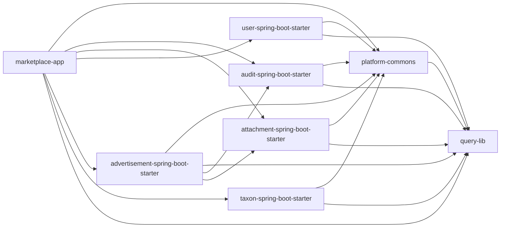

# Module Dependencies

## Overview

Maven dependency graph for all 8 modules in the marketplace monolith. Each node represents a module; arrows show `<dependency>` directives in pom.xml.

## Dependency Graph

## Dependency Table

| Module | Dependencies | Scope |
|--------|--------------|-------|
| **query-lib** | platform-commons | compile |
| **platform-commons** | (none - foundation) | - |
| **audit-spring-boot-starter** | platform-commons, query-lib | compile |
| **attachment-spring-boot-starter** | platform-commons, query-lib | compile |
| **user-spring-boot-starter** | platform-commons, query-lib | compile |
| **advertisement-spring-boot-starter** | platform-commons, query-lib, audit (optional), attachment (optional) | compile; optional for audit/attachment |
| **taxon-spring-boot-starter** | platform-commons, query-lib | compile |
| **marketplace-app** | All starters + query-lib; taxon as runtime scope | compile (all starters except taxon), runtime (taxon) |

## Key Observations

1. **Shared Kernel:** `platform-commons` is the foundation — no module depends on any other module except via platform-commons SPI contracts.

2. **Starter Independence:** Each starter (audit, attachment, user, advertisement, taxon) is self-contained and can be deployed independently.

3. **Optional Dependencies:** `advertisement-spring-boot-starter` declares audit and attachment as `<optional>true</optional>` — it can run without them.

4. **Query Library:** `query-lib` is a pure utility library (no Spring Boot autoconfiguration) that provides SQL filtering and sorting helpers.

5. **No Circular Dependencies:** All edges are acyclic — the dependency graph forms a DAG.

6. **Marketplace App Dependency:** The main application depends on all starters, composing the full feature set.

## Module Versions

All modules are siblings with the same version: `0.0.1-SNAPSHOT`

Parent POM: `/app/pom.xml` (advertisement-parent)
