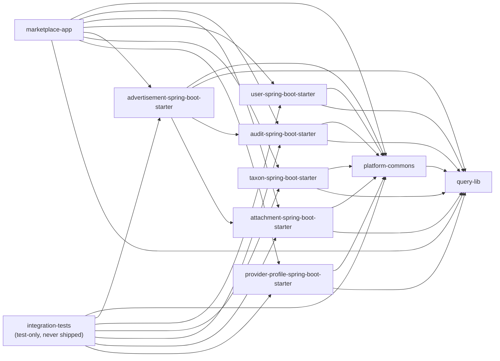

# Module Dependencies

## Overview

Maven dependency graph for all 10 modules in the marketplace monolith. Each node represents a module; arrows show `<dependency>` directives in pom.xml.

## Dependency Graph

```mermaid
graph LR
    QL["query-lib"]
    PC["platform-commons"]
    AUD["audit-spring-boot-starter"]
    ATT["attachment-spring-boot-starter"]
    USR["user-spring-boot-starter"]
    ADV["advertisement-spring-boot-starter"]
    TAX["taxon-spring-boot-starter"]
    PROV["provider-profile-spring-boot-starter"]
    APP["marketplace-app"]
    IT["integration-tests<br/>(test-only, never shipped)"]

    PC --> QL
    AUD --> PC
    AUD --> QL
    ATT --> PC
    ATT --> QL
    USR --> PC
    USR --> QL
    ADV --> PC
    ADV --> QL
    ADV --> AUD
    ADV --> ATT
    TAX --> PC
    TAX --> QL
    PROV --> PC
    PROV --> QL
    APP --> PC
    APP --> AUD
    APP --> ATT
    APP --> USR
    APP --> ADV
    APP --> TAX
    APP --> PROV
    APP --> QL
    IT --> PC
    IT --> ADV
    IT --> USR
    IT --> TAX
    IT --> AUD
    IT --> ATT
    IT --> PROV
```

## Dependency Table

| Module | Dependencies | Scope |
|--------|--------------|-------|
| **query-lib** | platform-commons | compile |
| **platform-commons** | (none - foundation) | - |
| **audit-spring-boot-starter** | platform-commons, query-lib | compile |
| **attachment-spring-boot-starter** | platform-commons, query-lib | compile |
| **user-spring-boot-starter** | platform-commons, query-lib | compile |
| **advertisement-spring-boot-starter** | platform-commons, query-lib, audit (optional), attachment (optional) | compile; optional for audit/attachment |
| **taxon-spring-boot-starter** | platform-commons, query-lib | compile |
| **provider-profile-spring-boot-starter** | platform-commons, query-lib | compile |
| **marketplace-app** | All starters + query-lib; taxon and provider-profile as runtime scope | compile (audit/attachment/user/advertisement/query-lib), runtime (taxon, provider-profile) |
| **integration-tests** | platform-commons, advertisement-spring-boot-starter, user-spring-boot-starter, taxon-spring-boot-starter, audit-spring-boot-starter, attachment-spring-boot-starter, provider-profile-spring-boot-starter; Testcontainers/Spring Boot test deps | compile — but the module itself is never shipped or deployed (see `integration-tests/CLAUDE.md`), so this does not count as a starter-to-starter dependency under the "no sibling imports" rule |

## Key Observations

1. **Shared Kernel:** `platform-commons` is the foundation — no module depends on any other module except via platform-commons SPI contracts.

2. **Starter Independence:** Each starter (audit, attachment, user, advertisement, taxon, provider-profile) is self-contained and can be deployed independently.

3. **Optional Dependencies:** `advertisement-spring-boot-starter` declares audit and attachment as `<optional>true</optional>` — it can run without them.

4. **Query Library:** `query-lib` is a pure utility library (no Spring Boot autoconfiguration) that provides SQL filtering and sorting helpers.

5. **No Circular Dependencies:** All edges are acyclic — the dependency graph forms a DAG.

6. **Marketplace App Dependency:** The main application depends on all starters, composing the full feature set.

7. **Test-Only Reactor Member:** `integration-tests` is the sole module allowed to depend on more than one domain starter at once (`advertisement-`, `user-`, `taxon-`, `audit-`, `attachment-`, `provider-profile-spring-boot-starter` today) — a real, `compile`-scope Maven dependency, not SPI-mediated. This is safe only because the module is never shipped, deployed, or depended upon by anything else (a leaf with zero inbound edges) — see `integration-tests/CLAUDE.md` for the full rationale and why this doesn't violate "starters must not depend on each other."

## Module Versions

All modules are siblings with the same version: `0.0.1-SNAPSHOT`

Parent POM: `/app/pom.xml` (advertisement-parent)
