# SPI Map — Extension Points & Implementation

## Overview

All cross-module extension points (Ports and Hooks) live in `platform-commons` to decouple starters from marketplace-app. Suffixes encode call direction:
- `*Port`: marketplace → starter (marketplace calls the starter)
- `*Hook`: starter → marketplace (starter calls back to marketplace)

## SPI Dependency Graph

```mermaid
graph TD
    subgraph PC["platform-commons"]
        AuditPort["AuditPort<br/>(audit.spi)"]
        AuditDomainHook["AuditDomainHook<br/>(audit.spi)"]
        AuditActivityFieldsHook["AuditActivityFieldsHook<br/>(audit.spi)"]
        AuditActivityEnrichHook["AuditActivityEnrichHook<br/>(audit.spi)"]
        
        AttachmentPort["AttachmentPort<br/>(attachment.spi)"]
        AttachmentMediaChangeHook["AttachmentMediaChangeHook<br/>(attachment.spi)"]
        AttachmentAuditHook["AttachmentAuditHook<br/>(attachment.spi)"]
        
        UserPort["UserPort<br/>(user.spi)"]
        UserSettingsChangedHook["UserSettingsChangedHook<br/>(user.spi)"]
        AuthenticatedPrincipal["AuthenticatedPrincipal<br/>(user.spi)"]
        
        AdvertisementPort["AdvertisementPort<br/>(advertisement.spi)"]
        
        CurrentActorHook["CurrentActorHook<br/>(core.spi)"]
        
        TaxonPort["TaxonPort<br/>(taxon.spi)"]
        TaxonAuditHook["TaxonAuditHook<br/>(taxon.spi)"]
    end
    
    subgraph AUD["audit-spring-boot-starter"]
        DefaultAuditPort["DefaultAuditPort<br/>(services)"]
    end
    
    subgraph ATT["attachment-spring-boot-starter"]
        DefaultAttachmentPort["DefaultAttachmentPort<br/>(spi)"]
        AttachmentAuditHookImpl["AttachmentAuditHookImpl<br/>(spi)"]
    end
    
    subgraph USR["user-spring-boot-starter"]
        UserPortImpl["UserPortImpl<br/>(spi)"]
    end
    
    subgraph ADV["advertisement-spring-boot-starter"]
        AdvertisementPortImpl["AdvertisementPortImpl<br/>(spi)"]
        MediaChangeHookImpl["MediaChangeHookImpl<br/>(spi)"]
    end
    
    subgraph TAX["taxon-spring-boot-starter"]
        DefaultTaxonPort["DefaultTaxonPort<br/>(services)"]
    end
    
    subgraph APP["marketplace-app"]
        CurrentActorHookImpl["CurrentActorHookImpl<br/>(spi)"]
        AuditDomainHookImpl["AuditDomainHookImpl<br/>(spi)"]
        AdvertisementActivityFieldsHookImpl["AdvertisementActivityFieldsHookImpl<br/>(spi)"]
        UserActivityFieldsHookImpl["UserActivityFieldsHookImpl<br/>(spi)"]
        UserSettingsActivityFieldsHookImpl["UserSettingsActivityFieldsHookImpl<br/>(spi)"]
        ActivityEnrichHookImpl["ActivityEnrichHookImpl<br/>(spi)"]
        TaxonAuditHookImpl["TaxonAuditHookImpl<br/>(spi)"]
        TaxonActivityFieldsHookImpl["TaxonActivityFieldsHookImpl<br/>(spi)"]
        SettingsPaginationService["SettingsPaginationService<br/>(pagination)"]
    end
    
    AuditPort -->|implemented by| DefaultAuditPort
    AuditDomainHook -->|implemented by| AuditDomainHookImpl
    AuditActivityFieldsHook -->|implemented by| AdvertisementActivityFieldsHookImpl
    AuditActivityFieldsHook -->|implemented by| UserActivityFieldsHookImpl
    AuditActivityFieldsHook -->|implemented by| UserSettingsActivityFieldsHookImpl
    AuditActivityFieldsHook -->|implemented by| TaxonActivityFieldsHookImpl
    AuditActivityEnrichHook -->|implemented by| ActivityEnrichHookImpl
    
    AttachmentPort -->|implemented by| DefaultAttachmentPort
    AttachmentAuditHook -->|implemented by| AttachmentAuditHookImpl
    AttachmentMediaChangeHook -->|implemented by| MediaChangeHookImpl
    
    UserPort -->|implemented by| UserPortImpl
    UserSettingsChangedHook -->|implemented by| SettingsPaginationService
    
    AdvertisementPort -->|implemented by| AdvertisementPortImpl
    
    CurrentActorHook -->|implemented by| CurrentActorHookImpl
    
    TaxonPort -->|implemented by| DefaultTaxonPort
    TaxonAuditHook -->|implemented by| TaxonAuditHookImpl
```



## SPI Interface Details

### Audit Subsystem

| Interface | Location | Direction | Implementation | Purpose |
|-----------|----------|-----------|-----------------|---------|
| **AuditPort** | `org.ost.platform.audit.spi` | marketplace → starter | `org.ost.audit.services.DefaultAuditPort` | Write/read audit entries; query snapshots; get entity activity & timeline. Methods: `captureCreation`, `captureUpdate`, `captureDeletion`, `captureRestore` (added for `ActionType.RESTORED`), `getSnapshotContent`, `getEntityActivity`, `getLastSnapshot`, `getTimelinePage`, `countTimeline` |
| **AuditDomainHook** | `org.ost.platform.audit.spi` | starter → marketplace | `org.ost.marketplace.spi.AuditDomainHookImpl` | Callback: marketplace tells audit module about owned domain events |
| **AuditActivityFieldsHook** | `org.ost.platform.audit.spi` | starter → marketplace | `AdvertisementActivityFieldsHookImpl`, `UserActivityFieldsHookImpl`, `UserSettingsActivityFieldsHookImpl`, `TaxonActivityFieldsHookImpl` | Callback: enrich audit activity with domain-specific field labels & descriptions. Each impl declares `entityType()` to register for a specific domain. |
| **AuditActivityEnrichHook** | `org.ost.platform.audit.spi` | starter → marketplace | `org.ost.marketplace.spi.ActivityEnrichHookImpl` | Callback: merge cross-cutting activity (e.g., media changes into advertisement activity) |

### Attachment Subsystem

| Interface | Location | Direction | Implementation | Purpose |
|-----------|----------|-----------|-----------------|---------|
| **AttachmentPort** | `org.ost.platform.attachment.spi` | marketplace → starter | `org.ost.attachment.spi.DefaultAttachmentPort` | Upload, delete, query, restore attachments; manage snapshots |
| **AttachmentMediaChangeHook** | `org.ost.platform.attachment.spi` | starter → marketplace | `org.ost.advertisement.spi.MediaChangeHookImpl` | Callback: attachment module notifies marketplace when media changes |
| **AttachmentAuditHook** | `org.ost.platform.attachment.spi` | starter → marketplace | `org.ost.attachment.spi.AttachmentAuditHookImpl` | Callback: attachment module requests audit records for media snapshots |

### User Subsystem

| Interface | Location | Direction | Implementation | Purpose |
|-----------|----------|-----------|-----------------|---------|
| **UserPort** | `org.ost.platform.user.spi` | marketplace → starter | `org.ost.user.spi.UserPortImpl` | CRUD users, query filters, get profile, update settings |
| **AuthenticatedPrincipal** | `org.ost.platform.user.spi` | type contract | `org.ost.user.security.UserPrincipal` | Spring Security principal; holds user identity & roles |
| **UserSettingsChangedHook** | `org.ost.platform.user.spi` | starter → marketplace | `org.ost.marketplace.ui.views.services.pagination.SettingsPaginationService` | Callback: marketplace notified when user settings change (pagination defaults reset) |

### Advertisement Subsystem

| Interface | Location | Direction | Implementation | Purpose |
|-----------|----------|-----------|-----------------|---------|
| **AdvertisementPort** | `org.ost.platform.advertisement.spi` | marketplace → starter | `org.ost.advertisement.spi.AdvertisementPortImpl` | CRUD advertisements, query filters, ownership checks, media notifications |

### Taxon (Reference Data) Subsystem

| Interface | Location | Direction | Implementation | Purpose |
|-----------|----------|-----------|-----------------|---------|
| **TaxonPort** | `org.ost.platform.taxon.spi` | marketplace → starter | `org.ost.taxon.services.DefaultTaxonPort` | Manage taxonomies (categories, tags); query; translations |
| **TaxonAuditHook** | `org.ost.platform.taxon.spi` | starter → marketplace | `org.ost.marketplace.spi.TaxonAuditHookImpl` | Callback: taxon module notifies marketplace of taxon changes for audit |

### Core / Platform

| Interface | Location | Direction | Implementation | Purpose |
|-----------|----------|-----------|-----------------|---------|
| **CurrentActorHook** | `org.ost.platform.core.spi` | starter → marketplace | `org.ost.marketplace.spi.CurrentActorHookImpl` | Callback: resolve the currently authenticated user from Spring Security context |

## Implementation Rules

All implementations follow these patterns:

### Port Implementation (`*PortImpl`, `Default*Port`)
- **Location:** Same module as the port interface
- **Pattern:** Pure delegation to service methods — no business logic
- **Example:** `org.ost.audit.services.DefaultAuditPort` delegates all methods to `AuditLogRepository`, `AuditReadService`, `AuditDiffService`

### Hook Implementation (`*HookImpl`)
- **Location:** Service module that implements the hook
- **Pattern:** Pure delegation to service methods — no business logic, no conditionals beyond entity-type routing
- **Example:** `org.ost.marketplace.spi.CurrentActorHookImpl` calls `AuthContextService.getCurrentActorId()`

## Call Flow Examples

### Example 1: Create Advertisement with Audit
```
marketplace-app (UI)
  → calls AdvertisementPort.save()
      ↓
  org.ost.advertisement.spi.AdvertisementPortImpl
      ↓
  org.ost.advertisement.services.AdvertisementService.save()
      ↓
  org.ost.audit.services.DefaultAuditPort.captureCreation()
      ↓
  org.ost.marketplace.spi.AuditDomainHookImpl.on(CREATED, ...)
      ↓
  marketplace-app (custom domain handlers)
```

### Example 2: Upload Media to Advertisement
```
marketplace-app (UI)
  → calls AttachmentPort.upload()
      ↓
  org.ost.attachment.spi.DefaultAttachmentPort
      ↓
  org.ost.attachment.services.AttachmentService.save()
      ↓
  calls AttachmentMediaChangeHook.onChange()
      ↓
  org.ost.advertisement.spi.MediaChangeHookImpl
      ↓
  updates advertisement media_count, media_url
```

### Example 3: Enrich Audit Activity
```
marketplace-app (viewing activity feed)
  → calls AuditPort.getEntityActivity()
      ↓
  org.ost.audit.services.DefaultAuditPort
      ↓
  calls AuditActivityFieldsHook.fields() for each activity item
      ↓
  org.ost.marketplace.spi.AdvertisementActivityFieldsHookImpl
      ↓
  returns field labels: "Title", "Description", etc.
```

## File Locations Summary

**Interfaces (platform-commons):**
- `/app/platform-commons/src/main/java/org/ost/platform/audit/spi/` — AuditPort, hooks
- `/app/platform-commons/src/main/java/org/ost/platform/attachment/spi/` — AttachmentPort, hooks
- `/app/platform-commons/src/main/java/org/ost/platform/user/spi/` — UserPort, hooks
- `/app/platform-commons/src/main/java/org/ost/platform/advertisement/spi/` — AdvertisementPort
- `/app/platform-commons/src/main/java/org/ost/platform/taxon/spi/` — TaxonPort, hooks
- `/app/platform-commons/src/main/java/org/ost/platform/core/spi/` — CurrentActorHook

**Port Implementations (starters):**
- `/app/audit-spring-boot-starter/src/main/java/org/ost/audit/services/DefaultAuditPort.java`
- `/app/attachment-spring-boot-starter/src/main/java/org/ost/attachment/spi/DefaultAttachmentPort.java`
- `/app/user-spring-boot-starter/src/main/java/org/ost/user/spi/UserPortImpl.java`
- `/app/advertisement-spring-boot-starter/src/main/java/org/ost/advertisement/spi/AdvertisementPortImpl.java`
- `/app/taxon-spring-boot-starter/src/main/java/org/ost/taxon/services/DefaultTaxonPort.java`

**Hook Implementations (marketplace-app):**
- `/app/marketplace-app/src/main/java/org/ost/marketplace/spi/CurrentActorHookImpl.java`
- `/app/marketplace-app/src/main/java/org/ost/marketplace/spi/AuditDomainHookImpl.java`
- `/app/marketplace-app/src/main/java/org/ost/marketplace/spi/AdvertisementActivityFieldsHookImpl.java`
- `/app/marketplace-app/src/main/java/org/ost/marketplace/spi/UserActivityFieldsHookImpl.java`
- `/app/marketplace-app/src/main/java/org/ost/marketplace/spi/UserSettingsActivityFieldsHookImpl.java`
- `/app/marketplace-app/src/main/java/org/ost/marketplace/spi/ActivityEnrichHookImpl.java`
- `/app/marketplace-app/src/main/java/org/ost/marketplace/spi/TaxonAuditHookImpl.java`
- `/app/marketplace-app/src/main/java/org/ost/marketplace/spi/TaxonActivityFieldsHookImpl.java`
- `/app/marketplace-app/src/main/java/org/ost/marketplace/ui/views/services/pagination/SettingsPaginationService.java`

**Hook Implementations (starters):**
- `/app/advertisement-spring-boot-starter/src/main/java/org/ost/advertisement/spi/MediaChangeHookImpl.java`
- `/app/attachment-spring-boot-starter/src/main/java/org/ost/attachment/spi/AttachmentAuditHookImpl.java`
