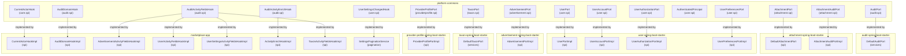

# SPI Map — Extension Points & Implementation

## Overview

All cross-module extension points (Ports and Hooks) live in `platform-commons` to decouple starters from marketplace-app. Suffixes encode call direction:
- `*Port`: marketplace → starter (marketplace calls the starter)
- `*Hook`: starter → marketplace (starter calls back to marketplace)

See `platform-commons/CLAUDE.md`'s "SPI Interface Naming" table for the authoritative direction/role definition of each suffix — not restated here.

## SPI Dependency Graph


```mermaid
graph TD
    subgraph PC["platform-commons"]
        AuditPort["AuditPort<br/>(audit.spi)"]
        AuditDomainHook["AuditDomainHook<br/>(audit.spi)"]
        AuditActivityFieldsHook["AuditActivityFieldsHook<br/>(audit.spi)"]
        AuditActivityEnrichHook["AuditActivityEnrichHook<br/>(audit.spi)"]

        AttachmentPort["AttachmentPort<br/>(attachment.spi)"]
        AttachmentAuditPort["AttachmentAuditPort<br/>(attachment.spi)"]

        UserPort["UserPort<br/>(user.spi)"]
        UserAccountPort["UserAccountPort<br/>(user.spi)"]
        UserAuthorizationPort["UserAuthorizationPort<br/>(user.spi)"]
        UserPreferencesPort["UserPreferencesPort<br/>(user.spi)"]
        UserSettingsChangedHook["UserSettingsChangedHook<br/>(user.spi)"]
        AuthenticatedPrincipal["AuthenticatedPrincipal<br/>(user.spi)"]

        AdvertisementPort["AdvertisementPort<br/>(advertisement.spi)"]

        CurrentActorHook["CurrentActorHook<br/>(core.spi)"]

        TaxonPort["TaxonPort<br/>(taxon.spi)"]

        ProviderProfilePort["ProviderProfilePort<br/>(providerprofile.spi)"]
    end

    subgraph AUD["audit-spring-boot-starter"]
        DefaultAuditPort["DefaultAuditPort<br/>(services)"]
    end

    subgraph ATT["attachment-spring-boot-starter"]
        DefaultAttachmentPort["DefaultAttachmentPort<br/>(spi)"]
        AttachmentAuditPortImpl["AttachmentAuditPortImpl<br/>(spi)"]
    end

    subgraph USR["user-spring-boot-starter"]
        UserPortImpl["UserPortImpl<br/>(spi)"]
        UserAccountPortImpl["UserAccountPortImpl<br/>(spi)"]
        UserAuthorizationPortImpl["UserAuthorizationPortImpl<br/>(spi)"]
        UserPreferencesPortImpl["UserPreferencesPortImpl<br/>(spi)"]
    end

    subgraph ADV["advertisement-spring-boot-starter"]
        AdvertisementPortImpl["AdvertisementPortImpl<br/>(spi)"]
    end

    subgraph TAX["taxon-spring-boot-starter"]
        DefaultTaxonPort["DefaultTaxonPort<br/>(services)"]
    end

    subgraph PROV["provider-profile-spring-boot-starter"]
        ProviderProfilePortImpl["ProviderProfilePortImpl<br/>(spi)"]
    end

    subgraph APP["marketplace-app"]
        CurrentActorHookImpl["CurrentActorHookImpl<br/>(spi)"]
        AuditDomainHookImpl["AuditDomainHookImpl<br/>(spi)"]
        AdvertisementActivityFieldsHookImpl["AdvertisementActivityFieldsHookImpl<br/>(spi)"]
        UserActivityFieldsHookImpl["UserActivityFieldsHookImpl<br/>(spi)"]
        UserSettingsActivityFieldsHookImpl["UserSettingsActivityFieldsHookImpl<br/>(spi)"]
        ActivityEnrichHookImpl["ActivityEnrichHookImpl<br/>(spi)"]
        TaxonActivityFieldsHookImpl["TaxonActivityFieldsHookImpl<br/>(spi)"]
        SettingsPaginationService["SettingsPaginationService<br/>(pagination)"]
    end

    AuditPort -->|implemented by| DefaultAuditPort
    AuditDomainHook -->|implemented by| AuditDomainHookImpl
    AuditActivityFieldsHook -->|implemented by| AdvertisementActivityFieldsHookImpl
    AuditActivityFieldsHook -->|implemented by| UserActivityFieldsHookImpl
    AuditActivityFieldsHook -->|implemented by| UserSettingsActivityFieldsHookImpl
    AuditActivityFieldsHook -->|implemented by| TaxonActivityFieldsHookImpl
    AuditActivityEnrichHook -->|implemented by| ActivityEnrichHookImpl

    AttachmentPort -->|implemented by| DefaultAttachmentPort
    AttachmentAuditPort -->|implemented by| AttachmentAuditPortImpl

    UserPort -->|implemented by| UserPortImpl
    UserAccountPort -->|implemented by| UserAccountPortImpl
    UserAuthorizationPort -->|implemented by| UserAuthorizationPortImpl
    UserPreferencesPort -->|implemented by| UserPreferencesPortImpl
    UserSettingsChangedHook -->|implemented by| SettingsPaginationService

    AdvertisementPort -->|implemented by| AdvertisementPortImpl

    CurrentActorHook -->|implemented by| CurrentActorHookImpl

    TaxonPort -->|implemented by| DefaultTaxonPort

    ProviderProfilePort -->|implemented by| ProviderProfilePortImpl
```

## SPI Interface Details

Package prefix shown once per subsystem heading — the **Interface** column below states only the
leaf class name.

### Audit Subsystem — `org.ost.platform.audit.spi`

| Interface | Direction | Implementation | Purpose |
|-----------|-----------|-----------------|---------|
| **AuditPort** | marketplace → starter | `org.ost.audit.services.DefaultAuditPort` | Write/read audit entries; query snapshots; get entity activity & timeline. Methods: `captureCreation`, `captureUpdate`, `captureDeletion`, `captureRestore`, `getSnapshotContent`, `getEntityActivity`, `getLastSnapshot`, `getTimelinePage`, `countTimeline` |
| **AuditDomainHook** | starter → marketplace | `org.ost.marketplace.spi.AuditDomainHookImpl` | Callback: marketplace tells audit module about owned domain events |
| **AuditActivityFieldsHook** | starter → marketplace | `AdvertisementActivityFieldsHookImpl`, `UserActivityFieldsHookImpl`, `UserSettingsActivityFieldsHookImpl`, `TaxonActivityFieldsHookImpl` | Callback: enrich audit activity with domain-specific field labels & descriptions. Each impl declares `entityType()` to register for a specific domain. |
| **AuditActivityEnrichHook** | starter → marketplace | `org.ost.marketplace.spi.ActivityEnrichHookImpl` | Callback: merge cross-cutting activity (e.g., media changes into advertisement activity) |

### Attachment Subsystem — `org.ost.platform.attachment.spi`

| Interface | Direction | Implementation | Purpose |
|-----------|-----------|-----------------|---------|
| **AttachmentPort** | marketplace → starter | `org.ost.attachment.spi.DefaultAttachmentPort` | Upload, delete, query, restore attachments; manage snapshots |
| **AttachmentAuditPort** | marketplace → starter | `org.ost.attachment.spi.AttachmentAuditPortImpl` | Attachment module requests audit records for media snapshots |

`AttachmentMediaChangeHook` was removed entirely (improvement-102, zero implementations) — there is
no starter→marketplace media-change callback anymore. Media summaries are computed at read time via
`AttachmentPort.getMediaSummaries()` instead (see `marketplace-app/DECISIONS.md` ADR-035).

### User Subsystem — `org.ost.platform.user.spi`

Split into 4 narrow ports (see `platform-commons/DECISIONS.md` ADR-026 for the rationale — interface
cohesion, not runtime-toggle behavior; all 4 are always implemented by `user-spring-boot-starter`).

| Interface | Direction | Implementation | Purpose |
|-----------|-----------|-----------------|---------|
| **UserPort** | marketplace → starter | `org.ost.user.spi.UserPortImpl` | Query: find/filter users, get profile |
| **UserAccountPort** | marketplace → starter | `org.ost.user.spi.UserAccountPortImpl` | Mutate: save/delete/register/refresh |
| **UserAuthorizationPort** | marketplace → starter | `org.ost.user.spi.UserAuthorizationPortImpl` | `isAdmin`/`isModerator`/`isOwner` checks |
| **UserPreferencesPort** | marketplace → starter | `org.ost.user.spi.UserPreferencesPortImpl` | Settings/locale read+write |
| **AuthenticatedPrincipal** | type contract | `org.ost.user.security.UserPrincipal` | Spring Security principal; holds user identity & roles |
| **UserIdMarker** | type contract | implemented by domain types (e.g. `UserDto`) | Marker interface identifying "something with a user id" for ownership checks (`UserAuthorizationPort.isOwner(UserDto, UserIdMarker)`) |
| **UserSettingsChangedHook** | starter → marketplace | `org.ost.marketplace.ui.views.services.pagination.SettingsPaginationService` | Callback: marketplace notified when user settings change (pagination defaults reset) |

### Advertisement Subsystem — `org.ost.platform.advertisement.spi`

| Interface | Direction | Implementation | Purpose |
|-----------|-----------|-----------------|---------|
| **AdvertisementPort** | marketplace → starter | `org.ost.advertisement.spi.AdvertisementPortImpl` | CRUD advertisements, query filters, ownership checks |

### Taxon (Reference Data) Subsystem — `org.ost.platform.taxon.spi`

| Interface | Direction | Implementation | Purpose |
|-----------|-----------|-----------------|---------|
| **TaxonPort** | marketplace → starter | `org.ost.taxon.services.DefaultTaxonPort` | Manage taxonomies (categories, tags); query; translations |

### Provider Profile Subsystem — `org.ost.platform.providerprofile.spi`

| Interface | Direction | Implementation | Purpose |
|-----------|-----------|-----------------|---------|
| **ProviderProfilePort** | marketplace → starter | `org.ost.provider.spi.ProviderProfilePortImpl` | CRUD provider profiles (MASTER/SHOP/SUPPORT), category assignment |

### Core / Platform — `org.ost.platform.core.spi`

| Interface | Direction | Implementation | Purpose |
|-----------|-----------|-----------------|---------|
| **CurrentActorHook** | starter → marketplace | `org.ost.marketplace.spi.CurrentActorHookImpl` | Callback: resolve the currently authenticated user from Spring Security context |

## Implementation Rules

All implementations follow these patterns:

### Port Implementation (`*PortImpl`, `Default*Port`)
- **Location:** Same module as the port interface
- **Pattern:** Pure delegation to service methods — no business logic
- **Example:** `org.ost.audit.services.DefaultAuditPort` delegates all methods to `AuditLogRepository` and `AuditReadService`

### Hook Implementation (`*HookImpl`)
- **Location:** Service module that implements the hook
- **Pattern:** Pure delegation to service methods — no business logic, no conditionals beyond entity-type routing
- **Example:** `org.ost.marketplace.spi.CurrentActorHookImpl` calls `AuthContextService.getCurrentActorId()`

## Call Flow Examples

### Example 1: Create Advertisement with Audit
```
marketplace-app (UI)
  → calls AdvertisementPort.save()
      ↓
  org.ost.advertisement.spi.AdvertisementPortImpl
      ↓
  org.ost.advertisement.services.AdvertisementService.save()
      ↓
  org.ost.audit.services.DefaultAuditPort.captureCreation()
      ↓
  org.ost.marketplace.spi.AuditDomainHookImpl.on(CREATED, ...)
      ↓
  marketplace-app (custom domain handlers)
```

### Example 2: Upload Media to Advertisement
```
marketplace-app (UI)
  → calls AttachmentPort.upload()
      ↓
  org.ost.attachment.spi.DefaultAttachmentPort
      ↓
  org.ost.attachment.services.AttachmentService.save()

Media summaries are never stored on the advertisement row. They are computed at read time:
AdvertisementService.enrichWithMediaSummary() → AttachmentPort.getMediaSummaries()
(bulk lookup over the attachment table, one query per list render).
```

### Example 3: Enrich Audit Activity
```
marketplace-app (viewing activity feed)
  → calls AuditPort.getEntityActivity()
      ↓
  org.ost.audit.services.DefaultAuditPort
      ↓
  calls AuditActivityFieldsHook.fields() for each activity item
      ↓
  org.ost.marketplace.spi.AdvertisementActivityFieldsHookImpl
      ↓
  returns field labels: "Title", "Description", etc.
```

## File Locations Summary

**Interfaces (platform-commons):** one directory per subsystem under
`/app/platform-commons/src/main/java/org/ost/platform/<subsystem>/spi/` — `audit`, `attachment`,
`user`, `advertisement`, `taxon`, `providerprofile`, `core`.

**Port Implementations (starters):**
- `/app/audit-spring-boot-starter/src/main/java/org/ost/audit/services/DefaultAuditPort.java`
- `/app/attachment-spring-boot-starter/src/main/java/org/ost/attachment/spi/DefaultAttachmentPort.java`
- `/app/attachment-spring-boot-starter/src/main/java/org/ost/attachment/spi/AttachmentAuditPortImpl.java`
- `/app/user-spring-boot-starter/src/main/java/org/ost/user/spi/UserPortImpl.java` (+ `UserAccountPortImpl`, `UserAuthorizationPortImpl`, `UserPreferencesPortImpl` in the same package)
- `/app/advertisement-spring-boot-starter/src/main/java/org/ost/advertisement/spi/AdvertisementPortImpl.java`
- `/app/taxon-spring-boot-starter/src/main/java/org/ost/taxon/services/DefaultTaxonPort.java`
- `/app/provider-profile-spring-boot-starter/src/main/java/org/ost/provider/spi/ProviderProfilePortImpl.java`

**Hook Implementations (marketplace-app):**
- `/app/marketplace-app/src/main/java/org/ost/marketplace/spi/CurrentActorHookImpl.java`
- `/app/marketplace-app/src/main/java/org/ost/marketplace/spi/AuditDomainHookImpl.java`
- `/app/marketplace-app/src/main/java/org/ost/marketplace/spi/AdvertisementActivityFieldsHookImpl.java`
- `/app/marketplace-app/src/main/java/org/ost/marketplace/spi/UserActivityFieldsHookImpl.java`
- `/app/marketplace-app/src/main/java/org/ost/marketplace/spi/UserSettingsActivityFieldsHookImpl.java`
- `/app/marketplace-app/src/main/java/org/ost/marketplace/spi/ActivityEnrichHookImpl.java`
- `/app/marketplace-app/src/main/java/org/ost/marketplace/spi/TaxonActivityFieldsHookImpl.java`
- `/app/marketplace-app/src/main/java/org/ost/marketplace/ui/views/services/pagination/SettingsPaginationService.java`
