# Bounded Contexts

## Domain Structure

This is a modular monolith organized around discrete business domains. Each domain owns its data model, business logic, and SPI contracts. Domains communicate only through explicit extension points (Ports and Hooks) in `platform-commons`.

## Context Map

```mermaid
graph TB
    subgraph Shared["Shared Kernel<br/>(platform-commons)"]
        SPI["SPI Interfaces<br/>(Ports & Hooks)"]
        DTOs["Cross-Domain DTOs<br/>(Filter/Info/Save/Snapshot)"]
        Models["Core Models<br/>(EntityType, ActionType, EntityRef, ChangeEntry)"]
    end
    
    subgraph User["User Domain<br/>(user-spring-boot-starter)"]
        UserEntity["User Entity<br/>(user_information table)"]
        UserService["UserService"]
        UserPort["UserPort<br/>(interface in platform-commons)"]
        UserRoles["Role: ADMIN, USER, MODERATOR"]
    end
    
    subgraph Advertisement["Advertisement Domain<br/>(advertisement-spring-boot-starter)"]
        AdvEntity["Advertisement Entity<br/>(advertisement table)"]
        AdvService["AdvertisementService"]
        AdvPort["AdvertisementPort<br/>(interface in platform-commons)"]
    end
    
    subgraph Audit["Audit Domain<br/>(audit-spring-boot-starter)"]
        AuditLog["audit_log table<br/>(write side)"]
        AuditSnapshot["audit_snapshot table<br/>(history)"]
        AuditReadService["AuditReadService<br/>(read side)"]
        AuditPort["AuditPort<br/>(interface in platform-commons)"]
    end
    
    subgraph Attachment["Attachment Domain<br/>(attachment-spring-boot-starter)"]
        AttachmentEntity["Attachment Entity<br/>(attachment table)"]
        AttachmentSnapshot["attachment_snapshot table"]
        StorageService["StorageService<br/>(S3 backend)"]
        AttachmentPort["AttachmentPort<br/>(interface in platform-commons)"]
    end
    
    subgraph Taxon["Taxon/Reference Data<br/>(taxon-spring-boot-starter)"]
        TaxonData["Taxon Entities<br/>(categories, tags)"]
        TaxonService["TaxonService"]
        TaxonPort["TaxonPort<br/>(interface in platform-commons)"]
    end
    
    subgraph UI["UI/Application Layer<br/>(marketplace-app)"]
        Views["Views<br/>(Advertisements, Users, Timeline, Settings)"]
        Overlays["Overlays<br/>(Create/Edit/View forms)"]
        HookImpls["Hook Implementations<br/>(receive callbacks from starters)"]
    end
    
    User -->|defines contract| UserPort
    UserPort -->|implements in| User
    User -->|audited via| Audit
    
    Advertisement -->|defines contract| AdvPort
    AdvPort -->|implements in| Advertisement
    Advertisement -->|audited via| Audit
    Advertisement -->|can have| Attachment
    
    Attachment -->|defines contract| AttachmentPort
    AttachmentPort -->|implements in| Attachment
    Attachment -->|audited via| Audit
    
    Audit -->|defines contract| AuditPort
    AuditPort -->|implements in| Audit
    Audit -->|calls back via| HookImpls
    
    Taxon -->|defines contract| TaxonPort
    TaxonPort -->|implements in| Taxon
    Taxon -->|audited via| Audit
    
    UI -->|calls| UserPort
    UI -->|calls| AdvPort
    UI -->|calls| AttachmentPort
    UI -->|calls| AuditPort
    UI -->|calls| TaxonPort
    
    UI -->|receives callbacks from| Audit
    UI -->|receives callbacks from| Attachment
    UI -->|receives callbacks from| Taxon
    
    Shared -.->|decouples| User
    Shared -.->|decouples| Advertisement
    Shared -.->|decouples| Audit
    Shared -.->|decouples| Attachment
    Shared -.->|decouples| Taxon
```

## Domain Details

### User Domain
**Ownership:** `org.ost.user.*` (user-spring-boot-starter)

**Entity:**
- `User` entity (table: `user_information`)
  - `id` (BIGINT PK)
  - `name`, `email` (VARCHAR, email unique)
  - `password_hash` (VARCHAR, hashed password)
  - `role` (VARCHAR: ADMIN, USER, MODERATOR)
  - `locale`, `settings` (JSONB for page sizes)
  - `created_at`, `updated_at` (audit timestamps)

**Key Services:**
- `UserService` — CRUD, role management, first-user promotion to ADMIN
- `UserSettingsService` — per-user settings (locale, pagination defaults)
- `UserRepository` — custom queries (find by email, role-based filters)
- `UserPrincipal` — Spring Security integration

**Contract:**
- `UserPort` — marketplace calls starter to manage users
- `UserSettingsChangedHook` — marketplace resets pagination defaults when settings change; implemented by `SettingsPaginationService`
- `AuthenticatedPrincipal` — type contract for Spring Security principals

**No Dependencies:** User domain does not depend on other starters (only platform-commons).

---

### Advertisement Domain
**Ownership:** `org.ost.advertisement.*` (advertisement-spring-boot-starter)

**Entity:**
- `Advertisement` entity (table: `advertisement`)
  - `id` (BIGINT PK)
  - `title`, `description` (VARCHAR/TEXT)
  - `created_by`, `updated_by`, `deleted_by` (actor references, no `_user_id` suffix — ADR-034)
  - `created_at`, `updated_at`, `deleted_at` (soft delete support)
  - no denormalized attachment columns — media summaries are computed at read time via
    `AttachmentPort.getMediaSummaries()` (ADR-035)

**Key Services:**
- `AdvertisementService` — create, update, delete, ownership checks, soft-delete
- `AdvertisementRepository` — CRUD + filtered/sorted queries via query-lib

**Contract:**
- `AdvertisementPort` — marketplace calls starter for CRUD + filtering
- `AdvertisementActivityFieldsHook` — marketplace enriches audit activity with advertisement field labels

**Cross-Domain Dependencies:**
- Calls `AuditPort` to capture entity changes (via Spring hooks)
- Calls `AttachmentPort.getMediaSummaries()` at read time for media-summary enrichment
  (`enrichWithMediaSummary()`), `UserPort.findByIds()` for author name/email enrichment, and
  `TaxonPort` for category assignment/enrichment
- Optional dependencies on audit, attachment, user, and taxon starters (all via `ComponentFactory`)

---

### Audit Domain
**Ownership:** `org.ost.audit.*` (audit-spring-boot-starter)

**Entities:**
- `audit_log` table — immutable write-only log
  - `id` (BIGINT PK)
  - `entity_type`, `entity_id` (VARCHAR/BIGINT — identifies audited entity)
  - `action_type` (CREATE, UPDATE, DELETE, RESTORE)
  - `snapshot_data` (JSONB — before/after field values)
  - `actor_id` (BIGINT — who made the change)
  - `created_at` (TIMESTAMP)
  - Indexes: (entity_type, entity_id, created_at DESC), (actor_id, created_at DESC)

- `audit_snapshot` table (future: history restoration)
  - Stores snapshots of entity state for point-in-time recovery

**Key Services:**
- `DefaultAuditPort` — entry point for all audit operations
- `AuditReadService` — query audit_log, build activity feeds, timeline queries
- Diffs are computed at read time by `AuditReadService` via `AuditableSnapshot.diff()` on snapshot pairs — no separate diff service or field-marker annotation exists

**Contract:**
- `AuditPort` — marketplace calls starter to capture events and query history
- `AuditDomainHook` — marketplace tells audit about domain-specific events and owners
- `AuditActivityFieldsHook` — marketplace supplies human-readable field labels for each entity type
- `AuditActivityEnrichHook` — marketplace merges related activities (e.g., media changes with advertisement changes)

**Cross-Domain Integration:**
- Called by advertisement, attachment, taxon, user starters via `AuditPort`
- Calls back to marketplace via hooks for domain-specific data

---

### Attachment Domain
**Ownership:** `org.ost.attachment.*` (attachment-spring-boot-starter)

**Entities:**
- `attachment` table
  - `id` (BIGINT PK)
  - `entity_type`, `entity_id` (VARCHAR/BIGINT — which entity owns this file)
  - `url`, `filename`, `content_type`, `size` (file metadata)
  - `created_at`, `deleted_at`, `deleted_by_actor_id` (soft delete + audit)
  - Indexes: (entity_type, entity_id), (deleted_at)

- `attachment_snapshot` table
  - Records file state changes for restore operations
  - `attachment_urls` (TEXT[] — list of URLs at time of snapshot)
  - `changes_summary` (JSONB)

**Key Services:**
- `AttachmentService` — upload, delete, query, snapshot management
- `StorageService` — S3-compatible backend (minIO in dev, AWS in prod)
- `AttachmentRepository` — CRUD + queries by entity
- `AttachmentCleanupJob` — scheduled orphan cleanup using `CleanupProperties`

**Contract:**
- `AttachmentPort` — marketplace calls starter for file operations
- `AttachmentMediaChangeHook` — fired on every media change; currently has no implementation
  (a valid, gracefully-degraded state for this optional SPI — ADR-035)
- `AttachmentAuditHook` — request audit records for media snapshots

**Cross-Domain Dependencies:**
- Calls `AuditPort` to capture file changes
- Fires `AttachmentMediaChangeHook` on media changes (no receiver today — ADR-035)
- Optional dependency on audit starter

---

### Taxon (Reference Data) Domain
**Ownership:** `org.ost.taxon.*` (taxon-spring-boot-starter)

**Purpose:** Generic taxonomy management for categories, tags, classifications. Designed to span multiple entity types; currently used by the advertisement domain for category assignment.

**Entities:**
- `Taxon` entity (table: `taxon`) — soft-deletable; optional stable `code` per type
- `TaxonTranslation` entity (table: `taxon_translation`) — locale-keyed name + description
- `TaxonAssignment` entity (table: `taxon_assignment`) — (entity_type, entity_id, taxon_id) triple

**Key Services:**
- `TaxonService` — CRUD taxon entries, soft-delete/restore, translation management
- `TaxonAssignmentService` — assign/unassign taxons to entities, batched lookup, usage counts
- `DefaultTaxonPort` — coordination layer: resolves translations, filters active records, builds DTOs (not pure delegation)
- `TaxonFilter` — internal value object for repository filter conditions (active / all / deleted)
- `TaxonProperties` — configurable `defaultLocale` for translation fallback

**Contract:**
- `TaxonPort` (`platform-commons`) — marketplace calls starter for CRUD, assignment management, and batched queries

**Cross-Domain Dependencies:**
- Category assignment changes are not independently recorded to `audit_log` (`TaxonAuditHook` was
  removed entirely in improvement-058 — zero implementations, and both call sites already sit
  inside an advertisement save/delete that produces its own audit snapshot). The advertisement's
  own snapshot (`AdvertisementSnapshotDto.categoryIds`) captures the change instead, with
  `AdvertisementEnrichService` resolving raw taxon ids to display names via `TaxonPort.findByIds()`
  at read time.
- Advertisement domain uses `TaxonPort.findEntityIdsWithAnyTaxon()` to filter by category without a direct SQL JOIN to `taxon_assignment`

---

### Shared Kernel
**Location:** `platform-commons`

**Role:** Foundation for all modules — contains only:
1. **SPI Interfaces** (`*.spi`) — Ports and Hooks for cross-domain communication
2. **Data Transfer Objects** (`*.dto`) — Cross-domain value objects (no behavior)
3. **Core Models** (`core.model`) — Enums and markers used across domains
4. **API Markers** (`audit.api`) — the `AuditableSnapshot` interface marketplace implements on its snapshot DTOs
5. **Utility** (`attachment.util`) — Shared helpers like `YoutubeUtil`

**Key Classes:**
- `EntityType` — enum of auditable entity types (ADVERTISEMENT, USER, TAXON, etc.)
- `ActionType` — enum of audit actions (CREATED, UPDATED, DELETED, RESTORED)
- `ChangeEntry` — records field-level changes with old/new values
- `EntityRef` — identifies an entity (type + id)
- `ComponentFactory<T>` — factory for optional singleton services (used in UI for ObjectProvider)

---

## Integration Patterns

### Pattern 1: Entity Lifecycle with Audit
When marketplace creates an advertisement:
1. Marketplace calls `AdvertisementPort.save(AdvertisementSaveDto)`
2. Advertisement starter saves entity to database
3. Advertisement starter calls `AuditPort.captureCreation(...)`
4. Audit starter computes diff, stores in audit_log
5. Audit starter calls `AuditDomainHook` callback (marketplace can add custom logic)

### Pattern 2: Media Attachment
When user uploads a photo to an advertisement:
1. Marketplace calls `AttachmentPort.upload(...)`
2. Attachment starter stores file in S3
3. Attachment starter fires `AttachmentMediaChangeHook.onChange(ADVERTISEMENT, advId)` — no
   implementation is registered today, so the event is dropped (ADR-035)
4. Attachment starter calls `AuditPort.captureUpdate(...)` for media snapshot
5. Advertisement lists/detail views get media summaries at read time via
   `AdvertisementService.enrichWithMediaSummary()` → `AttachmentPort.getMediaSummaries()` —
   nothing is stored on the `advertisement` row

### Pattern 3: Activity Feed Enrichment
When marketplace queries advertisement activity:
1. Marketplace calls `AuditPort.getEntityActivity(ADVERTISEMENT, id)`
2. Audit starter queries audit_log
3. For each log entry, calls `AuditActivityFieldsHook` → marketplace returns field labels
4. Marketplace calls `AuditActivityEnrichHook` → merges related activities (media + advertisement)
5. Returns enriched activity timeline to UI

---

## Domain Independence

Each domain can be:
- **Deployed independently** as a starter (JAR on classpath)
- **Removed entirely** (other modules don't directly import it — only via SPI)
- **Tested in isolation** (mock the Port interface)
- **Evolved independently** (internal changes don't affect other modules)

**Exception:** marketplace-app depends on all starters and orchestrates UI/views.

**Test-only exception:** `integration-tests` (not a business domain — see `integration-tests/CLAUDE.md`)
is the one module allowed a real `compile`-scope dependency on more than one starter at a time
(`advertisement-spring-boot-starter` + `user-spring-boot-starter` today), because it verifies real
SQL against a real Postgres (via Testcontainers) rather than mocking the Port interface. Safe only
because the module itself is never shipped, deployed, or depended upon by anything else.

---

## Risks & Future Considerations

1. **User & Advertisement Tight Coupling:** Advertisement has FK to User. Consider extracting a "UserReference" SPI interface if User module ever needs to become truly optional.

2. **Audit + Attachment Optional:** Advertisement marks audit and attachment starters as `<optional>true/>` in pom.xml, but internal code does not guard calls with `ObjectProvider`. If either starter is missing, the app will fail at runtime. Consider: either make them required, or add ObjectProvider guards.

3. **Taxon Cross-Cutting:** Taxon is currently used by the advertisement domain (category assignment) and is designed generically for any entity type. The `taxon_assignment` table is keyed by `(entity_type, entity_id)` — no schema change is needed to add new entity types. The standalone starter design is justified.

