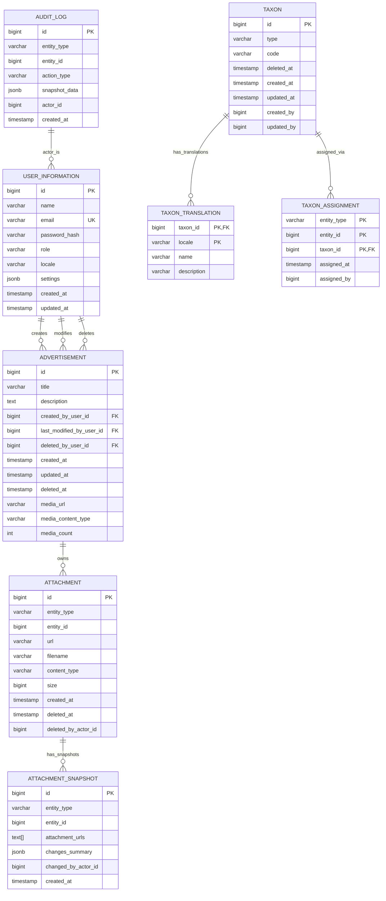

# Database ERD

## Overview

All tables are created via Liquibase migrations. Each starter owns its own changelog under `src/main/resources/db/*/`. No shared migrations between modules.

## Entity Relationship Diagram



## Table Schemas

### user_information

**Module:** `user-spring-boot-starter`  
**Changelog:** `/app/user-spring-boot-starter/src/main/resources/db/user-changelog/changes/01-user-schema.xml`

| Column | Type | Constraints | Notes |
|--------|------|-------------|-------|
| `id` | BIGSERIAL | PK | Auto-increment |
| `name` | VARCHAR(255) | NOT NULL | User's display name |
| `email` | VARCHAR(255) | UNIQUE, NOT NULL | Login email |
| `password_hash` | VARCHAR(255) | | BCrypt hash of password |
| `role` | VARCHAR(50) | NOT NULL, CHECK IN ('ADMIN', 'USER', 'MODERATOR') | Authorization role |
| `locale` | VARCHAR(10) | | BCP-47 language tag (e.g., 'en', 'uk') |
| `settings` | JSONB | NOT NULL, DEFAULT '{"adsPageSize":20,"usersPageSize":20}' | Pagination & UI preferences |
| `created_at` | TIMESTAMP WITH TIME ZONE | NOT NULL, DEFAULT NOW() | Account creation timestamp |
| `updated_at` | TIMESTAMP WITH TIME ZONE | | Last profile update |

**Constraints:**
- `CHECK (role IN ('ADMIN', 'USER', 'MODERATOR'))`

**Indexes:** None explicitly defined (email is UNIQUE)

**Notes:**
- First registered user auto-promoted to ADMIN
- Settings stored as JSONB for flexibility (page sizes, locale preferences)

---

### advertisement

**Module:** `advertisement-spring-boot-starter`  
**Changelog:** `/app/advertisement-spring-boot-starter/src/main/resources/db/advertisement-changelog/changes/01-advertisement-schema.xml`

| Column | Type | Constraints | Notes |
|--------|------|-------------|-------|
| `id` | BIGSERIAL | PK | Auto-increment |
| `title` | VARCHAR(255) | NOT NULL | Advertisement title |
| `description` | TEXT | | Full description (nullable) |
| `created_by_user_id` | BIGINT | NOT NULL, FK → user_information.id (RESTRICT) | Creator |
| `last_modified_by_user_id` | BIGINT | FK → user_information.id (SET NULL) | Last editor |
| `deleted_by_user_id` | BIGINT | FK → user_information.id (SET NULL) | Who soft-deleted |
| `created_at` | TIMESTAMP WITH TIME ZONE | NOT NULL, DEFAULT NOW() | Creation timestamp |
| `updated_at` | TIMESTAMP WITH TIME ZONE | | Last modification time |
| `deleted_at` | TIMESTAMP WITH TIME ZONE | | Soft-delete timestamp (NULL = active) |
| `media_url` | VARCHAR(1024) | | Featured image URL (from attachment module) |
| `media_content_type` | VARCHAR(127) | | MIME type of featured image (e.g., 'image/jpeg') |
| `media_count` | INT | NOT NULL, DEFAULT 0 | Count of attached images |

**Foreign Keys:**
- `fk_advertisement_created_by`: created_by_user_id → user_information.id (ON DELETE RESTRICT)
- `fk_advertisement_modified_by`: last_modified_by_user_id → user_information.id (ON DELETE SET NULL)
- `fk_advertisement_deleted_by`: deleted_by_user_id → user_information.id (ON DELETE SET NULL)

**Indexes:**
- `idx_advertisement_title` (title)
- `idx_advertisement_created_at` (created_at)
- `idx_advertisement_created_by` (created_by_user_id)
- `idx_advertisement_deleted_at` (deleted_at) — supports soft-delete queries

**Notes:**
- Supports soft-delete: deleted_at IS NULL identifies active records
- media_url/media_count updated by attachment module via hook
- Audit events recorded separately in audit_log table

---

### attachment

**Module:** `attachment-spring-boot-starter`  
**Changelog:** `/app/attachment-spring-boot-starter/src/main/resources/db/attachment-changelog/changes/01-attachment-schema.xml`

| Column | Type | Constraints | Notes |
|--------|------|-------------|-------|
| `id` | BIGSERIAL | PK | Auto-increment |
| `entity_type` | VARCHAR(50) | NOT NULL | Entity type (e.g., 'ADVERTISEMENT') |
| `entity_id` | BIGINT | NOT NULL | ID of owner entity |
| `url` | VARCHAR(1024) | NOT NULL | S3/storage URL |
| `filename` | VARCHAR(255) | NOT NULL | Original filename |
| `content_type` | VARCHAR(127) | NOT NULL | MIME type (e.g., 'image/jpeg') |
| `size` | BIGINT | NOT NULL | File size in bytes |
| `created_at` | TIMESTAMP WITH TIME ZONE | NOT NULL, DEFAULT NOW() | Upload timestamp |
| `deleted_at` | TIMESTAMP WITH TIME ZONE | | Soft-delete timestamp |
| `deleted_by_actor_id` | BIGINT | | User ID who deleted |

**Composite Key (Logical):** (entity_type, entity_id) — identifies which entity owns files

**Indexes:**
- `idx_attachment_entity` (entity_type, entity_id)
- `idx_attachment_deleted_at` (deleted_at) — supports soft-delete queries

**Notes:**
- Generic: can attach to any entity type (ADVERTISEMENT, USER, TAXON, etc.)
- No FK to user_information (loosely coupled)
- Actual file stored in S3 (StorageService); database only tracks metadata
- Supports soft-delete: deleted_at IS NULL identifies active records

---

### attachment_snapshot

**Module:** `attachment-spring-boot-starter`  
**Changelog:** `/app/attachment-spring-boot-starter/src/main/resources/db/attachment-changelog/changes/01-attachment-schema.xml`

| Column | Type | Constraints | Notes |
|--------|------|-------------|-------|
| `id` | BIGSERIAL | PK | Auto-increment |
| `entity_type` | VARCHAR(50) | NOT NULL | Entity type (e.g., 'ADVERTISEMENT') |
| `entity_id` | BIGINT | NOT NULL | ID of owner entity |
| `attachment_urls` | TEXT[] | | Array of file URLs at snapshot time |
| `changes_summary` | JSONB | | Summary of changes (which files added/removed) |
| `changed_by_actor_id` | BIGINT | | User ID who triggered the change |
| `created_at` | TIMESTAMP WITH TIME ZONE | NOT NULL, DEFAULT NOW() | Snapshot timestamp |

**Composite Key (Logical):** (entity_type, entity_id) — snapshots for a specific entity

**Indexes:**
- `idx_attachment_snapshot_entity` (entity_type, entity_id)
- `idx_attachment_snapshot_changes` (changes_summary) — GIN index for JSONB queries

**Notes:**
- Used for point-in-time snapshot recovery
- attachment_urls is a PostgreSQL TEXT[] (array type)
- changes_summary is JSONB for flexible schema

---

### audit_log

**Module:** `audit-spring-boot-starter`  
**Changelog:** `/app/audit-spring-boot-starter/src/main/resources/db/audit-changelog/changes/01-audit-schema.xml`

| Column | Type | Constraints | Notes |
|--------|------|-------------|-------|
| `id` | BIGSERIAL | PK | Auto-increment |
| `entity_type` | VARCHAR(50) | NOT NULL | Type of audited entity (from EntityType enum) |
| `entity_id` | BIGINT | NOT NULL | ID of audited entity |
| `action_type` | VARCHAR(50) | NOT NULL | Action (CREATE, UPDATE, DELETE, RESTORE) |
| `snapshot_data` | JSONB | | Before/after snapshot: `{"before": {...}, "after": {...}}` or `{"snapshot": {...}}` |
| `actor_id` | BIGINT | NOT NULL | User ID who made the change |
| `created_at` | TIMESTAMP WITH TIME ZONE | NOT NULL, DEFAULT NOW() | Timestamp of change |

**Composite Key (Logical):** (entity_type, entity_id) — audit trail for a specific entity

**Indexes:**
- `idx_audit_entity` (entity_type, entity_id, created_at DESC) — query all changes to an entity
- `idx_audit_changed_by` (actor_id, created_at DESC) — activity feed by user

**Notes:**
- Immutable write-only table (never updated, only inserted)
- snapshot_data format varies by action type:
  - CREATE/RESTORE: `{"snapshot": {...}}`
  - UPDATE: `{"before": {...}, "after": {...}}`
  - DELETE: `{"snapshot": {...}}`
- JSONB allows flexible schema for different entity types
- Audit_snapshot table (not yet populated) will support point-in-time recovery

---

### taxon

**Module:** `taxon-spring-boot-starter`  
**Changelog:** `/app/taxon-spring-boot-starter/src/main/resources/db/taxon-changelog/changes/001-taxon.xml`

| Column | Type | Constraints | Notes |
|--------|------|-------------|-------|
| `id` | BIGSERIAL | PK | Auto-increment |
| `type` | VARCHAR(64) | NOT NULL | Classifier type (e.g., 'CATEGORY') |
| `code` | VARCHAR(64) | | Optional stable code (unique per type when set) |
| `deleted_at` | TIMESTAMP WITH TIME ZONE | | Soft-delete timestamp (NULL = active) |
| `created_at` | TIMESTAMP WITH TIME ZONE | NOT NULL, DEFAULT NOW() | Creation timestamp |
| `updated_at` | TIMESTAMP WITH TIME ZONE | NOT NULL, DEFAULT NOW() | Last update timestamp |
| `created_by` | BIGINT | | User ID who created the entry |
| `updated_by` | BIGINT | | User ID who last updated |

**Indexes:**
- `idx_taxon_type_deleted_at` (type, deleted_at) — for listing active/all entries by type
- `uidx_taxon_type_code` UNIQUE PARTIAL `(type, code) WHERE code IS NOT NULL` — stable code enforcement

---

### taxon_translation

**Module:** `taxon-spring-boot-starter`  
**Changelog:** `/app/taxon-spring-boot-starter/src/main/resources/db/taxon-changelog/changes/001-taxon.xml`

| Column | Type | Constraints | Notes |
|--------|------|-------------|-------|
| `taxon_id` | BIGINT | PK, FK → taxon(id) CASCADE DELETE | Owner taxon entry |
| `locale` | VARCHAR(8) | PK | BCP-47 language tag (e.g., 'en', 'uk') |
| `name` | VARCHAR(255) | NOT NULL | Localised display name |
| `description` | VARCHAR(2000) | NOT NULL | Localised description |

**Indexes:**
- `idx_taxon_translation_locale_name` (locale, name) — name-search within a locale

---

### taxon_assignment

**Module:** `taxon-spring-boot-starter`  
**Changelog:** `/app/taxon-spring-boot-starter/src/main/resources/db/taxon-changelog/changes/001-taxon.xml`

| Column | Type | Constraints | Notes |
|--------|------|-------------|-------|
| `entity_type` | VARCHAR(64) | PK | Entity type ('ADVERTISEMENT', 'USER', etc.) |
| `entity_id` | BIGINT | PK | ID of the entity being classified |
| `taxon_id` | BIGINT | PK, FK → taxon(id) | Assigned taxon entry |
| `assigned_at` | TIMESTAMP WITH TIME ZONE | NOT NULL, DEFAULT NOW() | When the assignment was made |
| `assigned_by` | BIGINT | | User ID who made the assignment |

**Indexes:**
- `idx_taxon_assignment_taxon_id` (taxon_id) — for reverse lookup (find all entities with a given taxon)

**Notes:**
- Generic: any entity type can have taxons assigned (no FK to advertisement table)
- Idempotent assignment (replaceAssignments handles add/remove diff)
- Used for filtering advertisements by category without exposing the join table to marketplace UI

---

## Data Flow & Relationships

### Creating an Advertisement
```
1. User submits form in marketplace-app
2. AdvertisementPort.save(AdvertisementSaveDto)
   → INSERT INTO advertisement (title, description, created_by_user_id, created_at)
   → RETURNS Long id
3. AuditPort.captureCreation(id, snapshot, actorId)
   → INSERT INTO audit_log (entity_type='ADVERTISEMENT', entity_id=id, action_type='CREATE', snapshot_data={...}, actor_id)
```

### Uploading Media to Advertisement
```
1. User uploads image in UI
2. AttachmentPort.upload(entityType='ADVERTISEMENT', entityId=advId, file)
   → StorageService uploads to S3
   → INSERT INTO attachment (entity_type='ADVERTISEMENT', entity_id=advId, url, filename, content_type, size, created_at)
3. Calls AttachmentMediaChangeHook.onChange('ADVERTISEMENT', advId)
   → Advertisement updates: UPDATE advertisement SET media_url=..., media_count=... WHERE id=advId
4. AuditPort.captureUpdate(advId, before, after, actorId)
   → INSERT INTO audit_log (entity_type='ADVERTISEMENT', entity_id=advId, action_type='UPDATE', ...)
5. Also: INSERT INTO attachment_snapshot (entity_type, entity_id, attachment_urls=ARRAY[...], ...)
```

### Querying Advertisement Activity
```
1. User views "Activity" tab
2. AuditPort.getEntityActivity(EntityType.ADVERTISEMENT, advId, userId, showAll=true)
   → SELECT * FROM audit_log WHERE entity_type='ADVERTISEMENT' AND entity_id=advId ORDER BY created_at DESC
   → For each row, call AuditActivityFieldsHook.fields(EntityType.ADVERTISEMENT) to get field labels
   → Enrich with user names from user_information JOIN on actor_id
   → Return List<AuditActivityItemDto>
```

---

## Soft Delete Pattern

`advertisement` and `attachment` tables support soft-delete via `deleted_at` column:

```sql
-- Active records
SELECT * FROM advertisement WHERE deleted_at IS NULL;

-- Deleted records
SELECT * FROM advertisement WHERE deleted_at IS NOT NULL;

-- Soft delete
UPDATE advertisement SET deleted_at = NOW() WHERE id = ?;
```

Index on `deleted_at` supports efficient queries.

---

## Extensibility

Audit table is generic (`entity_type` VARCHAR, `entity_id` BIGINT):
- Can audit any entity (ADVERTISEMENT, USER, TAXON, ATTACHMENT, etc.)
- New entity types require no schema changes, only new entries in EntityType enum

Attachment table is generic (`entity_type` VARCHAR, `entity_id` BIGINT):
- Can attach media to any entity type
- Generic tagging/categorization without schema modifications

---

## Performance Considerations

1. **audit_log indexes:** Composite index on (entity_type, entity_id, created_at DESC) supports efficient timeline queries.
2. **attachment_snapshot GIN index:** JSONB index for complex queries on changes_summary.
3. **Soft-delete indexes:** Explicit index on deleted_at column for active record queries.
4. **FK constraints:** All FKs use RESTRICT or SET NULL to maintain referential integrity without cascading deletes.

