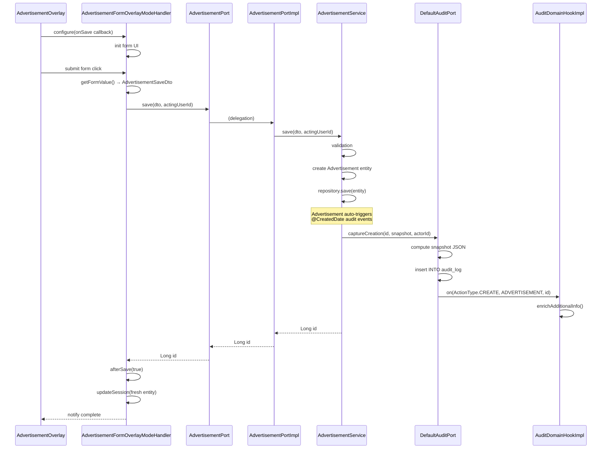
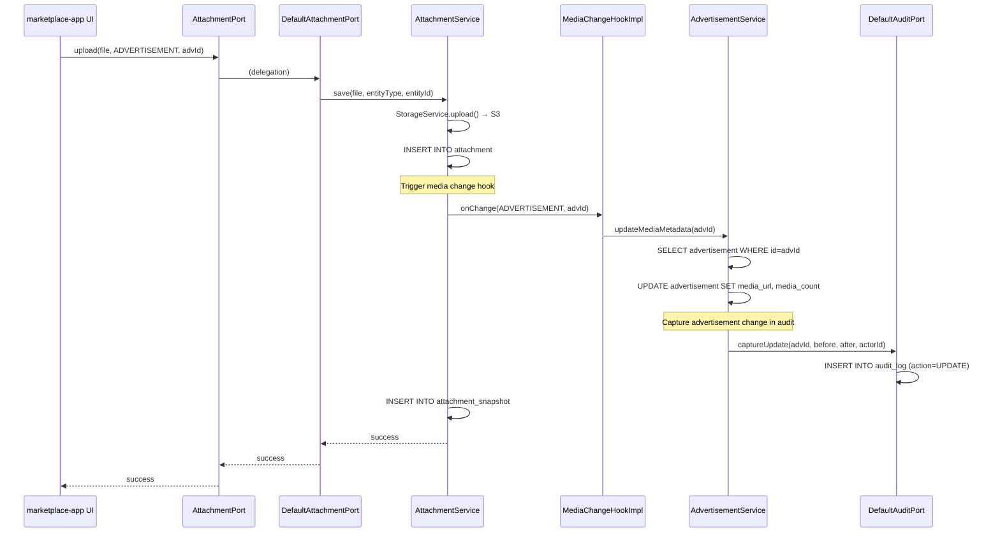
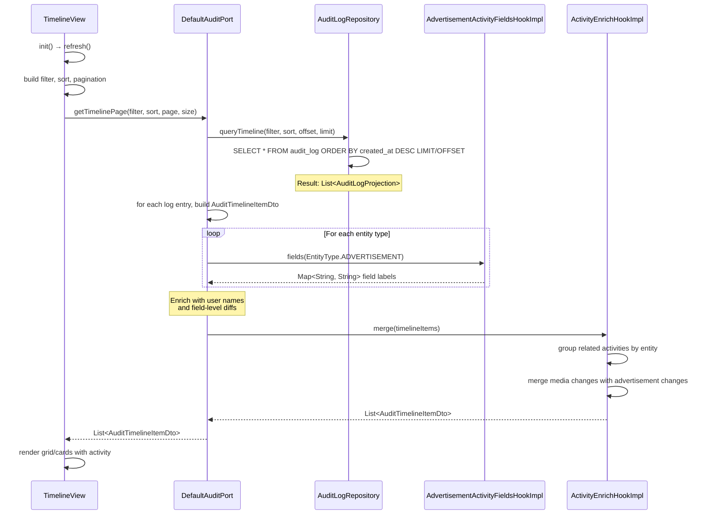
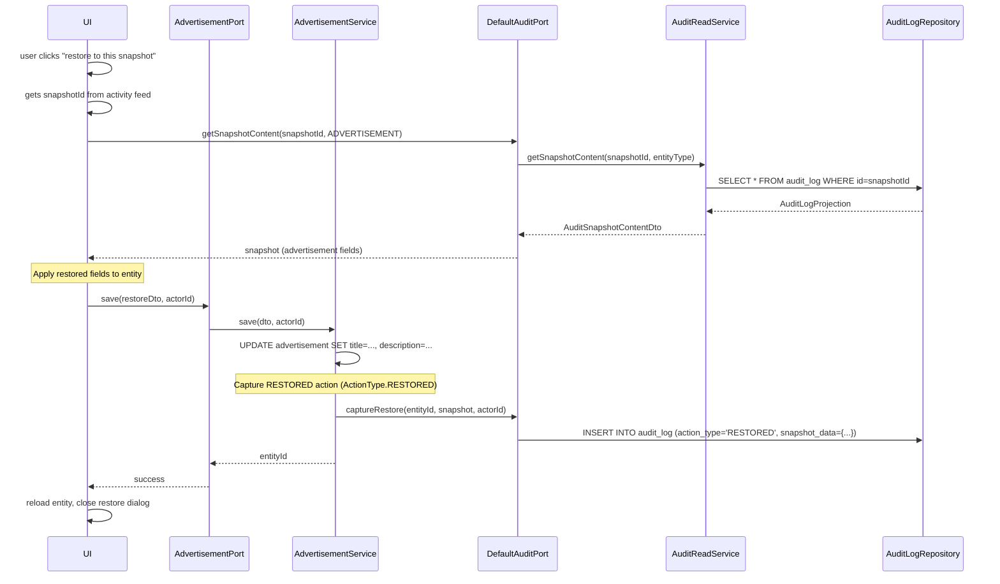
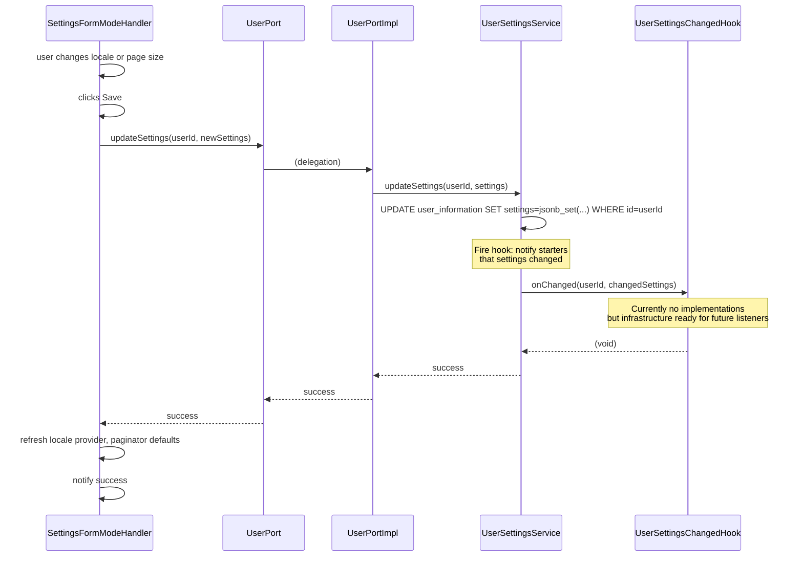
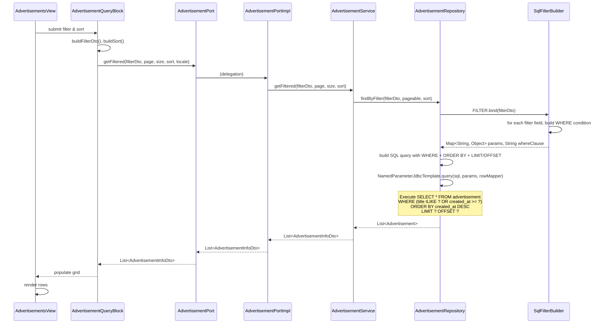
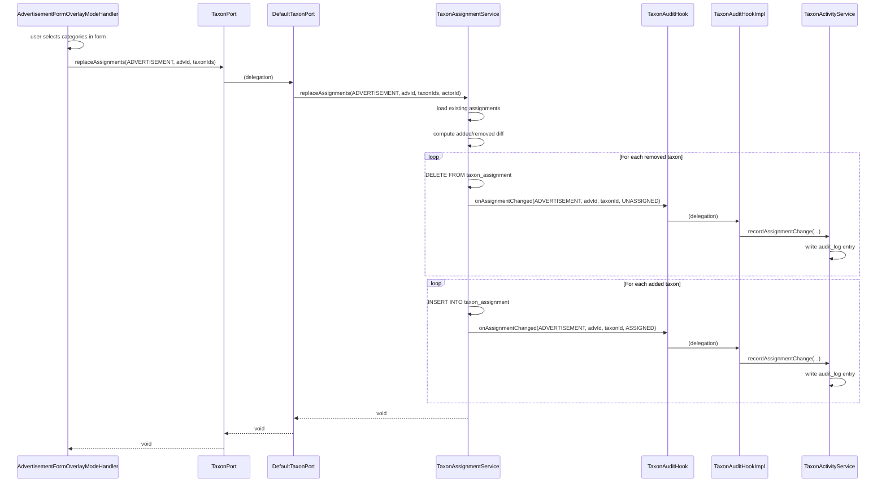
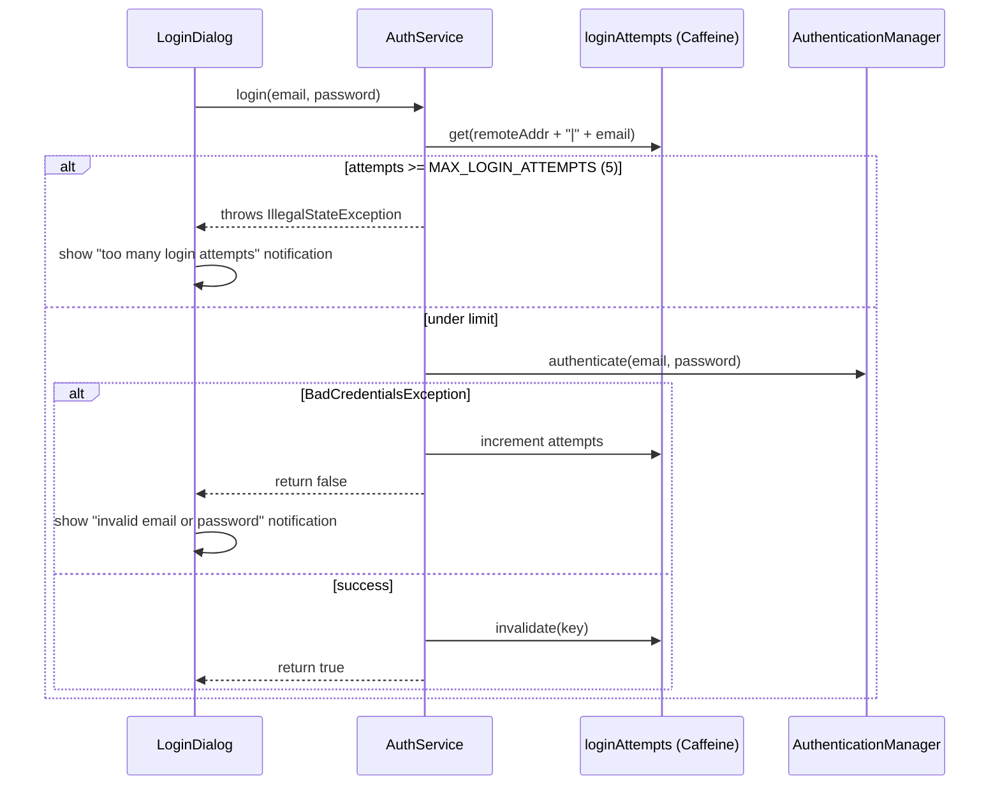
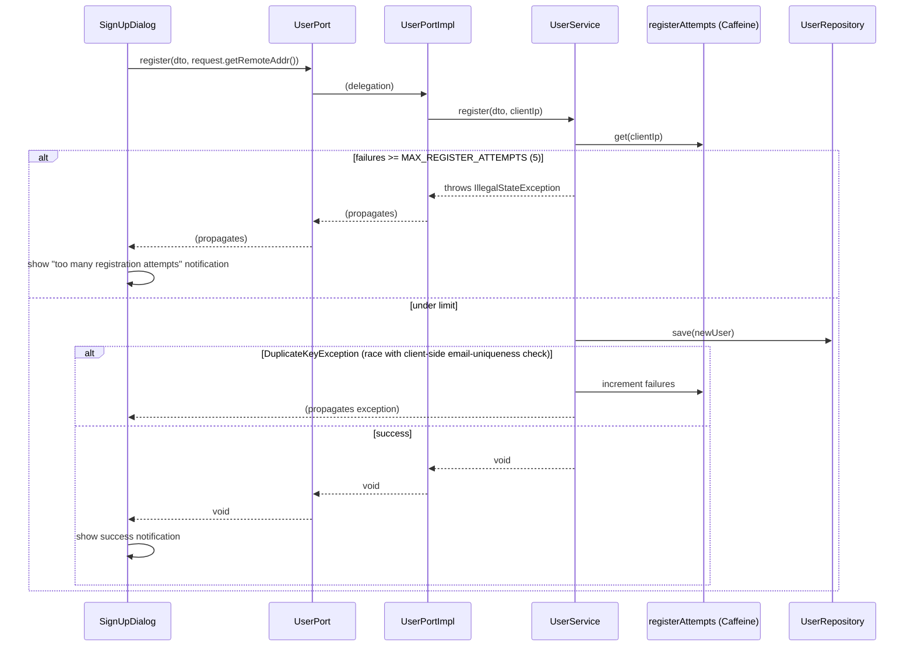

# Sequence Diagrams

## Real Code Paths

These diagrams trace actual class-to-class interactions based on source code inspection.

## 1. Advertisement Creation Flow

**Classes involved:**
- `org.ost.marketplace.ui.views.main.tabs.advertisements.overlay.AdvertisementOverlay` (UI overlay)
- `org.ost.marketplace.ui.views.main.tabs.advertisements.overlay.modes.AdvertisementFormOverlayModeHandler` (form handler)
- `org.ost.platform.advertisement.spi.AdvertisementPort` (interface in platform-commons)
- `org.ost.advertisement.spi.AdvertisementPortImpl` (implementation in starter)
- `org.ost.advertisement.services.AdvertisementService` (business logic)
- `org.ost.audit.services.DefaultAuditPort` (audit capture)
- `org.ost.marketplace.spi.AuditDomainHookImpl` (marketplace callback)



---

## 2. Advertisement Update with Media Change

**Classes involved:**
- `org.ost.advertisement.services.AdvertisementService`
- `org.ost.attachment.spi.DefaultAttachmentPort` (attachment starter)
- `org.ost.advertisement.spi.MediaChangeHookImpl` (advertisement listens to attachment changes)
- `org.ost.audit.services.DefaultAuditPort`
- `org.ost.attachment.services.AttachmentService`



---

## 3. Activity Feed Timeline Query

**Classes involved:**
- `org.ost.marketplace.ui.views.main.tabs.timeline.TimelineView` (UI view)
- `org.ost.audit.services.DefaultAuditPort` (audit read side)
- `org.ost.audit.repository.AuditLogRepository` (queries audit_log table)
- `org.ost.marketplace.spi.AdvertisementActivityFieldsHookImpl` (field enrichment)
- `org.ost.marketplace.spi.ActivityEnrichHookImpl` (cross-cutting activity merge)



---

## 4. Restore from Snapshot

**Classes involved:**
- UI view initiates restore (e.g., `AdvertisementViewOverlayModeHandler`)
- `org.ost.audit.services.DefaultAuditPort` (retrieve snapshot + capture restore event)
- `org.ost.audit.services.AuditReadService` (load snapshot data)
- `org.ost.audit.repository.AuditLogRepository` (queries audit_log table)
- `org.ost.advertisement.services.AdvertisementService` (applies entity restore)



---

## 5. User Settings Change Propagation

**Classes involved:**
- `org.ost.marketplace.ui.views.main.header.settings.SettingsFormModeHandler` (UI form for settings)
- `org.ost.platform.user.spi.UserPort` (interface)
- `org.ost.user.spi.UserPortImpl` (implementation)
- `org.ost.user.services.UserSettingsService` (business logic)
- `org.ost.platform.user.spi.UserSettingsChangedHook` (callback interface)



---

## 6. Filter and Sort Advertisement List

**Classes involved:**
- `org.ost.marketplace.ui.views.main.tabs.advertisements.AdvertisementsView` (grid view)
- `org.ost.marketplace.ui.views.main.tabs.advertisements.query.AdvertisementQueryBlock` (filter/sort UI)
- `org.ost.platform.advertisement.spi.AdvertisementPort` (interface)
- `org.ost.advertisement.spi.AdvertisementPortImpl` (implementation)
- `org.ost.advertisement.repository.AdvertisementRepository` (custom SQL queries using query-lib)



---

---

## 7. Taxon Category Assignment to Advertisement

**Classes involved:**
- `org.ost.marketplace.ui.views.main.tabs.advertisements.overlay.modes.AdvertisementFormOverlayModeHandler` (saves categories on form submit)
- `org.ost.platform.taxon.spi.TaxonPort` (interface)
- `org.ost.taxon.services.DefaultTaxonPort` (implementation)
- `org.ost.taxon.services.TaxonAssignmentService` (business logic)
- `org.ost.platform.taxon.spi.TaxonAuditHook` (callback to marketplace)
- `org.ost.marketplace.spi.TaxonAuditHookImpl` (records to audit log)



---

## 8. Login and Registration Rate Limiting

**Classes involved:**
- `org.ost.marketplace.ui.views.main.header.dialogs.LoginDialog` / `SignUpDialog` (UI)
- `org.ost.marketplace.services.auth.AuthService` (login — marketplace-app, transport-aware: injects `HttpServletRequest`)
- `org.ost.platform.user.spi.UserPort` (interface) / `org.ost.user.spi.UserPortImpl` (implementation)
- `org.ost.user.services.UserService` (registration — user-spring-boot-starter, transport-agnostic: takes `clientIp` as `String`)

Both paths use an in-memory Caffeine cache (`expireAfterWrite(15 min)`, `maximumSize(10_000)`) keyed
per client, and only increment the failure counter on an actual failure — never on success. This
was a deliberate fix: an earlier version counted every attempt (including successful ones), which
locked out legitimate bulk usage (e.g. the Playwright e2e suite signing up dozens of accounts from
one IP within the 15-minute window).





---

## Key Interaction Patterns

### Port Pattern (Marketplace → Starter)
All calls from marketplace-app to starters go through a `*Port` interface defined in platform-commons:
```
UI → AdvPort.method() → AdvPortImpl (thin delegate) → AdvService (business logic)
```

### Hook Pattern (Starter → Marketplace)
All callbacks from starters to marketplace-app go through a `*Hook` interface:
```
Service → HookInterface.method() → HookImpl (thin delegate) → custom marketplace logic
```

### No Direct Imports
Marketplace UI classes never import from starter internal classes:
- Good: `import org.ost.platform.advertisement.spi.AdvertisementPort`
- Bad: `import org.ost.advertisement.services.AdvertisementService`

### Delegation Pattern
All Port/Hook implementations are pure delegation with no business logic:
- Example: `AdvertisementPortImpl.save()` calls `AdvertisementService.save()` and returns result
- Example: `MediaChangeHookImpl.onChange()` calls `AdvertisementService.updateMediaMetadata()` and returns

