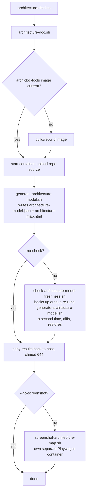

# docs/architecture/

`docs/architecture/architecture-map.html` is the live, generated architecture control plane for
this repo — every diagram and data table lives there, rendered from real repo state, not
hand-maintained markdown. This directory holds the tool's two entry-point scripts
(`architecture-doc.sh`/`.bat`) and the generated `architecture-map.html` itself; the generation
logic lives in `docs/architecture/scripts/` (its own `README.md`), the generated/hand-written data
files it reads and writes in `docs/architecture/data/` (its own `README.md`).

## What's in `architecture-map.html`

- **Module Dependencies** — Maven dependency graph, rendered live from `pom.xml`, domain-colored,
  click a node to open its module page. Includes a live "Architecture Checks" section (real grep-
  based coupling verification), Largest Java Files, Constructor Injection, and Largest Packages
  tables.
- **SPI Map** — which Ports and Hooks live in `platform-commons` and who implements them, rendered
  live from real Java source, grouped by subsystem, click a node to open its real `.java` file.
- **Database ERD** — tables with columns, types, constraints, indexes, and foreign keys, rendered
  live from the real Liquibase changelogs; each column's/table's own `remarks=` attribute is the
  single source of truth for what it means (see root `CLAUDE.md`'s "Database Changes" guideline).
- **Bounded Contexts** — domain grouping (entities/services/tables/SPI ports per domain) and
  cross-domain relationships, both derived live from real code signals (real `@Table`/`*Service`
  classes, real SPI `implements` relationships, real Hook `entityType()` declarations).
- **Module page** (per module) — a "Code Metrics" section with real SonarQube numbers (lines of
  code, complexity, cognitive complexity, code smells) and real ArchUnit numbers (Efferent/
  Afferent Coupling, Instability, Abstractness), when their respective data sources are available.

## How to use it

1. Open `docs/architecture/architecture-map.html` in a browser.
2. **System** screen — entry points to Tooling & Pipelines, Backlog, Diagrams, ADRs, and Code
   Quality, plus the project README inline at the bottom.
3. **Diagrams → Module Dependencies** — start here for module structure and the live coupling
   checks.
4. **Diagrams → SPI Map** — all Ports/Hooks and their implementations.
5. **Diagrams → Database ERD** — full schema.
6. **Diagrams → Bounded Contexts** — domain boundaries and cross-domain relationships.
7. Click any module to see its own page — dependencies, entities, key services, contracts, ADRs,
   and Code Metrics.

## Generated from

- Project root: `/app`
- Analyzed source directories: `query-lib`, `platform-commons`, every `*-spring-boot-starter`,
  `marketplace-orchestrator`, `marketplace-app`.
- Analyzed schemas: every Liquibase migration under `*/src/main/resources/db/*/changes/`.
- `pom.xml` files for every module listed in the root `pom.xml`'s `<modules>` block.
- A running SonarQube server (`localhost:9099`) for code-quality metrics, and the last
  `bash scripts/build-and-test.sh --archunit-metrics` run's `ArchitectureMetricsExport` output for
  coupling metrics — both optional; the tool degrades gracefully when either is unavailable.

## Flow

Entry points: `architecture-doc.sh` (Linux/WSL) and `architecture-doc.bat` (Windows, delegates to
`architecture-doc.sh` via WSL).

```bash
bash docs/architecture/architecture-doc.sh                    # regenerate, verify reproducibility, screenshot
bash docs/architecture/architecture-doc.sh --no-check          # skip the reproducibility re-check
bash docs/architecture/architecture-doc.sh --no-screenshot     # skip screenshotting
bash docs/architecture/architecture-doc.sh --rebuild-image     # force-rebuild the generation image
```

Both flags default to running the full pipeline; the two decision diamonds below are what each
flag skips. `generate-architecture-model.sh` genuinely runs twice when the reproducibility check
is enabled (the check's own job is diffing a second run against the first), not once.



See `docs/architecture/scripts/README.md` for the generation scripts' own file-to-file detail.
