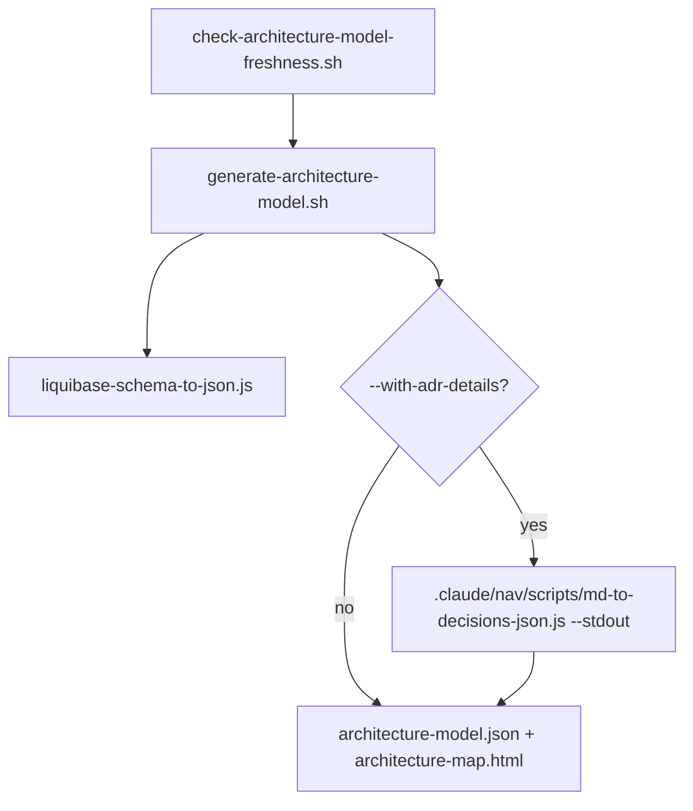

# docs/architecture/scripts/

Generation logic behind `docs/architecture/architecture-map.html` — see `docs/architecture/README.md`
for what the tool itself is and how to use it; this directory is only the code that builds it.
Invoked by the parent directory's `architecture-doc.sh`/`.bat` entry points inside a disposable
Docker container (`Dockerfile`, this directory's own), but every script here is also independently
runnable directly on the host.

## Flow

Real entry points, independently invocable:

```bash
bash docs/architecture/scripts/generate-architecture-model.sh [--with-adr-details] [--with-sonar] [--with-archunit] [--with-ci-metrics]
bash docs/architecture/scripts/check-architecture-model-freshness.sh
bash docs/architecture/scripts/screenshot-architecture-map.sh
```

`check-architecture-model-freshness.sh` wraps `generate-architecture-model.sh` (backs up the
committed output, re-runs the generator, diffs, restores) — a real caller/callee relationship.
`generate-architecture-model.sh` in turn always calls `liquibase-schema-to-json.js`, and calls
`.claude/nav/scripts/md-to-decisions-json.js` (its `--stdout` mode, a cross-directory call — that
script itself lives with the rest of the ADR-navigation tooling, not here, since its primary real
use is `--extract`, unrelated to this generator) only when `--with-adr-details` is passed:



`screenshot-architecture-map.sh` is a genuinely separate flow, not part of the chain above — it
only reads the already-generated `architecture-map.html` (one level up) via a headless browser, no
calls into any file in this directory.

## Nested folder

`architecture-map-screenshots/` — `screenshot-architecture-map.sh`'s own output directory (PNG
files, one per screen of `architecture-map.html`). Gitignored, ephemeral verification artifacts,
never committed — no `README.md` of its own for that reason.
