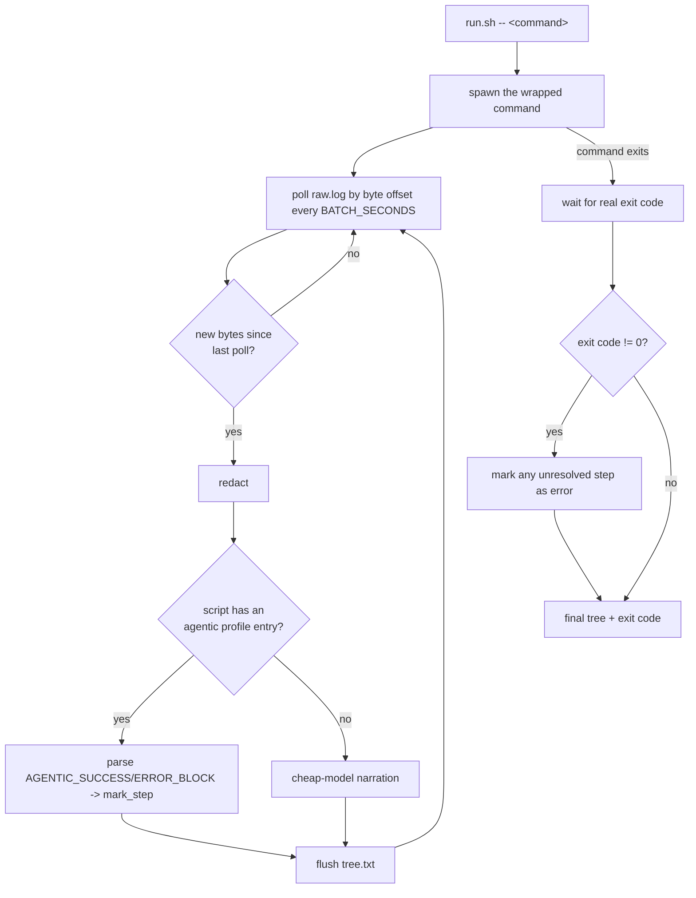

# scripts/activity-monitor

Wraps a target command and renders a live step checklist instead of raw stdout — so both the
agent's own `Monitor` tool and a human's own second terminal pane see a compact ✅/⏳/⬜/⚠️/❌ tree
instead of hundreds of low-signal log lines. Known, structured `AGENTIC_SUCCESS_BLOCK`/
`AGENTIC_ERROR_BLOCK` markers (`scripts/utils/agentic-output.sh`) are recognised mechanically, for
free; anything else falls back to a single cheap-model narration call per batch, never a per-line
call. Pass/fail is always the wrapped command's own real exit code — narration never decides it.

Two usage modes, the same one command either way — the only difference is who's watching it and
how: an agent backgrounds it (`run_in_background`) and watches `tree.txt` via its own `Monitor`
tool, printing the tree in chat when asked, since stdout isn't visible to a human in that case; a
human runs the exact same command directly in their own terminal and sees the checklist redraw
live in place every `BATCH_SECONDS`, automatically, with no second command or pane required — the
command detects whether its own stdout is a real terminal and redraws only then. `--watch <name>`
from a second terminal is for the narrower case of peeking at a run already started elsewhere
(e.g. by the agent) without launching a second one.

## Usage

Always through the thin top-level entry point, `scripts/activity-monitor.sh` (never `run.sh`
directly — see `.claude/rules.md`'s "Script-group directory structure"). Any script's own flags go
after the wrapped command, unchanged:

```bash
# Run any of the 8 covered scripts wrapped — <command-basename> below is always this command's
# own basename (e.g. "deploy-and-run.sh"), used by --render/--watch to find its run directory.
bash scripts/activity-monitor.sh -- bash scripts/deploy-and-run.sh [flags...]
bash scripts/activity-monitor.sh -- bash scripts/build-and-test.sh [flags...]
bash scripts/activity-monitor.sh -- bash scripts/playwright.sh [scenario] [flags...]
bash scripts/activity-monitor.sh -- bash scripts/sonar.sh [flags...]
bash scripts/activity-monitor.sh -- bash scripts/run-all-tests.sh [flags...]
bash scripts/activity-monitor.sh -- bash scripts/reset.sh [flags...]
# ci.sh needs --foreground -- without it, ci.sh's own process returns almost immediately after
# triggering the Dagu run, long before the run itself finishes:
bash scripts/activity-monitor.sh -- bash scripts/ci.sh --foreground [flags...]

# A command not on the agentic-output.sh contract still works, fully model-narrated (needs
# ANTHROPIC_API_KEY + jq -- see "Dependencies" below):
bash scripts/activity-monitor.sh -- docker-compose -f scripts/deploy-and-run/docker-compose.db.yml \
  -f scripts/deploy-and-run/docker-compose.minio.yml up -d

# The "run" command above already redraws live in its own terminal when run directly by a human
# -- --watch is only for peeking at a run started elsewhere (e.g. by the agent) from a second,
# separate terminal, without launching a second one:
bash scripts/activity-monitor.sh --watch deploy-and-run.sh

# Print the latest/last tree once, no live redraw:
bash scripts/activity-monitor.sh --render deploy-and-run.sh
```

Force a specific profile instead of the auto-selected one (rarely needed): `--profile NAME` right
after `scripts/activity-monitor.sh`, before `--`.

## Running in a container

`--in-container` (right after `scripts/activity-monitor.sh`, before `--`) runs the wrapped command
inside a dedicated, disposable `dev-shell` container instead of the current shell. Use it whenever
a standalone run's own live state needs to stay visible from here regardless of which shell/
terminal actually triggered it — `tree.txt`/`raw.log` then live in Docker-daemon state (readable
via `docker exec dev-shell cat ...`), not on a host filesystem path this process may not reliably
see. [`scripts/utils/ensure-dev-shell.sh`](../utils/ensure-dev-shell.sh) starts the container on
first use and self-terminates it after an idle period; [`scripts/utils/sync-source.sh`](../utils/sync-source.sh)
syncs the current working tree into it before every run. Default (no flag) behavior is unchanged.

```bash
bash scripts/activity-monitor.sh --in-container -- bash scripts/deploy-and-run.sh --reset-only-db
```

Verified support, both modes, each run for real (not assumed):

| Script | Local | `--in-container` |
|---|---|---|
| `deploy-and-run.sh` | ✅ | ✅ |
| `build-and-test.sh` | ✅ | ✅ |
| `playwright.sh` | ✅ | ✅ |
| `sonar.sh` | ✅ | ✅ |
| `reset.sh` | ✅ | ✅ |
| `run-all-tests.sh` | ✅ | ✅ |
| `ci.sh` | N/A | N/A |

`ci.sh` already always runs its own work inside its own container regardless of this flag, so the
local/`--in-container` distinction doesn't apply to it.

## Flow

Entry point: [`run.sh`](run.sh).



Each file's own header has its own Description/Usage/Env/Input/Outputs/Returns — this file only
shows how they chain together.

## Dependencies

- bash 4+ (associative arrays), `sed` — always, for the shared `agentic` profile
  ([`profiles/agentic.sh`](profiles/agentic.sh)), which covers every script already on the
  `agentic-output.sh` contract.
- `curl` + `jq` + `ANTHROPIC_API_KEY` — only for the `generic` fallback profile (a wrapped command
  not yet on the `agentic-output.sh` contract); the primary 7 project scripts never need these.

## Adding a new profile

Only once there's a real observed log to write patterns against (see `run.sh`'s own header) — a
profile file defines `try_mechanical_format()` and nothing else; the engine (redaction, bounding,
the untrusted-data model prompt, step-state storage) is not overridable per profile.

## Adding a new script to the shared `agentic` profile

No new profile file needed if the script already emits the `agentic-output.sh` contract — but
`run.sh`'s own `STEP_LABELS`/`STEP_IS_CONTAINER`/`SCRIPT_PROFILE_MAP` maps each need a new entry
for that script (display label per `currentStep` value, whether a step is container-associated,
and the script→profile mapping itself); without those entries the script still renders (falling
back to its raw `currentStep` string as the label), just without readable labels.
