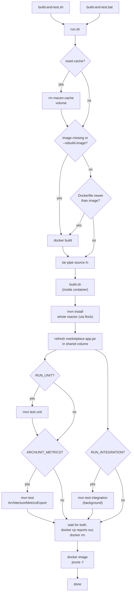

# scripts/build-and-test

A Docker container (JDK 25) that gives every Maven-touching script a working Java
environment regardless of whether the host machine has one — this project's WSL/Windows users hit
a real, confirmed gap where WSL cannot use a host-installed Java through Maven cleanly (path
translation issues between Linux-style and Windows-style paths). Everything Maven-related routes
through this one container instead of assuming Java is available wherever the caller happens to
run.

## Flow

Two entry points, same underlying flow — an OS-specific pair converging into the same shared
logic:

```bash
bash scripts/build-and-test.sh          # Linux/WSL
scripts\build-and-test.bat              # Windows
```



`I`+`I2` (unit tests, then the ArchUnit metrics export) run as one sequential group, backgrounded
together against `J` (integration tests), not fully three-way parallel — once the reactor install
finishes, both sides only *read* the shared `~/.m2`, but unit tests and the ArchUnit export both
touch `marketplace-app`'s own `target/`, so they stay sequential against each other and only the
group as a whole runs concurrently with integration tests (a disjoint `target/` dir).

`RUN_UNIT`/`RUN_INTEGRATION` are both **on** by default (`build-and-test.properties`);
`ARCHUNIT_METRICS` is **off** by default (CLI flag only, not in `.properties`) — the export takes
several minutes even on a warm build, disproportionate to run on every call. `run.sh` sets these
from flags/`.properties` defaults before invoking the container. The build step always builds the
whole reactor and always refreshes `marketplace-app.jar` in the shared volume regardless —
Maven's own incremental compilation makes a no-op rebuild cheap, so there's no separate
"build-only" vs "full" mode to keep in sync.

## Environment notes

The shared `.m2` lives entirely inside a Docker named volume (`maven-cache`), never bind-mounted
to the host's real `~/.m2` — a container build can never corrupt a developer's own local
repository, and a developer's own local Maven runs are never affected by what happens inside this
container. Concurrent `mvn` invocations across separate container instances running at the same
time are serialized via `flock` against a lock file living inside that same shared volume, so the
lock is visible to every container instance that mounts it, not just one. `marketplace-app.jar`
itself lives at a fixed path inside the same volume (`/root/.m2/artifacts/marketplace-app.jar`),
outside Maven's own `.m2/repository` tree — the volume doubles as the shared artifact store, no
second volume needed.

`run.sh` runs under a fixed container name by default so a run in progress can be attached to
directly, without first looking it up: `advertisement-build-only` (`docker exec -it
advertisement-build-only bash`). Override via `BUILD_CONTAINER_NAME` when a caller needs to invoke
this script concurrently with another invocation of itself — Docker container names must be
unique, so two concurrent runs under the same name fail outright with a name conflict, independent
of and before the shared-volume `flock` above ever gets a chance to serialize anything (e.g.
`scripts/deploy-and-run/run.sh`'s own internal call uses `advertisement-build-only-deploy` for
exactly this reason).
