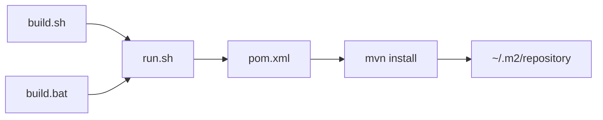

# scripts/build

Installs platform-commons and every domain starter into the local Maven repository (`~/.m2`) in
one pass, so later test suites that depend on these modules find them already fresh instead of
triggering a redundant install mid-suite.

## Flow

Entry points:
```bash
bash scripts/build.sh      # Linux/WSL
scripts\build.bat          # Windows
```

`build.sh`/`build.bat` are thin wrappers — the real logic lives in `run.sh`, which reads the
module list live from `pom.xml` and installs it in one `mvn install`:



Each file's own header has its own Description/Usage/Env/Input/Outputs/Returns — this file only
shows how they chain together.

## Environment notes

This sandbox's `/app` and `~/.m2` are bind mounts of the real project folder and the real local
Maven repository on the host machine (not copies) — running `run.sh` here writes to the exact same
files a locally-running IDE build would. Running a build here and a build in a local IDE at the
same time, against the same modules, risks a last-writer-wins overwrite or a corrupted/partial jar
if truly concurrent — no script currently guards against this, so avoid running both sides at once
on the same modules.
