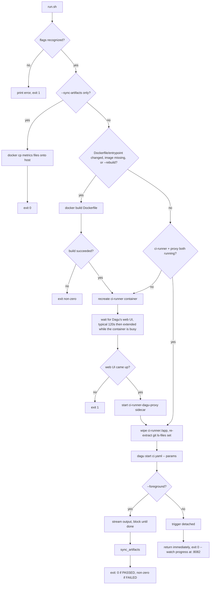
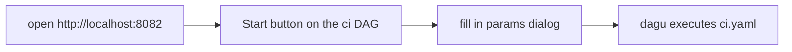

# Local CI Runner

Dagu (https://github.com/dagucloud/dagu) is a single-binary, no-database DAG/workflow engine with a
built-in web UI — clickable "Start", live per-stage status/logs, run history. This project runs it
in one persistent `ci-runner` container to orchestrate the same checks a hosted CI would (compile,
unit tests, Testcontainers integration tests, Playwright e2e, optionally SonarQube and an ArchUnit
module-coupling export), isolated from the normal dev stack and safe to run alongside it.

## Requirements

- Docker Engine with a reachable daemon (this tool mounts `/var/run/docker.sock` into its own
  container — Docker-outside-of-Docker, not Docker-in-Docker; see
  [`.claude/nav/adr-index.md`](../../.claude/nav/adr-index.md))
- Everything else (Maven, Node, Playwright browsers, Dagu itself) is already inside the built
  image or downloaded on first container start — nothing extra to install locally

## Flow

Entry point: [`run.sh`](run.sh). Once `ci-runner` is running, a DAG run can also be triggered
directly from Dagu's own web UI, bypassing `run.sh` entirely for that one step.



Once `ci-runner` is up, the same DAG run can be triggered a second way, entirely independent of
`run.sh`:



`run.sh` replaces `ci-runner:/app` with the working tree before every run — it wipes `/app` and
re-extracts the `git ls-files` set (tracked + untracked-not-`.gitignored`), piped through `tar`
(wiping first, so a file *deleted* from the working tree doesn't linger in the container and break
the compile) — and rebuilds the image only when
[`Dockerfile`](Dockerfile)/[`docker-entrypoint.sh`](docker-entrypoint.sh) changed — the image's
own baked-in `COPY . .` is not trusted, since Docker's layer cache can serve a stale copy of it.
**The UI "Start" path does not stream the working tree** — it runs against whatever source `run.sh`
last synced in; a bind mount isn't used instead (it doesn't work when the caller invoking
`docker run` is itself inside a container — see [`DECISIONS.md`](DECISIONS.md)).

## Running

```bash
bash scripts/ci/run.sh                # default: most extensive run
bash scripts/ci/run.sh --unit         # one stage only
bash scripts/ci/run.sh --all --sonar  # everything, spelled out explicitly
```

Every flag and its exact behavior is documented in [`run.sh`](run.sh)'s own header — not restated
here.

## Live status, logs, and run history

`http://localhost:8082` — Dagu's own web UI; see [`run.sh`](run.sh)'s own header for how it's
exposed and the full list of test/metrics artifacts `sync_artifacts()` pulls onto the host (every
stage's Surefire/JaCoCo/Playwright/Sonar output, not just the architecture-metrics files). Run
history is backed by the `ci-dagu-home` named volume.

For a scripted/automated watch instead of the browser,
`python3 -u` [`dagu-rest-run-monitor.py`](dagu-rest-run-monitor.py) polls the same API for whichever
`ci` run is newest and prints an `AGENTIC_SUCCESS_BLOCK`/`AGENTIC_ERROR_BLOCK` marker per
step-status change, exiting once the run reaches a terminal state — `run.sh --foreground` invokes
this itself, which is what lets `bash scripts/activity-monitor.sh -- bash scripts/ci.sh --foreground`
render a real per-step checklist the same way it already does for every other wrapped script; see
the script's own header for the exact output/exit-code contract.

## Isolation

The e2e stage runs its own `ci-advertisement-db`/`ci-advertisement-minio`/`ci-marketplace-app`
containers on different host ports (15432/19000-19001/18081) and a separate Docker network
(`ci-advertisement`) from the persistent dev stack — safe to run concurrently with normal dev work.
They're left running after the run by default, for debugging (`--no-keep-e2e-infra` to tear them
down instead). Since the containers (and their DB/MinIO volumes) can persist across runs, the
stage's own deploy always applies `--reset-only-db` first (fast truncate — clears leftover data
from a prior run without touching the schema/migration history) unless `--reset-e2e-db` asks for a
full `--reset` instead (only needed when the DB schema itself changed since the stack was last
brought up). The
`integration` stage always applies the Testcontainers sandbox workaround internally (not a
toggleable flag) — `ci-runner`'s own Docker-outside-of-Docker nature hits the same
dynamically-assigned-port problem regardless of host machine.

## Can I develop and run the app/tests myself while this runs?

Yes — genuinely, not just "probably fine":
- Maven dependency caching uses `ci-m2-cache`, a Docker-managed named volume mounted only inside
  the container — completely separate from your own `~/.m2`. No shared state, no race.
  `integration-tests` always spins up its own ephemeral Postgres via Testcontainers regardless.
- The e2e stage's `ci-*` stack (see "Isolation" above) never touches the persistent dev stack's
  containers, ports, network, or database.

**The one real, observed limit is CPU/RAM contention, not data isolation.** Running the e2e stage
alongside a full dev stack (app + db + minio + `pw-runner`) *and* SonarQube simultaneously caused
genuine Playwright timeout flakiness on this project's own constrained sandbox — confirmed
directly, not theoretical. On a normal, less constrained dev machine this is much less likely to
bite, but it's a real resource limit, not a design flaw to "fix" — see
[`DECISIONS.md`](DECISIONS.md) for the full writeup.

**Two `--e2e` runs at once will collide with each other** — the isolated stack's container/network
names (`ci-advertisement-db`, etc.) are fixed, not unique per run. Sequential CI runs, or one CI
run alongside normal dev work, are both fine; two concurrent e2e stages are not.

See [`DECISIONS.md`](DECISIONS.md) for the full design rationale.
