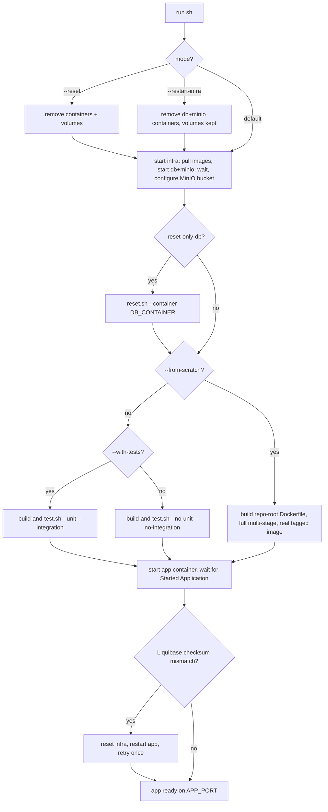
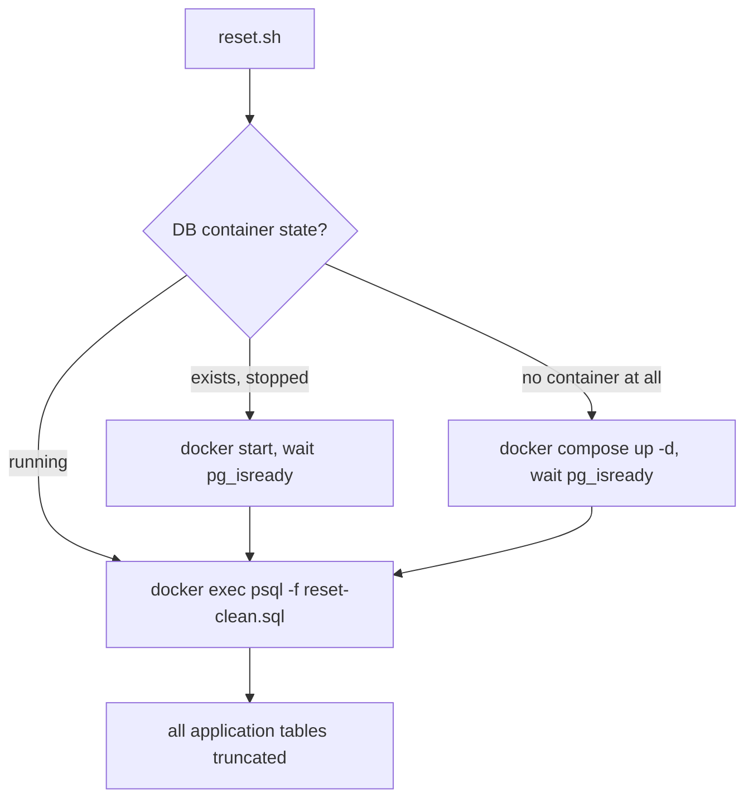

# deploy-and-run

The local prod-simulation deploy pipeline: starts the application alongside PostgreSQL and MinIO,
so the full stack runs the same way locally as it would in a real deployment (production Vaadin
bundle, real Postgres, real S3-compatible storage) — without needing a hosted environment. Also
owns this project's shared local infrastructure (the raw `docker-compose*.yml` files for DB/MinIO/
app, usable independently of the deploy pipeline itself) and the database-truncate script
([`reset.sh`](reset.sh)).

## Flow

Two independent entry points: [`run.sh`](run.sh) (full deploy pipeline) and
[`reset.sh`](reset.sh) (standalone DB truncate) — `reset.sh` is also invoked internally by
`run.sh` itself (`--reset-only-db`) and by [`playwright/run.sh`](../../playwright/run.sh), but
it's a real, independently runnable entry point on its own too, not just an internal helper.

### Deploy pipeline (`run.sh`)

See `run.sh`'s own header for the default-vs-`--from-scratch` behavior and
[`DECISIONS.md`](../DECISIONS.md) for the design rationale.

### Standalone DB reset (`reset.sh`)

### Raw docker-compose files (no script entry point)

[`docker-compose.db.yml`](docker-compose.db.yml) / [`docker-compose.minio.yml`](docker-compose.minio.yml) /
[`docker-compose.app.yml`](docker-compose.app.yml) aren't invoked by either script above — see each
file's own header for what it's for and its exact invocation.
