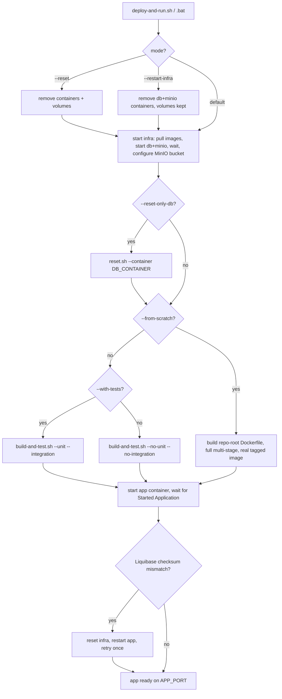
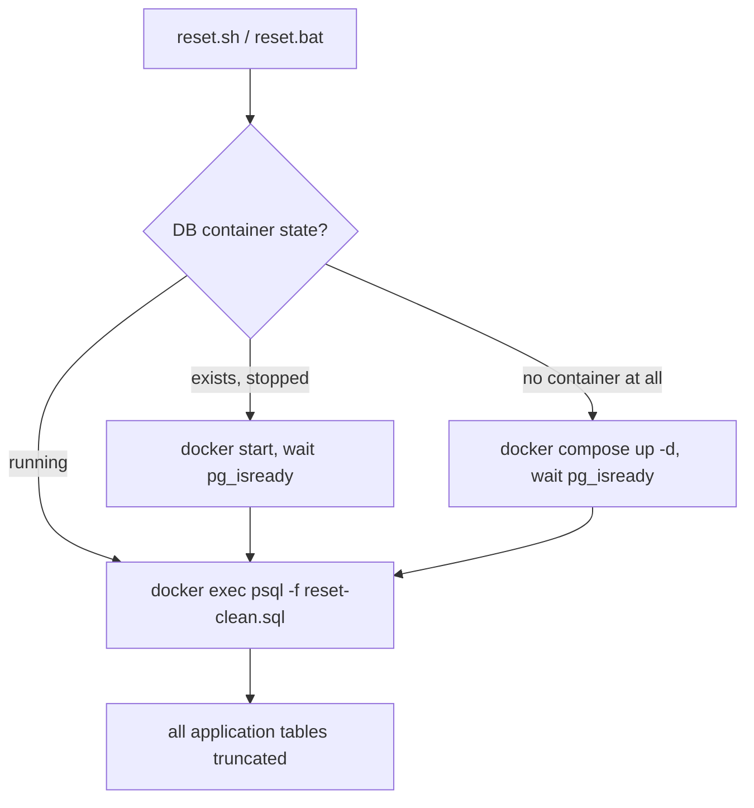

# deploy-and-run

The local prod-simulation deploy pipeline: starts the application alongside PostgreSQL and MinIO,
so the full stack runs the same way locally as it would in a real deployment (production Vaadin
bundle, real Postgres, real S3-compatible storage) — without needing a hosted environment. Runs
the app directly from the shared `maven-cache` volume by default (no image build); `--from-scratch`
builds a real, separately tagged Docker image instead, for when one is actually needed. Also owns
this project's shared local infrastructure (the raw `docker-compose*.yml` files for DB/MinIO/app,
usable independently of the deploy pipeline itself) and the database-truncate script (`reset.sh`)
both the deploy pipeline and Playwright call into.

## Flow

Two independent entry points:

```bash
bash scripts/deploy-and-run.sh [flags]      # Linux / WSL — full deploy pipeline
scripts\deploy-and-run.bat [flags]          # Windows — delegates to the same via WSL

bash scripts/deploy-and-run/reset.sh [--container <name>]   # standalone DB truncate
scripts\deploy-and-run\reset.bat [--container <name>]       # Windows — delegates via bash
```

`reset.sh` is also invoked internally by the deploy pipeline itself (`--reset-only-db`) and by
`playwright/run.sh` — both reuse it instead of keeping their own inline truncate logic — but it's
a real, independently runnable entry point on its own too, not just an internal helper.

### Deploy pipeline (`deploy-and-run.sh` / `deploy-and-run/run.sh`)



By default (no `--from-scratch`), no Docker image is built at all: the app container runs
`java -jar` directly out of a plain `eclipse-temurin:25-jre` container with the shared
`maven-cache` volume mounted (`docker run`, unlike `docker build`, can mount a named volume
directly), reusing `scripts/build-and-test.sh`'s already-built jar and eliminating the duplicate
full-project compile the old (pre-reuse) deploy path used to do. `--from-scratch` still builds a
real, separately tagged `marketplace-app` image from the full multi-stage root `Dockerfile`, for
when an actual portable/deployable image is genuinely needed. See DECISIONS.md for the full
rationale and the container-name-collision issue the build-and-test.sh reuse surfaced (two
concurrent `build-and-test.sh` invocations need distinct container names).

### Standalone DB reset (`reset.sh` / `reset.bat`)



### Raw docker-compose files (no script entry point)

`docker-compose.db.yml` / `docker-compose.minio.yml` / `docker-compose.app.yml` aren't invoked by
either script above — they're used directly via `docker compose`, either for IDE dev mode (DB +
MinIO only, application runs from the IDE) or for local production-build verification independent
of `deploy-and-run.sh` (`docker-compose.app.yml`, builds from the repo-root `Dockerfile`). See each
file's own header for its exact invocation.
