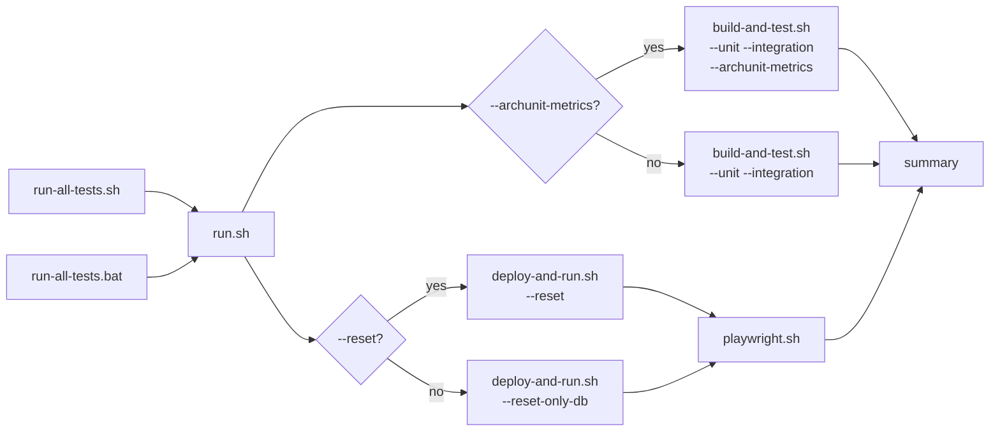

# scripts/run-all-tests

The daily-iteration test loop — one command that runs the whole reactor build, unit tests,
integration tests, and Playwright end-to-end tests together, instead of invoking each suite by
hand. Exists purely as a convenience grouping on top of `scripts/build-and-test.sh` and
`scripts/playwright.sh` — it never reimplements either suite's own logic.

## Flow

Two entry points, same underlying flow — an OS-specific pair converging into the same shared
logic:

```bash
bash scripts/run-all-tests.sh          # Linux/WSL
scripts\run-all-tests.bat              # Windows
```



`build-and-test.sh` runs in parallel with a `deploy-and-run.sh` → `playwright.sh` sequence —
`deploy-and-run.sh` always clears app data first (`--reset-only-db` by default, `--reset` when
`--reset` is passed to `run-all-tests.sh` itself) so `playwright.sh` always tests a freshly-rebuilt,
guaranteed-clean `marketplace-app` container, never whatever happened to already be running. The
two resulting `build-and-test.sh` invocations (this script's own direct one, and the one
`deploy-and-run.sh` triggers internally to reuse its shared jar) are safe to run concurrently
against the shared `maven-cache` volume — serialized by that script's own `flock`, with distinct
container names to avoid a Docker name collision. `run.sh` waits for both branches, then reports
`ALL PASSED`/`SOME FAILED` based on each one's own exit code.

## Environment notes

`--unit-test`/`--integration-test`/`--sandbox`/`--archunit-metrics` are forwarded verbatim to
`build-and-test.sh`'s own flags of the same name — no separate parsing logic, no risk of the
argument sets drifting apart. `--archunit-metrics` is off by default, same as on `build-and-test.sh`
itself (several minutes even on a warm build) — not part of the normal daily loop. `--reset` is
forwarded to `deploy-and-run.sh`'s own `--reset` (full DB/MinIO volume wipe, only needed when the
schema itself changed) — default is `--reset-only-db` (fast, truncate-only). `--playwright "<args>"`
is the one flag with no `build-and-test.sh`/`deploy-and-run.sh` equivalent, forwarded directly to
`playwright.sh` instead.
