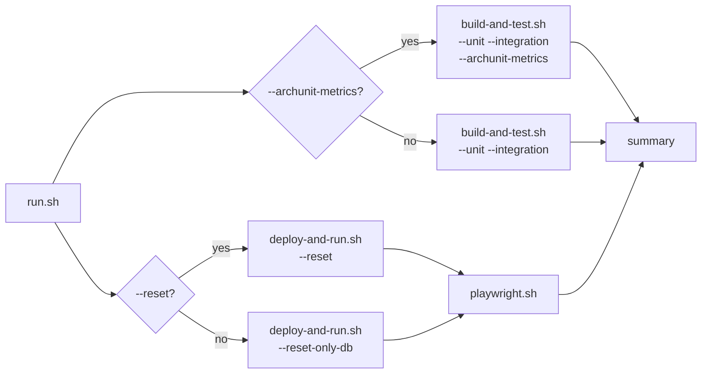

# scripts/run-all-tests

The daily-iteration test loop — one command that runs the whole reactor build, unit tests,
integration tests, and Playwright end-to-end tests together, instead of invoking each suite by
hand. Exists purely as a convenience grouping on top of `scripts/build-and-test.sh` and
`scripts/playwright.sh` — it never reimplements either suite's own logic.

## Flow

Entry point: `run.sh`.

See `run.sh`'s own header for the full parallel-execution and flag-forwarding behavior.
