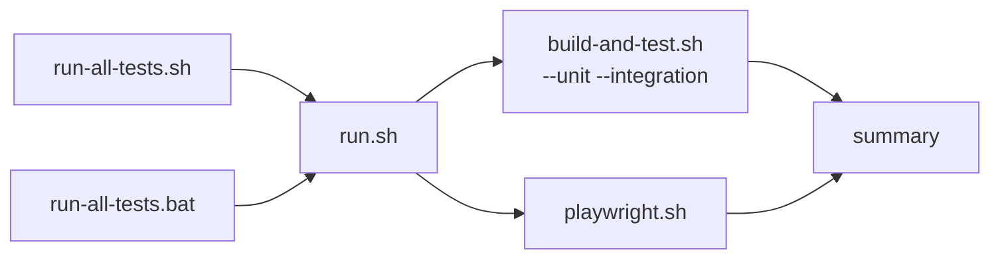

# scripts/run-all-tests

The daily-iteration test loop — one command that runs the whole reactor build, unit tests,
integration tests, and Playwright end-to-end tests together, instead of invoking each suite by
hand. Exists purely as a convenience grouping on top of `scripts/build-and-test.sh` and
`scripts/playwright.sh` — it never reimplements either suite's own logic.

## Flow

Two entry points, same underlying flow — an OS-specific pair converging into the same shared
logic:

```bash
bash scripts/run-all-tests.sh          # Linux/WSL
scripts\run-all-tests.bat              # Windows
```



`build-and-test.sh` and `playwright.sh` start together and run concurrently — `playwright.sh`
never touches the Maven reactor (it only drives an already-running `marketplace-app` container),
so it has nothing to race with `build-and-test.sh`'s own reactor install + parallel unit/
integration test phases. `run.sh` waits for both, then reports `ALL PASSED`/`SOME FAILED` based on
each one's own exit code.

## Environment notes

`--unit-test`/`--integration-test`/`--sandbox` are forwarded verbatim to `build-and-test.sh`'s own
flags of the same name — no separate parsing logic, no risk of the two argument sets drifting
apart. `--playwright "<args>"` is the one flag with no `build-and-test.sh` equivalent, forwarded
directly to `playwright.sh` instead.
