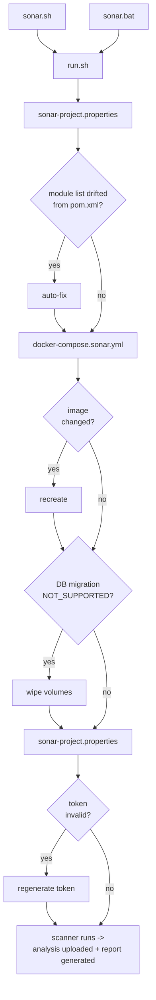

# scripts/sonar

SonarQube is a static-analysis tool that scans the codebase for bugs, code smells, and security
vulnerabilities, enforcing a quality gate on every run. This project runs it locally in an isolated
Docker container instead of a hosted SonarCloud instance, so results stay available offline and the
quality gate can block a local run without depending on an external service — no `pom.xml` changes
(see `DECISIONS.md`).

## Flow

Entry points:
```bash
bash scripts/sonar.sh [--no-gate]      # Linux/WSL
scripts\sonar.bat [--no-gate]          # Windows
```

`sonar.sh`/`sonar.bat` are thin wrappers — the real logic lives in `run.sh`, which manages the
SonarQube server container itself (recreating it on a stale image, wiping it if a version jump
makes the embedded database unmigratable — see `DECISIONS.md`) before running the scanner:



Each file's own header (open the file, or this directory's Tooling & Pipelines card on
`architecture-map.html`) has its own Description/Usage/Env/Input/Outputs/Returns — this file only
shows how they chain together.

## Dependencies

- Docker (SonarQube server container + scanner container)
- Compiled `target/classes` per module (`sonar.java.binaries` — see `DECISIONS.md`)
