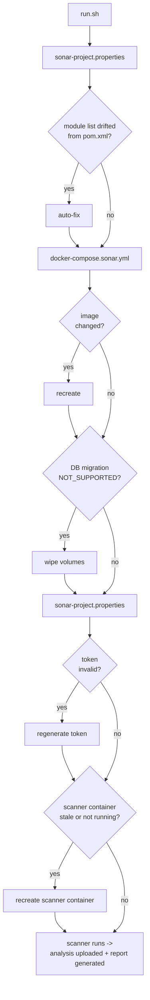

# scripts/sonar

SonarQube is a static-analysis tool that scans the codebase for bugs, code smells, and security
vulnerabilities, enforcing a quality gate on every run. This project runs it locally in an isolated
Docker container instead of a hosted SonarCloud instance, so results stay available offline and the
quality gate can block a local run without depending on an external service — no `pom.xml` changes
(see [`DECISIONS.md`](DECISIONS.md)).

## Flow

Entry point: [`run.sh`](run.sh).

Each file's own header has its own Description/Usage/Env/Input/Outputs/Returns — this file only
shows how they chain together.

## Dependencies

- Docker (SonarQube server container + scanner container)
- Compiled `target/classes` per module (`sonar.java.binaries` — see [`DECISIONS.md`](DECISIONS.md))

## MCP server — structured post-run data

The `sonar-analyst` agent (`.claude/agents/sonar/sonar-analyst.md`) queries the official
`sonarsource/sonarqube-mcp` Docker image (stdio) against this project's own local SonarQube
instance — quality-gate status, issues, and metrics via direct tool calls instead of parsing the
HTML report or the dashboard URL by hand. It complements [`run.sh`](run.sh)'s own live-progress tracking (a log tail during the
scan), not a replacement for it — the MCP server talks to the already-running SonarQube server's
REST API, which has nothing to report until the scanner uploads its report at the end of a run.

The MCP server is scoped to that one agent (an inline `mcpServers` entry in its own frontmatter,
not a session-wide `.mcp.json`) so it connects fresh on every dispatch instead of once per Claude
Code session. Its `command` is
[`.claude/agents/sonar/ensure-token-and-launch.sh`](../../.claude/agents/sonar/ensure-token-and-launch.sh),
which calls [`scripts/utils/ensure-sonar-token.sh`](../utils/ensure-sonar-token.sh)'s
`ensure_sonar_token` (the same server-up/token-valid check `run.sh` itself uses) before launching
the real MCP process — the token is guaranteed fresh on every dispatch, no manual `export` needed.
